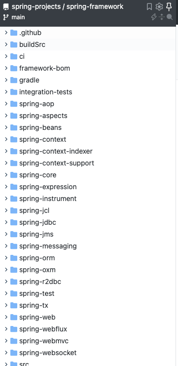
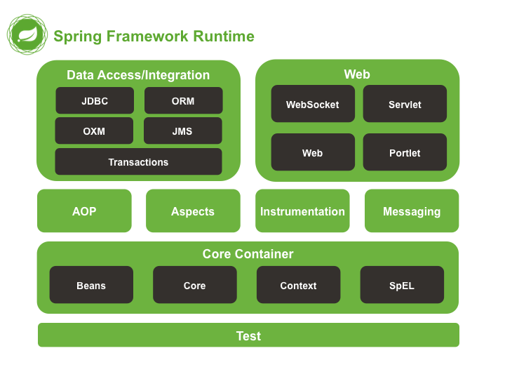
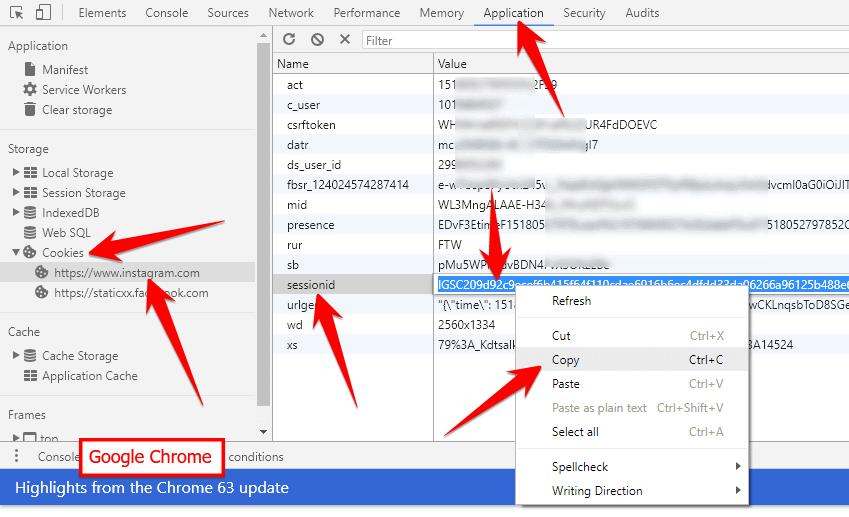
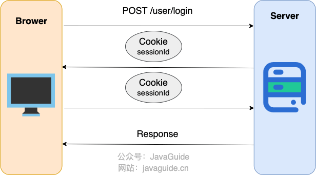
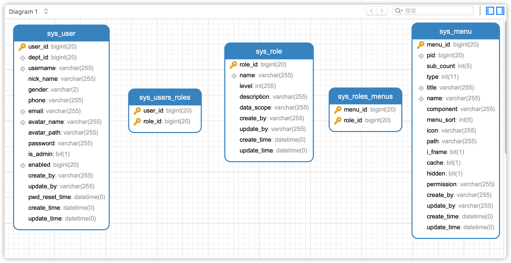
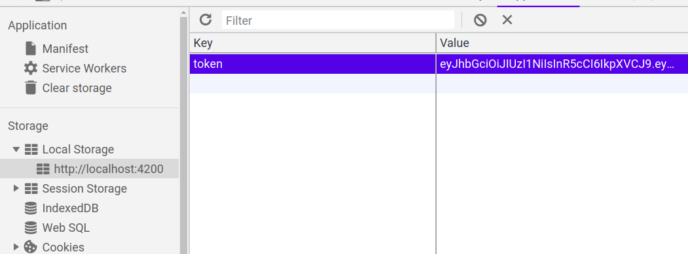
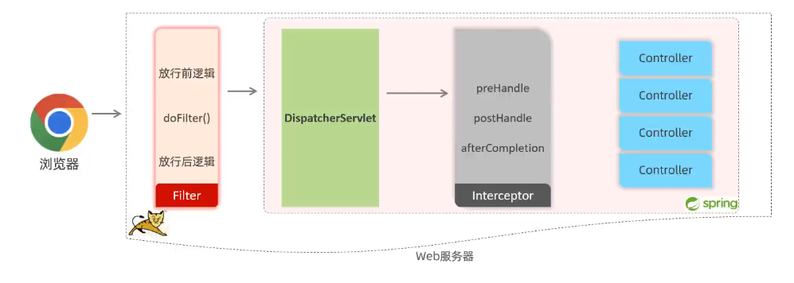
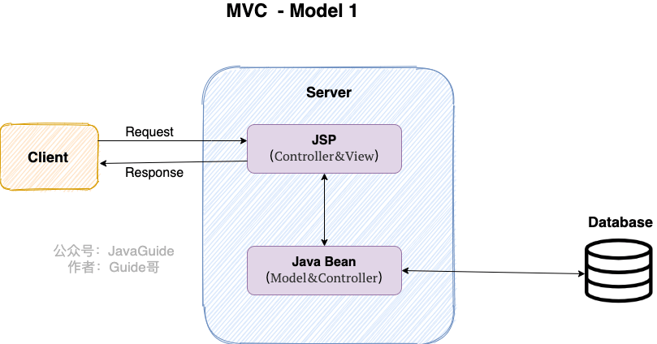
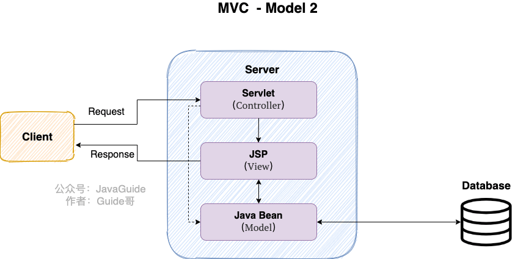

# Spring框架

Spring 是一款开源的轻量级 Java 开发框架，旨在提高开发人员的开发效率以及系统的可维护性。

一般说 Spring 框架指的都是 Spring Framework，它是很多模块的集合，使用这些模块可以很方便地协助我们进行开发，比如说 Spring 支持 IoC（Inversion of Control:控制反转） 和 AOP(Aspect-Oriented Programming:面向切面编程)、可以很方便地对数据库进行访问、可以很方便地集成第三方组件（电子邮件，任务，调度，缓存等等）、对单元测试支持比较好、支持 RESTful Java 应用程序的开发。



Spring 最核心的思想就是不重新造轮子，开箱即用，提高开发效率。

🤐 多提一嘴：**语言的流行通常需要一个杀手级的应用，Spring 就是 Java 生态的一个杀手级的应用框架。**

Spring 提供的核心功能主要是 IoC 和 AOP。学习 Spring ，一定要把 IoC 和 AOP 的核心思想搞懂！

- GitHub 地址： https://github.com/spring-projects/spring-framework

### Spring 包含的模块有哪些？

**Spring4.x 版本**：



**Spring5.x 版本**：


Spring5.x 版本中 Web 模块的 Portlet 组件已经被废弃掉，同时增加了用于异步响应式处理的 WebFlux 组件。

Spring 各个模块的依赖关系如下：


#### Core Container

Spring 框架的核心模块，也可以说是基础模块，主要提供 IoC 依赖注入功能的支持。Spring 其他所有的功能基本都需要依赖于该模块，从上面那张 Spring 各个模块的依赖关系图就可以看出来。

- **spring-core**：Spring 框架基本的核心工具类。
- **spring-beans**：提供对 bean 的创建、配置和管理等功能的支持。
- **spring-context**：提供对国际化、事件传播、资源加载等功能的支持。
- **spring-expression**：提供对表达式语言（Spring Expression Language） SpEL 的支持，只依赖于 core 模块，不依赖于其他模块，可以单独使用。

#### AOP

- **spring-aspects**：该模块为与 AspectJ 的集成提供支持。
- **spring-aop**：提供了面向切面的编程实现。
- **spring-instrument**：提供了为 JVM 添加代理（agent）的功能。 具体来讲，它为 Tomcat 提供了一个织入代理，能够为 Tomcat 传递类文 件，就像这些文件是被类加载器加载的一样。没有理解也没关系，这个模块的使用场景非常有限。

#### Data Access/Integration

- **spring-jdbc**：提供了对数据库访问的抽象 JDBC。不同的数据库都有自己独立的 API 用于操作数据库，而 Java 程序只需要和 JDBC API 交互，这样就屏蔽了数据库的影响。
- **spring-tx**：提供对事务的支持。
- **spring-orm**：提供对 Hibernate、JPA、iBatis 等 ORM 框架的支持。
- **spring-oxm**：提供一个抽象层支撑 OXM(Object-to-XML-Mapping)，例如：JAXB、Castor、XMLBeans、JiBX 和 XStream 等。
- **spring-jms** : 消息服务。自 Spring Framework 4.1 以后，它还提供了对 spring-messaging 模块的继承。

#### Spring Web

- **spring-web**：对 Web 功能的实现提供一些最基础的支持。
- **spring-webmvc**：提供对 Spring MVC 的实现。
- **spring-websocket**：提供了对 WebSocket 的支持，WebSocket 可以让客户端和服务端进行双向通信。
- **spring-webflux**：提供对 WebFlux 的支持。WebFlux 是 Spring Framework 5.0 中引入的新的响应式框架。与 Spring MVC 不同，它不需要 Servlet API，是完全异步。

#### Messaging

**spring-messaging** 是从 Spring4.0 开始新加入的一个模块，主要职责是为 Spring 框架集成一些基础的报文传送应用。

#### Spring Test

Spring 团队提倡测试驱动开发（TDD）。有了控制反转 (IoC)的帮助，单元测试和集成测试变得更简单。

Spring 的测试模块对 JUnit（单元测试框架）、TestNG（类似 JUnit）、Mockito（主要用来 Mock 对象）、PowerMock（解决 Mockito 的问题比如无法模拟 final, static， private 方法）等等常用的测试框架支持的都比较好。

### Spring,Spring MVC,Spring Boot 之间什么关系?

Spring 包含了多个功能模块（上面刚刚提到过），其中最重要的是 Spring-Core（主要提供 IoC 依赖注入功能的支持） 模块， Spring 中的其他模块（比如 Spring MVC）的功能实现基本都需要依赖于该模块。

Spring MVC 是 Spring 中的一个很重要的模块，主要赋予 Spring 快速构建 MVC 架构的 Web 程序的能力。MVC 是模型(Model)、视图(View)、控制器(Controller)的简写，其核心思想是通过将业务逻辑、数据、显示分离来组织代码。

使用 Spring 进行开发各种配置过于麻烦比如开启某些 Spring 特性时，需要用 XML 或 Java 进行显式配置。于是，Spring Boot 诞生了！

Spring 旨在简化 J2EE 企业应用程序开发。Spring Boot 旨在简化 Spring 开发（减少配置文件，开箱即用！）。Spring Boot 只是简化了配置，如果你需要构建 MVC 架构的 Web 程序，你还是需要使用 Spring MVC 作为 MVC 框架，只是说 Spring Boot 帮你简化了 Spring MVC 的很多配置，真正做到开箱即用！

## 分层解耦

### 请求

- 简单参数：参数名与形参变量名相同，定义形参即可接收参数	`@RequestMapping("/..")`
  - 如果方法形参名与请求参数名不匹配，可使用`@RequestParam()`完成映射，且该注解的required属性默认为true，请求参数必须传递，否则报错；如果该参数是可选的，将required属性设置为false


- 实体参数：

  - 简单实体对象：请求参数名与作为形参的对象的属性名相同，定义POJO (Plain Ordinary Java Object 简单的Java对象) 接收
  - 复杂实体参数：请求参数名与形参对象属性名相同，按照对象层次结构关系(.)即可接收嵌套POJO (实际就是普通JavaBean) 属性参数

- 数组Array参数：请求参数名与形参数组名相同且请求参数为多个，定义数组类型作为形参接收
- 集合List参数：请求参数名与形参集合名相同且请求参数为多个，`@RequestParam`（默认会封装到数组，所以需要注解指定封装到集合）List<> 绑定参数关系
- 日期参数：使用@DateTimeFormat注解完成日期参数格式转换 `(@DateTimeFormat(pattern=" ") LocalDateTime 形参名)`
- json参数（post请求）：JSON数据**键名**与形参对象**属性名**相同，定义POJO类型形参接收参数，需要使用`@RequestBody`标识
- 路径参数：通过请求URL直接传递参数，使用如 {id} 来标识该路径参数，需要使用`@PathVariable`声明获取路径参数

### 响应

- `@ResponseBody`

  - 位置：Controller方法上/类上
  - 作用：将方法返回值直接响应，如果返回值类型是 实体对象/集合，会转换为JSON格式响应
  - 说明：@RestController == @Controller + @ResponseBody;

- 功能接口：`@RequestMapping("/")`

- 统一响应结果：导入 Result封装类

  - ```java
    pubic class Result{
        //响应码：1表示成功，0表示失败
        private Integer code;
        //提示信息
        private String msg;
        //返回的数据
        private Object data;
        //...
    }
    ```

### 分层

复用性、拓展性、可维护性， 单一职责原则

**三层架构：**

1. controller 控制层：接收前端发起的请求，对请求进行处理，并响应数据。

2. service 业务逻辑层：处理具体的业务逻辑。

3. dao(Data Access Object) 数据访问层（持久层）：负责数据访问操作，包括数据的增删改查。

### 解耦

软件设计原则：高内聚低耦合

- 内聚：软件中各个功能模块内部的功能联系

- 耦合：衡量软件中各个层/模块之间的依赖、关联的程度

### IoC

IOC(Inversion of Control) 控制反转：对象的创建控制权由程序自身转移到外部（IOC容器）。

Bean对象：IOC容器中创建、管理的对象。

​	——Service层 及 Dao层的实现类，交给IOC容器管理

- IOC：`@Component` —衍生—> （不属于以下三类，比如工具类，用此注解，否则推荐下述注解；可读性?）

  - `@Controller`(层) —— 已被`@RestController`包含
  - `@Service`(层)
  - `@Repository`(Dao层)（由于与mybatis整合，用得少）

  注：

  1. 声明bean的时候可以通过 value 属性指定bean的名字，默认为首字母小写的类名
  2. 使用以上四个注解都可以声明bean，但在springboot集成web开发中，声明控制器bean只能用`@Controller`

- Bean组件扫描：上述声明bean的四个注解想要生效，还需要被组件扫描注解`@ComponentScan({"", "", …})`扫描（虽然没有显式配置，但实际已包含在了启动类声明注解`@SpringBootApplication`中，默认扫描范围是启动类所在包及其子包）。

  - 不推荐，推荐按规范把代码全放在启动类所在包及其子包下

### DI

DI(Dependency Injection) 依赖注入：容器为应用程序提供运行时所依赖的资源。

​	——为Controller层 及 Service 层注入运行时依赖的对象

- DI：Bean注入：`@Autowired`：默认是按照**类型**进行，如果存在多个相同类型的bean，将会报错
  - `@Primary`：（位于@Service上下）让当前bean生效
  - `@Qualifier("")`：（位于@Autowired上下）按类型指定bean生效
  - `@Resource(name="")`：（不需要@Autowired）按名称指定bean生效

## Spring IoC（Spring框架的第一大核心）

### 谈谈自己对于 Spring IoC 的了解

**IoC（Inversion of Control:控制反转）** 是一种设计思想，而不是一个具体的技术实现。IoC 的思想就是将原本在程序中手动创建对象的控制权，交由 Spring 框架来管理。不过， IoC 并非 Spring 特有，在其他语言中也有应用。

**为什么叫控制反转？**

- **控制**：指的是对象创建（实例化、管理）的权力
- **反转**：控制权交给外部环境（Spring 框架、IoC 容器）

将对象之间的相互依赖关系交给 IoC 容器来管理，并由 IoC 容器完成对象的注入。这样可以很大程度上简化应用的开发，把应用从复杂的依赖关系中解放出来。 IoC 容器就像是一个工厂一样，当我们需要创建一个对象的时候，只需要配置好配置文件/注解即可，完全不用考虑对象是如何被创建出来的。

在实际项目中一个 Service 类可能依赖了很多其他的类，假如我们需要实例化这个 Service，你可能要每次都要搞清这个 Service 所有底层类的构造函数，这可能会把人逼疯。如果利用 IoC 的话，你只需要配置好，然后在需要的地方引用就行了，这大大增加了项目的可维护性且降低了开发难度。

在 Spring 中， IoC 容器是 Spring 用来实现 IoC 的载体， IoC 容器实际上就是个 Map（key，value），Map 中存放的是各种对象。

Spring 时代我们一般通过 XML 文件来配置 Bean，后来开发人员觉得 XML 文件来配置不太好，于是 SpringBoot 注解配置就慢慢开始流行起来。

相关阅读：

- [IoC 源码阅读](https://javadoop.com/post/spring-ioc)
- [IoC & AOP 详解（快速搞懂）](https://javaguide.cn/system-design/framework/spring/ioc-and-aop.html)

### 什么是 Spring Bean？

简单来说，Bean 代指的就是那些被 IoC 容器所管理的对象。

我们需要告诉 IoC 容器帮助我们管理哪些对象，这个是通过配置元数据来定义的。配置元数据可以是 XML 文件、注解或者 Java 配置类。

`org.springframework.beans`和 `org.springframework.context` 这两个包是 IoC 实现的基础，如果想要研究 IoC 相关的源码的话，可以去看看

### 将一个类声明为 Bean 的注解有哪些?

- `@Component`：通用的注解，可标注任意类为 `Spring` 组件。如果一个 Bean 不知道属于哪个层，可以使用`@Component` 注解标注。
- `@Repository` : 对应持久层即 Dao 层，主要用于数据库相关操作。
- `@Service` : 对应服务层，主要涉及一些复杂的逻辑，需要用到 Dao 层。
- `@Controller` : 对应 Spring MVC 控制层，主要用于接受用户请求并调用 `Service` 层返回数据给前端页面。

### @Component 和 @Bean 的区别是什么？

- `@Component` 注解作用于类，而`@Bean`注解作用于方法。
- `@Component`通常是通过类路径扫描来自动侦测以及自动装配到 Spring 容器中（我们可以使用 `@ComponentScan` 注解定义要扫描的路径从中找出标识了需要装配的类自动装配到 Spring 的 bean 容器中）。`@Bean` 注解通常是我们在标有该注解的方法中定义产生这个 bean,`@Bean`告诉了 Spring 这是某个类的实例，当我需要用它的时候还给我。
- `@Bean` 注解比 `@Component` 注解的自定义性更强，而且很多地方我们只能通过 `@Bean` 注解来注册 bean。比如当我们引用第三方库中的类需要装配到 `Spring`容器时，则只能通过 `@Bean`来实现。

`@Bean`注解使用示例：

```
@Configuration
public class AppConfig {
    @Bean
    public TransferService transferService() {
        return new TransferServiceImpl();
    }

}
```

上面的代码相当于下面的 xml 配置

```
<beans>
    <bean id="transferService" class="com.acme.TransferServiceImpl"/>
</beans>
```

下面这个例子是通过 `@Component` 无法实现的。

```
@Bean
public OneService getService(status) {
    case (status)  {
        when 1:
                return new serviceImpl1();
        when 2:
                return new serviceImpl2();
        when 3:
                return new serviceImpl3();
    }
}
```

### 注入 Bean 的注解有哪些？

Spring 内置的 `@Autowired` 以及 JDK 内置的 `@Resource` 和 `@Inject` 都可以用于注入 Bean。`@Autowired` 和`@Resource`使用的比较多一些。

### @Autowired 和 @Resource 的区别是什么？

`Autowired` 属于 Spring 内置的注解，默认的注入方式为`byType`（根据类型进行匹配），也就是说会优先根据接口类型去匹配并注入 Bean （接口的实现类）。

**这会有什么问题呢？** 当一个接口存在多个实现类的话，`byType`这种方式就无法正确注入对象了，因为这个时候 Spring 会同时找到多个满足条件的选择，默认情况下它自己不知道选择哪一个。这种情况下，注入方式会变为 `byName`（根据名称进行匹配），这个名称通常就是类名（首字母小写）。还是建议通过 `@Qualifier` 注解来显式指定名称而不是依赖变量的名称。

`@Resource`属于 JDK 提供的注解，默认注入方式为 `byName`。如果无法通过名称匹配到对应的 Bean 的话，注入方式会变为`byType`。`@Resource` 有两个比较重要且日常开发常用的属性：`name`（名称）、`type`（类型）。如果仅指定 `name` 属性则注入方式为`byName`，如果仅指定`type`属性则注入方式为`byType`，如果同时指定`name` 和`type`属性（不建议这么做）则注入方式为`byType`+`byName`。

总结：

- `@Autowired` 是 Spring 提供的注解，`@Resource` 是 JDK 提供的注解。
- `Autowired` 默认的注入方式为`byType`（根据类型进行匹配），`@Resource`默认注入方式为 `byName`（根据名称进行匹配）。
- 当一个接口存在多个实现类的情况下，`@Autowired` 和`@Resource`都需要通过名称才能正确匹配到对应的 Bean。`Autowired` 可以通过 `@Qualifier` 注解来显式指定名称，`@Resource`可以通过 `name` 属性来显式指定名称。
- `@Autowired` 支持在构造函数、方法、字段和参数上使用。`@Resource` 主要用于字段和方法上的注入，不支持在构造函数或参数上使用。

### 注入 Bean 的方式有哪些？

依赖注入 (Dependency Injection, DI) 的常见方式：

1. 构造函数注入：通过类的构造函数来注入依赖项。
2. Setter 注入：通过类的 Setter 方法来注入依赖项。
3. Field（字段） 注入：直接在类的字段上使用注解（如 `@Autowired` 或 `@Resource`）来注入依赖项。

### 构造函数注入还是 Setter 注入？

Spring 官方有对这个问题的回答：https://docs.spring.io/spring-framework/reference/core/beans/dependencies/factory-collaborators.html#beans-setter-injection。

提取总结完善一下 Spring 官方的建议：

**Spring 官方推荐构造函数注入**，这种注入方式的优势如下：

1. 依赖完整性：确保所有必需依赖在对象创建时就被注入，避免了空指针异常的风险。
2. 不可变性：有助于创建不可变对象，提高了线程安全性。
3. 初始化保证：组件在使用前已完全初始化，减少了潜在的错误。
4. 测试便利性：在单元测试中，可以直接通过构造函数传入模拟的依赖项，而不必依赖 Spring 容器进行注入。

构造函数注入适合处理**必需的依赖项**，而 **Setter 注入** 则更适合**可选的依赖项**，这些依赖项可以有默认值或在对象生命周期中动态设置。虽然 `@Autowired` 可以用于 Setter 方法来处理必需的依赖项，但构造函数注入仍然是更好的选择。

在某些情况下（例如第三方类不提供 Setter 方法），构造函数注入可能是**唯一的选择**。

### Bean 的作用域有哪些?

Spring 中 Bean 的作用域通常有下面几种：

- **singleton** : IoC 容器中只有唯一的 bean 实例。Spring 中的 bean 默认都是单例的，是对单例设计模式的应用。
- **prototype** : 每次获取都会创建一个新的 bean 实例。也就是说，连续 `getBean()` 两次，得到的是不同的 Bean 实例。
- **request** （仅 Web 应用可用）: 每一次 HTTP 请求都会产生一个新的 bean（请求 bean），该 bean 仅在当前 HTTP request 内有效。
- **session** （仅 Web 应用可用） : 每一次来自新 session 的 HTTP 请求都会产生一个新的 bean（会话 bean），该 bean 仅在当前 HTTP session 内有效。
- **application/global-session** （仅 Web 应用可用）：每个 Web 应用在启动时创建一个 Bean（应用 Bean），该 bean 仅在当前应用启动时间内有效。
- **websocket** （仅 Web 应用可用）：每一次 WebSocket 会话产生一个新的 bean。

**如何配置 bean 的作用域呢？**

xml 方式：

```
<bean id="..." class="..." scope="singleton"></bean>
```

注解方式：

```
@Bean
@Scope(value = ConfigurableBeanFactory.SCOPE_PROTOTYPE)
public Person personPrototype() {
    return new Person();
}
```

### Bean 是线程安全的吗？

Spring 框架中的 Bean 是否线程安全，取决于其作用域和状态。

这里以最常用的两种作用域 prototype 和 singleton 为例介绍。几乎所有场景的 Bean 作用域都是使用默认的 singleton ，重点关注 singleton 作用域即可。

prototype 作用域下，每次获取都会创建一个新的 bean 实例，不存在资源竞争问题，所以不存在线程安全问题。singleton 作用域下，IoC 容器中只有唯一的 bean 实例，可能会存在资源竞争问题（取决于 Bean 是否有状态）。如果这个 bean 是有状态的话，那就存在线程安全问题（有状态 Bean 是指包含可变的成员变量的对象）。不过，大部分 Bean 实际都是无状态（没有定义可变的成员变量）的（比如 Dao、Service），这种情况下， Bean 是线程安全的。

对于有状态单例 Bean 的线程安全问题，常见的三种解决办法是：

1. **避免可变成员变量**: 尽量设计 Bean 为无状态。
2. **使用`ThreadLocal`**: 将可变成员变量保存在 `ThreadLocal` 中，确保线程独立。
3. **使用同步机制**: 利用 `synchronized` 或 `ReentrantLock` 来进行同步控制，确保线程安全。

### Bean 的生命周期

1. **创建 Bean 的实例**：Bean 容器首先会找到配置文件中的 Bean 定义，然后使用 Java 反射 API 来创建 Bean 的实例。
2. **Bean 属性赋值/填充**：为 Bean 设置相关属性和依赖，例如`@Autowired` 等注解注入的对象、`@Value` 注入的值、`setter`方法或构造函数注入依赖和值、`@Resource`注入的各种资源。
3. **Bean 初始化**： 
   - 如果 Bean 实现了 `BeanNameAware` 接口，调用 `setBeanName()`方法，传入 Bean 的名字。
   - 如果 Bean 实现了 `BeanClassLoaderAware` 接口，调用 `setBeanClassLoader()`方法，传入 `ClassLoader`对象的实例。
   - 如果 Bean 实现了 `BeanFactoryAware` 接口，调用 `setBeanFactory()`方法，传入 `BeanFactory`对象的实例。
   - 与上面的类似，如果实现了其他 `*.Aware`接口，就调用相应的方法。
   - 如果有和加载这个 Bean 的 Spring 容器相关的 `BeanPostProcessor` 对象，执行`postProcessBeforeInitialization()` 方法
   - 如果 Bean 实现了`InitializingBean`接口，执行`afterPropertiesSet()`方法。
   - 如果 Bean 在配置文件中的定义包含 `init-method` 属性，执行指定的方法。
   - 如果有和加载这个 Bean 的 Spring 容器相关的 `BeanPostProcessor` 对象，执行`postProcessAfterInitialization()` 方法。
4. 销毁 Bean：销毁并不是说要立马把 Bean 给销毁掉，而是把 Bean 的销毁方法先记录下来，将来需要销毁 Bean 或者销毁容器的时候，就调用这些方法去释放 Bean 所持有的资源。 
   - 如果 Bean 实现了 `DisposableBean` 接口，执行 `destroy()` 方法。
   - 如果 Bean 在配置文件中的定义包含 `destroy-method` 属性，执行指定的 Bean 销毁方法。或者，也可以直接通过`@PreDestroy` 注解标记 Bean 销毁之前执行的方法。

`AbstractAutowireCapableBeanFactory` 的 `doCreateBean()` 方法中能看到依次执行了这 4 个阶段。

`Aware` 接口能让 Bean 能拿到 Spring 容器资源。

Spring 中提供的 `Aware` 接口主要有：

1. `BeanNameAware`：注入当前 bean 对应 beanName；
2. `BeanClassLoaderAware`：注入加载当前 bean 的 ClassLoader；
3. `BeanFactoryAware`：注入当前 `BeanFactory` 容器的引用。

`BeanPostProcessor` 接口是 Spring 为修改 Bean 提供的强大扩展点。

- `postProcessBeforeInitialization`：Bean 实例化、属性注入完成后，`InitializingBean#afterPropertiesSet`方法以及自定义的 `init-method` 方法之前执行；
- `postProcessAfterInitialization`：类似于上面，不过是在 `InitializingBean#afterPropertiesSet`方法以及自定义的 `init-method` 方法之后执行。

`InitializingBean` 和 `init-method` 是 Spring 为 Bean 初始化提供的扩展点。

**如何记忆呢？**

1. 整体上可以简单分为四步：实例化 —> 属性赋值 —> 初始化 —> 销毁。
2. 初始化这一步涉及到的步骤比较多，包含 `Aware` 接口的依赖注入、`BeanPostProcessor` 在初始化前后的处理以及 `InitializingBean` 和 `init-method` 的初始化操作。
3. 销毁这一步会注册相关销毁回调接口，最后通过`DisposableBean` 和 `destory-method` 进行销毁。


## 登录功能

### 会话技术

会话：用户打开浏览器访问web服务器的资源，会话建立，直到有一方断开连接，会话结束。一次会话中可以包含多次请求和响应。

**会话跟踪：**一种维护浏览器状态的方法，服务器需要识别多次请求是否来自于同一浏览器，以便在同一次会话的多次请求间共享数据。

- 会话跟踪方案：

  - 客户端会话跟踪技术：Cookie
    - HTTP协议中支持的技术
    - 移动端app无法使用Cookie
    - 不安全，用户可以自己禁用Cookie
    - Cookie不能跨域（跨域区分三个维度：协议、IP/域名、端口）

  - 服务端会话跟踪技术：Session——底层基于Cookie实现
    - 存储在服务端，安全
    - 服务器集群环境下无法直接使用Session
    - 同Cookie的缺点
  - 令牌技术
    - 支持PC端、移动端
    - 解决集群环境下的认证问题
    - 减轻服务器端存储压力
    - 但需要自己实现

**什么是Cookie？Cookie的作用是？**



`Cookie` 和 `Session` 都是用来跟踪浏览器用户身份的会话方式，但是两者的应用场景不太一样。

维基百科是这样定义 `Cookie` 的：

> `Cookies` 是某些网站为了辨别用户身份而储存在用户本地终端上的数据（通常经过加密）。

简单来说：**`Cookie` 存放在客户端，一般用来保存用户信息**。

下面是 `Cookie` 的一些应用案例：

1. 我们在 `Cookie` 中保存已经登录过的用户信息，下次访问网站的时候页面可以自动帮你登录的一些基本信息给填了。除此之外，`Cookie` 还能保存用户首选项，主题和其他设置信息。
2. 使用 `Cookie` 保存 `SessionId` 或者 `Token` ，向后端发送请求的时候带上 `Cookie`，这样后端就能取到 `Session` 或者 `Token` 了。这样就能记录用户当前的状态了，因为 HTTP 协议是无状态的。
3. `Cookie` 还可以用来记录和分析用户行为。举个简单的例子你在网上购物的时候，因为 HTTP 协议是没有状态的，如果服务器想要获取你在某个页面的停留状态或者看了哪些商品，一种常用的实现方式就是将这些信息存放在 `Cookie`
4. ……

#### 如何在项目中使用 Cookie

以 Spring Boot 项目为例：

**1)设置 `Cookie` 返回给客户端**

```
@GetMapping("/change-username")
public String setCookie(HttpServletResponse response) {
    // 创建一个 cookie
    Cookie cookie = new Cookie("username", "Jovan");
    //设置 cookie过期时间
    cookie.setMaxAge(7 * 24 * 60 * 60); // expires in 7 days
    //添加到 response 中
    response.addCookie(cookie);

    return "Username is changed!";
}
```

**2) 使用 Spring 框架提供的 `@CookieValue` 注解获取特定的 cookie 的值**

```
@GetMapping("/")
public String readCookie(@CookieValue(value = "username", defaultValue = "Atta") String username) {
    return "Hey! My username is " + username;
}
```

**3) 读取所有的 `Cookie` 值**

```
@GetMapping("/all-cookies")
public String readAllCookies(HttpServletRequest request) {

    Cookie[] cookies = request.getCookies();
    if (cookies != null) {
        return Arrays.stream(cookies)
                .map(c -> c.getName() + "=" + c.getValue()).collect(Collectors.joining(", "));
    }

    return "No cookies";
}
```

更多关于如何在 Spring Boot 中使用 `Cookie` 的内容可以查看这篇文章：[How to use cookies in Spring Boot](https://attacomsian.com/blog/cookies-spring-boot) 。

**Cookie 和 Session 有什么区别？**

**`Session` 的主要作用就是通过服务端记录用户的状态。** 典型的场景是购物车，当你要添加商品到购物车的时候，系统不知道是哪个用户操作的，因为 HTTP 协议是无状态的。服务端给特定的用户创建特定的 `Session` 之后就可以标识这个用户并且跟踪这个用户了。

`Cookie` 数据保存在客户端(浏览器端)，`Session` 数据保存在服务器端。相对来说 `Session` 安全性更高。如果使用 `Cookie` 的一些敏感信息不要写入 `Cookie` 中，最好能将 `Cookie` 信息加密然后使用到的时候再去服务器端解密。

#### 如何使用 Session-Cookie 方案进行身份验证？

很多时候我们都是通过 `SessionID` 来实现特定的用户，`SessionID` 一般会选择存放在 Redis 中。举个例子：

1. 用户成功登陆系统，然后返回给客户端具有 `SessionID` 的 `Cookie` 。
2. 当用户向后端发起请求的时候会把 `SessionID` 带上，这样后端就知道你的身份状态了。

关于这种认证方式更详细的过程如下：



1. 用户向服务器发送用户名、密码、验证码用于登陆系统。
2. 服务器验证通过后，服务器为用户创建一个 `Session`，并将 `Session` 信息存储起来。
3. 服务器向用户返回一个 `SessionID`，写入用户的 `Cookie`。
4. 当用户保持登录状态时，`Cookie` 将与每个后续请求一起被发送出去。
5. 服务器可以将存储在 `Cookie` 上的 `SessionID` 与存储在内存中或者数据库中的 `Session` 信息进行比较，以验证用户的身份，返回给用户客户端响应信息的时候会附带用户当前的状态。

使用 `Session` 的时候需要注意下面几个点：

- 依赖 `Session` 的关键业务一定要确保客户端开启了 `Cookie`。
- 注意 `Session` 的过期时间。

另外，Spring Session 提供了一种跨多个应用程序或实例管理用户会话信息的机制。如果想详细了解可以查看下面几篇很不错的文章：

- [Getting Started with Spring Session](https://codeboje.de/spring-Session-tutorial/)
- [Guide to Spring Session](https://www.baeldung.com/spring-Session)
- [Sticky Sessions with Spring Session & Redis](https://medium.com/@gvnix/sticky-Sessions-with-spring-Session-redis-bdc6f7438cc3)

#### 如果没有 Cookie 的话 Session 还能用吗？

这是一道经典的面试题！

一般是通过 `Cookie` 来保存 `SessionID` ，假如你使用了 `Cookie` 保存 `SessionID` 的方案的话， 如果客户端禁用了 `Cookie`，那么 `Session` 就无法正常工作。

但是，并不是没有 `Cookie` 之后就不能用 `Session` 了，比如你可以将 `SessionID` 放在请求的 `url` 里面`https://javaguide.cn/?Session_id=xxx` 。这种方案的话可行，但是安全性和用户体验感降低。当然，为了安全你也可以对 `SessionID` 进行一次加密之后再传入后端。

### 登录校验

#### 认证 (Authentication) 和授权 (Authorization)

**区别是什么？**

说简单点就是：

- **认证 (Authentication)：** 你是谁。
- **授权 (Authorization)：** 你有权限干什么。

稍微正式点（啰嗦）的说法就是：

- **Authentication（认证）** 是验证您的身份的凭据（例如用户名/用户 ID 和密码），通过这个凭据，系统得以知道你就是你，也就是说系统存在你这个用户。所以，Authentication 被称为身份/用户验证。
- **Authorization（授权）** 发生在 **Authentication（认证）** 之后。它主要掌管我们访问系统的权限。比如有些特定资源只能具有特定权限的人才能访问比如 admin，有些对系统资源操作比如删除、添加、更新只能特定人才具有。

**RBAC 模型** 

RBAC 即基于角色的权限访问控制（Role-Based Access Control）。这是一种通过角色关联权限，角色同时又关联用户的授权的方式。

简单地说：一个用户可以拥有若干角色，每一个角色又可以被分配若干权限，这样就构造成“用户-角色-权限” 的授权模型。在这种模型中，用户与角色、角色与权限之间构成了多对多的关系。

在 RBAC 权限模型中，权限与角色相关联，用户通过成为包含特定角色的成员而得到这些角色的权限，这就极大地简化了权限的管理。

为了实现 RBAC 权限模型，数据库表的常见设计如下（一共 5 张表，2 张用户建立表之间的联系）：



通过这个权限模型，我们可以创建不同的角色并为不同的角色分配不同的权限范围（菜单）。通常来说，如果系统对于权限控制要求比较严格的话，一般都会选择使用 RBAC 模型来做权限控制。

#### 为什么 Cookie 无法防止 CSRF 攻击，而 Token 可以？

**CSRF(Cross Site Request Forgery)** 一般被翻译为 **跨站请求伪造** 。那什么是 **跨站请求伪造** 呢？说简单点，就是用你的身份去发送一些对你不友好的请求。

上面也提到过，进行 `Session` 认证的时候，我们一般使用 `Cookie` 来存储 `SessionId`,当我们登陆后后端生成一个 `SessionId` 放在 Cookie 中返回给客户端，服务端通过 Redis 或者其他存储工具记录保存着这个 `SessionId`，客户端登录以后每次请求都会带上这个 `SessionId`，服务端通过这个 `SessionId` 来标示你这个人。如果别人通过 `Cookie` 拿到了 `SessionId` 后就可以代替你的身份访问系统了。

`Session` 认证中 `Cookie` 中的 `SessionId` 是由浏览器发送到服务端的，借助这个特性，攻击者就可以通过让用户误点攻击链接，达到攻击效果。

但是，我们使用 `Token` 的话就不会存在这个问题，在我们登录成功获得 `Token` 之后，一般会选择存放在 `localStorage` （浏览器本地存储）中。然后我们在前端通过某些方式会给每个发到后端的请求加上这个 `Token`,这样就不会出现 CSRF 漏洞的问题。因为，即使你点击了非法链接发送了请求到服务端，这个非法请求是不会携带 `Token` 的，所以这个请求将是非法的。



需要注意的是：不论是 `Cookie` 还是 `Token` 都无法避免 **跨站脚本攻击（Cross Site Scripting）XSS** 。

> 跨站脚本攻击（Cross Site Scripting）缩写为 CSS 但这会与层叠样式表（Cascading Style Sheets，CSS）的缩写混淆。因此，有人将跨站脚本攻击缩写为 XSS。

XSS 中攻击者会用各种方式将恶意代码注入到其他用户的页面中。就可以通过脚本盗用信息比如 `Cookie` 。

推荐阅读：[如何防止 CSRF 攻击？—美团技术团队](https://tech.meituan.com/2018/10/11/fe-security-csrf.html)

#### JWT (JSON Web Token) 令牌

JWT 是目前最流行的跨域认证解决方案，是一种基于 Token 的认证授权机制。 从 JWT 的全称可以看出，JWT 本身也是 Token，一种规范化之后的 JSON 结构的 Token。其定义了一种简洁的、自包含的格式，用于在通信双方以json数据格式安全的传输信。由于数字签名存在，这些信息是可靠的。因为JWT 自身包含了身份验证所需要的所有信息，所以我们的服务器不需要存储 Session 信息。这显然增加了系统的可用性和伸缩性，大大减轻了服务端的压力。

可以看出，**JWT 更符合设计 RESTful API 时的「Stateless（无状态）」原则** 。并且， 使用 JWT 认证可以有效避免 CSRF 攻击，因为 JWT 一般是存在在 localStorage 中，使用 JWT 进行身份验证的过程中是不会涉及到 Cookie 的。 [RFC 7519](https://tools.ietf.org/html/rfc7519) 对 JWT 做了较为正式的定义。

**组成**：JWT 本质上就是一组字串，通过（`.`）切分成三个为 Base64 编码的部分：

- 被 Base64Url 编码后成为 JWT 的第一部分：Header (头部)，描述 JWT 的元数据，定义了生成签名的算法以及 `Token` 的类型
- 被 Base64Url 编码后成为 JWT 的第二部分：Payload (有效荷载)，用来存放实际需要传递的数据，携带一些自定义信息、默认信息等，包含声明（Claims），如`sub`（subject，主题）、`jti`（JWT ID）。
- 被 Base64Url 编码后成为 JWT 的第三部分：Signature (签名)，服务器通过 Payload、Header 和一个密钥(Secret)使用 Header 里面指定的签名算法（默认是 HMAC SHA256）生成。防止Token被篡改、保证安全性。

可以在 [jwt.io](https://jwt.io/) 这个网站上对其 JWT 进行解码，解码之后得到的就是 Header、Payload、Signature 这三部分。Header 和 Payload 都是 JSON 格式的数据，Signature 由 Payload、Header 和 Secret(密钥)通过特定的计算公式和加密算法得到。

**如何基于 JWT 进行身份验证？**

在基于 JWT 进行身份验证的的应用程序中，服务器通过 Payload、Header 和 Secret(密钥)创建 JWT 并将 JWT 发送给客户端。客户端接收到 JWT 之后，会将其保存在 Cookie 或者 localStorage 里面，以后客户端发出的所有请求都会携带这个令牌。


简化后的步骤如下：

1. 用户向服务器发送用户名、密码以及验证码用于登陆系统。
2. 如果用户用户名、密码以及验证码校验正确的话，服务端会返回已经签名的 Token，也就是 JWT。
3. 用户以后每次向后端发请求都在 Header 中带上这个 JWT 。
4. 服务端检查 JWT 并从中获取用户相关信息。

两点建议：

1. 建议将 JWT 存放在 localStorage 中，放在 Cookie 中会有 CSRF 风险。
2. 请求服务端并携带 JWT 的常见做法是将其放在 HTTP Header 的 `Authorization` 字段中（`Authorization: Bearer Token`）。

**如何防止 JWT 被篡改？**

有了签名之后，即使 JWT 被泄露或者截获，黑客也没办法同时篡改 Signature、Header、Payload。

为什么呢？因为服务端拿到 JWT 之后，会解析出其中包含的 Header、Payload 以及 Signature 。服务端会根据 Header、Payload、密钥再次生成一个 Signature。拿新生成的 Signature 和 JWT 中的 Signature 作对比，如果一样就说明 Header 和 Payload 没有被修改。

不过，如果服务端的秘钥也被泄露的话，黑客就可以同时篡改 Signature、Header、Payload 了。黑客直接修改了 Header 和 Payload 之后，再重新生成一个 Signature 就可以了。

​	**密钥一定保管好，一定不要泄露出去！JWT 安全的核心在于签名，签名安全的核心在密钥。**

**如何加强 JWT 的安全性？**

1. 使用安全系数高的加密算法。
2. 使用成熟的开源库，没必要造轮子。
3. JWT 存放在 localStorage 中而不是 Cookie 中，避免 CSRF 风险。
4. 一定不要将隐私信息存放在 Payload 当中。
5. 密钥一定保管好，一定不要泄露出去。JWT 安全的核心在于签名，签名安全的核心在密钥。
6. Payload 要加入 `exp` （JWT 的过期时间），永久有效的 JWT 不合理。并且，JWT 的过期时间不宜过长。
7. ……

**JWT 的优势**

- 无状态
  - JWT 自身包含了身份验证所需要的所有信息，因此，我们的服务器不需要存储 JWT 信息。这显然增加了系统的可用性和伸缩性，大大减轻了服务端的压力。
  - 不过，也正是由于 JWT 的无状态，也导致了它最大的缺点：**不可控！**就比如说，我们想要在 JWT 有效期内废弃一个 JWT 或者更改它的权限的话，并不会立即生效，通常需要等到有效期过后才可以。再比如说，当用户 Logout 的话，JWT 也还有效。除非，我们在后端增加额外的处理逻辑比如将失效的 JWT 存储起来，后端先验证 JWT 是否有效再进行处理。具体的解决办法，会在后面详细介绍，这里只是简单提一下。
- 有效避免 CSRF 攻击
  - **CSRF**一般被翻译为 **跨站请求伪造**，属于网络攻击领域范围。相比于 SQL 脚本注入、XSS 等安全攻击方式，CSRF 的知名度并没有它们高。但是，它的确是我们开发系统时必须要考虑的安全隐患。就连业内技术标杆 Google 的产品 Gmail 也曾在 2007 年的时候爆出过 CSRF 漏洞，这给 Gmail 的用户造成了很大的损失。
  - CSRF 攻击需要依赖 Cookie ，Session 认证中 Cookie 中的 `SessionID` 是由浏览器发送到服务端的，只要发出请求，Cookie 就会被携带。借助这个特性，即使黑客无法获取你的 `SessionID`，只要让你误点攻击链接，就可以达到攻击效果。另外，并不是必须点击链接才可以达到攻击效果，很多时候，只要你打开了某个页面，CSRF 攻击就会发生。
  - **那为什么 JWT 不会存在这种问题呢？**总结来说就一句话：**使用 JWT 进行身份验证不需要依赖 Cookie ，因此可以避免 CSRF 攻击。**不过，这样也会存在 XSS 攻击的风险。为了避免 XSS 攻击，你可以选择将 JWT 存储在标记为`httpOnly` 的 Cookie 中。但是，这样又导致了你必须自己提供 CSRF 保护，因此，实际项目中我们通常也不会这么做。
  - 常见的避免 XSS 攻击的方式是过滤掉请求中存在 XSS 攻击风险的可疑字符串。在 Spring 项目中，一般是通过创建 XSS 过滤器来实现的。
- 适合移动端应用
  - 使用 Session 进行身份认证的话，需要保存一份信息在服务器端，而且这种方式会依赖到 Cookie（需要 Cookie 保存 `SessionId`），所以不适合移动端。但是，使用 JWT 进行身份认证就不会存在这种问题，因为只要 JWT 可以被客户端存储就能够使用，而且 JWT 还可以跨语言使用。
- 单点登录友好
  - 使用 Session 进行身份认证的话，实现单点登录，需要我们把用户的 Session 信息保存在一台电脑上，并且还会遇到常见的 Cookie 跨域的问题。但是，使用 JWT 进行认证的话， JWT 被保存在客户端，不会存在这些问题。

**JWT 身份认证常见问题及解决办法**

- 注销登录等场景下JWT还有效

  - 与之类似的具体相关场景有：

    - 退出登录;
    - 修改密码;
    - 服务端修改了某个用户具有的权限或者角色；
    - 用户的帐户被封禁/删除；
    - 用户被服务端强制注销；
    - 用户被踢下线；
    - ……

  - 这个问题不存在于 Session 认证方式中，因为在 Session 认证方式中，遇到这种情况的话服务端删除对应的 Session 记录即可。但是，使用 JWT 认证的方式就不好解决了。我们也说过了，JWT 一旦派发出去，如果后端不增加其他逻辑的话，它在失效之前都是有效的。 4 种方案：

    1. **将 JWT 存入数据库**：将有效的 JWT 存入数据库中，更建议使用内存数据库比如 Redis。如果需要让某个 JWT 失效就直接从 Redis 中删除这个 JWT 即可。但是，这样会导致每次使用 JWT 都要先从 Redis 中查询 JWT 是否存在的步骤，而且违背了 JWT 的无状态原则。

    2. **黑名单机制**：和上面的方式类似，使用内存数据库比如 Redis 维护一个黑名单，如果想让某个 JWT 失效的话就直接将这个 JWT 加入到 **黑名单** 即可。然后，每次使用 JWT 进行请求的话都会先判断这个 JWT 是否存在于黑名单中。

       前两种方案的核心在于将有效的 JWT 存储起来或者将指定的 JWT 拉入黑名单。虽然这两种方案都违背了 JWT 的无状态原则，但是一般实际项目中我们通常还是会使用这两种方案。

    3. **修改密钥 (Secret)** ：我们为每个用户都创建一个专属密钥，如果我们想让某个 JWT 失效，我们直接修改对应用户的密钥即可。但是，这样相比于前两种引入内存数据库带来了危害更大：

       - 如果服务是分布式的，则每次发出新的 JWT 时都必须在多台机器同步密钥。为此，你需要将密钥存储在数据库或其他外部服务中，这样和 Session 认证就没太大区别了。
       - 如果用户同时在两个浏览器打开系统，或者在手机端也打开了系统，如果它从一个地方将账号退出，那么其他地方都要重新进行登录，这是不可取的。

    4. **保持令牌的有效期限短并经常轮换**：很简单的一种方式。但是，会导致用户登录状态不会被持久记录，而且需要用户经常登录。

       另外，对于修改密码后 JWT 还有效问题的解决还是比较容易的。说一种比较好的方式：**使用用户的密码的哈希值对 JWT 进行签名。因此，如果密码更改，则任何先前的令牌将自动无法验证。**

       不要用 JWT 替代 session 管理（上）：全面了解 Token,JWT,OAuth,SAML,SSO：https://zhuanlan.zhihu.com/p/38942172

**JWT 的续签问题**

JWT 有效期一般都建议设置的不太长，那么 JWT 过期后如何认证，如何实现动态刷新 JWT，避免用户经常需要重新登录？

先来看看在 Session 认证中一般的做法：**假如 Session 的有效期 30 分钟，如果 30 分钟内用户有访问，就把 Session 有效期延长 30 分钟。**

JWT 认证的话，我们应该如何解决续签问题呢？简单总结下面 4 种方案：

1. **类似于 Session 认证中的做法（不推荐）**
   - 这种做法的问题是仅仅在快过期的时候请求才会更新 JWT ，对客户端不是很友好。
2. **每次请求都返回新 JWT（不推荐）**
   - 这种方案的的思路很简单，但是，开销会比较大，尤其是在服务端要存储维护 JWT 的情况下。
3. **JWT 有效期设置到半夜（不推荐）**
   - 这种方案是一种折衷的方案，保证了大部分用户白天可以正常登录，适用于对安全性要求不高的系统。
4. **用户登录返回两个 JWT（推荐）**
   - 第一个是 accessJWT ，它的过期时间 JWT 本身的过期时间比如半个小时，另外一个是 refreshJWT 它的过期时间更长一点比如为 1 天。refreshJWT 只用来获取 accessJWT，不容易被泄露。客户端登录后，将 accessJWT 和 refreshJWT 保存在本地，每次访问将 accessJWT 传给服务端。服务端校验 accessJWT 的有效性，如果过期的话，就将 refreshJWT 传给服务端。如果有效，服务端就生成新的 accessJWT 给客户端。否则，客户端就重新登录即可。
   - 这种方案的不足是：
     - 需要客户端来配合；
     - 用户注销的时候需要同时保证两个 JWT 都无效；
     - 重新请求获取 JWT 的过程中会有短暂 JWT 不可用的情况（可以通过在客户端设置定时器，当 accessJWT 快过期的时候，提前去通过 refreshJWT 获取新的 accessJWT）;
     - 存在安全问题，只要拿到了未过期的 refreshJWT 就一直可以获取到 accessJWT。不过，由于 refreshJWT 只用来获取 accessJWT，不容易被泄露。

**JWT 体积太大**

JWT 结构复杂（Header、Payload 和 Signature），包含了更多额外的信息，还需要进行 Base64Url 编码，这会使得 JWT 体积较大，增加了网络传输的开销。

解决办法：

- 尽量减少 JWT Payload（载荷）中的信息，只保留必要的用户和权限信息。
- 在传输 JWT 之前，使用压缩算法（如 GZIP）对 JWT 进行压缩以减少体积。
- 在某些情况下，使用传统的 Token 可能更合适。传统的 Token 通常只是一个唯一标识符，对应的信息（例如用户 ID、Token 过期时间、权限信息）存储在服务端，通常会通过 Redis 保存。

**总结**

JWT 其中一个很重要的优势是无状态，但实际上，我们想要在实际项目中合理使用 JWT 做认证登录的话，也还是需要保存 JWT 信息。

JWT 也不是银弹，也有很多缺陷，具体是选择 JWT 还是 Session 方案还是要看项目的具体需求。万万不可尬吹 JWT，而看不起其他身份认证方案。

另外，不用 JWT 直接使用普通的 Token(随机生成的 ID，不包含具体的信息) 结合 Redis 来做身份认证也是可以的。

#### Filter

过滤器可以把**对资源的请求**拦截下来，从而实现一些特殊的功能，如：登录校验、统一编码处理、敏感字符处理等。

1. 定义一个类，实现 Filter 接口，并重写其所有方法（init、doFilter、destroy）
2. Filter 类上加 @WebFilter 注解，配置拦截资源的路径。启动类上加 @ServletComponentScan 开启 Servlet 组件支持

**执行流程：**放行前逻辑 -> 放行 -> web资源 -> 放行后逻辑

放行后访问对应资源，资源访问完成后还会回到Filter中吗？会的。

如果回到Filter中，是重新执行还是执行放行后的逻辑呢？执行放行后逻辑。

**拦截路径**

拦截具体路径，如：/login，只有访问/login才会被拦截

目录拦截，如：/emps/*，访问emps下所有资源都会被拦截

拦截所有，如：/*

**过滤器链**

顺序：注解配置的Filter，优先级是按照过滤器类名（字符串）的自然排序

#### Interceptor

是一种动态拦截方法调用的机制，类似于过滤器。是Spring 框架中提供的，用来动态拦截**控制器方法的执行**。

作用：拦截请求，在指定的方法调用前后，根据业务需要执行预先设定的代码

1. 定义拦截器，实现 HandlerInterceptor 接口，并重写其所有方法（preHandle 目标资源方法执行前执行，返回值为boolean、postHandle 目标资源方法执行后执行、afterCompletion 视图渲染完毕后执行，最后执行）
2. 注册拦截器
   1. `registry.addInterceptor(lognCheckInterceptor).addPathPatterns("/**").excludePathPatterns("/login")`——add..为需要拦截，exclude..为不需要拦截的资源

**拦截路径**

/* ：一级路径

/** ：任意级路径

/depts/* ：/depts下的一级路径

/depts/** ：/depts下的任意级路径

**执行流程**



#### SSO (Single Sign On)

即单点登录说的是用户登陆多个子系统的其中一个就有权访问与其相关的其他系统。举个例子我们在登陆了京东金融之后，我们同时也成功登陆京东的京东超市、京东国际、京东生鲜等子系统。

**SSO有什么好处**

- **用户角度** :用户能够做到一次登录多次使用，无需记录多套用户名和密码，省心。
- **系统管理员角度** : 管理员只需维护好一个统一的账号中心就可以了，方便。
- **新系统开发角度:** 新系统开发时只需直接对接统一的账号中心即可，简化开发流程，省时。

**如何设计实现一个 SSO 系统?**


#### OAuth 2.0

OAuth 是一个行业的标准授权协议，主要用来授权第三方应用获取有限的权限。而 OAuth 2.0 是对 OAuth 1.0 的完全重新设计，OAuth 2.0 更快，更容易实现，OAuth 1.0 已经被废弃。详见：[rfc6749](https://tools.ietf.org/html/rfc6749)。

实际上它就是一种授权机制，它的最终目的是为第三方应用颁发一个有时效性的令牌 Token，使得第三方应用能够通过该令牌获取相关的资源。

OAuth 2.0 比较常用的场景就是第三方登录，当你的网站接入了第三方登录的时候一般就是使用的 OAuth 2.0 协议。另外，现在 OAuth 2.0 也常见于支付场景（微信支付、支付宝支付）和开发平台（微信开放平台、阿里开放平台等等）。

#### 权限系统设计详解


### 异常处理

1. 在Controller的方法中进行try……catch处理——代码臃肿，不推荐
2. 全局异常处理器——简单优雅，推荐

@RestControllerAdvice ==  @ResponseBody（将方法的返回值转化为json再响应回去）+ @ControllerAdvice

```java
@RestControllerAdvice
public class GlobalExceptionHandler {
    
    @ExceptionHandler(Exception.class)
    public Result ex(Exception ex){
        ex.printStackTrace();
        return Result.error("");
    }
}
```

## AOP（Spring框架的第二大核心）

### AOP基础

Aspect Oriented Programming (面向切面编程、面向方面编程)。其实就是面向特定方法编程。能够将那些与业务无关，却为业务模块所共同调用的逻辑或责任（例如日志记录、事务管理、权限控制、接口限流、接口幂等等）从核心业务逻辑中分离出来，通过动态代理、字节码操作等技术，实现代码的复用和解耦，提高代码的可维护性和可扩展性。


动态代理是面向切面编程最主流的实现。Spring AOP就是基于动态代理的，是Spring框架的高级技术，旨在管理bean对象的过程中，通过底层的动态代理机制，对特定的方法进行编程。如果要代理的对象，实现了某个接口，那么 Spring AOP 会使用 **JDK Proxy**，去创建代理对象，而对于没有实现接口的对象，就无法使用 JDK Proxy 去进行代理了，这时候 Spring AOP 会使用 **Cglib** 生成一个被代理对象的子类来作为代理。当然也可以使用 **AspectJ** ！Spring AOP 已经集成了 AspectJ ，AspectJ 应该算的上是 Java 生态系统中最完整的 AOP 框架了。

1. 在 pom.xml 中导入AOP的依赖
2. 针对特定方法根据业务需求编写AOP程序 `@Aspect`

场景：

- 日志记录：自定义日志记录注解，利用 AOP，一行代码即可实现日志记录。
- 性能统计：利用 AOP 在目标方法的执行前后统计方法的执行时间，方便优化和分析。
- 事务管理：`@Transactional` 注解可以让 Spring 为我们进行事务管理比如回滚异常操作，免去了重复的事务管理逻辑。`@Transactional`注解就是基于 AOP 实现的。
- 权限控制：利用 AOP 在目标方法执行前判断用户是否具备所需要的权限，如果具备，就执行目标方法，否则就不执行。例如，SpringSecurity 利用`@PreAuthorize` 注解一行代码即可自定义权限校验。
- 接口限流：利用 AOP 在目标方法执行前通过具体的限流算法和实现对请求进行限流处理。
- 缓存管理：利用 AOP 在目标方法执行前后进行缓存的读取和更新。
- ……

#### 核心概念

入门：

- 连接点 JoinPoint : 可以被AOP控制的方法（暗含方法执行时的相关信息）
- 通知 Advice ：指重复的逻辑，也就是共性功能（最终体现为一个方法）
- 切入点 PointCut ：匹配连接点的条件，通知仅会在切入点方法执行时被应用
- 切面 Aspect ：描述通知与切入点的对应关系（通知+切入点）
- 目标对象 Target ：通知所应用的对象

| 术语              |                             含义                             |
| :---------------- | :----------------------------------------------------------: |
| 目标(Target)      |                         被通知的对象                         |
| 代理(Proxy)       |             向目标对象应用通知之后创建的代理对象             |
| 连接点(JoinPoint) |         目标对象的所属类中，定义的所有方法均为连接点         |
| 切入点(Pointcut)  | 被切面拦截 / 增强的连接点（切入点一定是连接点，连接点不一定是切入点） |
| 通知(Advice)      | 增强的逻辑 / 代码，也即拦截到目标对象的连接点之后要做的事情  |
| 切面(Aspect)      |                切入点(Pointcut)+通知(Advice)                 |
| Weaving(织入)     |       将通知应用到目标对象，进而生成代理对象的过程动作       |

深入：

- **横切关注点（cross-cutting concerns）** ：多个类或对象中的公共行为（如日志记录、事务管理、权限控制、接口限流、接口幂等等）。
- **切面（Aspect）**：对横切关注点进行封装的类，一个切面是一个类。切面可以定义多个通知，用来实现具体的功能。
- **连接点（JoinPoint）**：连接点是方法调用或者方法执行时的某个特定时刻（如方法调用、异常抛出等）。
- **通知（Advice）**：通知就是切面在某个连接点要执行的操作。通知有五种类型，分别是前置通知（Before）、后置通知（After）、返回通知（AfterReturning）、异常通知（AfterThrowing）和环绕通知（Around）。前四种通知都是在目标方法的前后执行，而环绕通知可以控制目标方法的执行过程。
- **切点（Pointcut）**：一个切点是一个表达式，它用来匹配哪些连接点需要被切面所增强。切点可以通过注解、正则表达式、逻辑运算等方式来定义。比如 `execution(* com.xyz.service..*(..))`匹配 `com.xyz.service` 包及其子包下的类或接口。
- **织入（Weaving）**：织入是将切面和目标对象连接起来的过程，也就是将通知应用到切点匹配的连接点上。常见的织入时机有两种，分别是编译期织入（Compile-Time Weaving 如：AspectJ）和运行期织入（Runtime Weaving 如：AspectJ、Spring AOP）。

### Spring AOP 和 AspectJ AOP 有什么区别？

| 特性           | Spring AOP                                               | AspectJ                                    |
| -------------- | -------------------------------------------------------- | ------------------------------------------ |
| **增强方式**   | 运行时增强（基于动态代理）                               | 编译时增强、类加载时增强（直接操作字节码） |
| **切入点支持** | 方法级（Spring Bean 范围内，不支持 final 和 staic 方法） | 方法级、字段、构造器、静态方法等           |
| **性能**       | 运行时依赖代理，有一定开销，切面多时性能较低             | 运行时无代理开销，性能更高                 |
| **复杂性**     | 简单，易用，适合大多数场景                               | 功能强大，但相对复杂                       |
| **使用场景**   | Spring 应用下比较简单的 AOP 需求                         | 高性能、高复杂度的 AOP 需求                |

Spring AOP 已经集成了 AspectJ ，AspectJ 应该算的上是 Java 生态系统中最完整的 AOP 框架了。AspectJ 相比于 Spring AOP 功能更加强大，但是 Spring AOP 相对来说更简单。

**如何选择？**

- **功能考量**：AspectJ 支持更复杂的 AOP 场景，Spring AOP 更简单易用。如果你需要增强 `final` 方法、静态方法、字段访问、构造器调用等，或者需要在非 Spring 管理的对象上应用增强逻辑，AspectJ 是唯一的选择。
- **性能考量**：切面数量较少时两者性能差异不大，但切面较多时 AspectJ 性能更优。

**一句话总结**：简单场景优先使用 Spring AOP；复杂场景或高性能需求时，选择 AspectJ。


### AOP进阶

#### 通知类型

- @Around 环绕通知：此注解标注的通知方法在目标方法前、后都被执行。编程式控制目标对象的方法调用。环绕通知是所有通知类型中可操作范围最大的一种，因为它可以直接拿到目标对象，以及要执行的方法，所以环绕通知可以任意的在目标对象的方法调用前后搞事，甚至不调用目标对象的方法。
  - 切入点表达式`("execution(方法返回值* 包名.类名.方法名(形参..))")` || `@Pointcut("execution(...)")    private/public void pt(){}`——该注解的作用是将公共的切点表达式抽取出来，private仅能在当前切面类中引用该表达式，public在其他外部切面类也可以

- @Before 前置通知：目标对象的方法调用之前触发
  - `@Before("pt()")`

- @After 后置通知：目标对象的方法调用之后触发，无论是否有异常都会执行
- @AfterReturning 返回后通知：目标对象的方法调用完成，在返回结果值之后触发，有异常不会执行
- @AfterThrowing 异常后通知：目标对象的方法运行中抛出 / 触发异常后触发。AfterReturning 和 AfterThrowing 两者互斥。如果方法调用成功无异常，则会有返回值；如果方法抛出了异常，则不会有返回值。

#### 通知顺序

当有多个切面的切入点都匹配到了目标方法，目标方法运行时，多个通知方法都会被执行

- 不同的切面类中，默认按照切面类的类名字母排序
  - 目标方法前的通知方法：字母排名靠前的先执行
  - 目标方法后的通知方法：字母排名靠前的后执行
- 用 `@Order(数字)` 注解在切面类上来控制顺序
  - 目标方法前的通知方法：数字小的先执行
  - 目标方法后的通知方法：数字小的后执行
- 实现`Ordered` 接口重写 `getOrder` 方法。

#### 切入点表达式

描述切入点方法的一种表达式

作用：主要用来决定项目中的哪些方法需要加入通知

常见形式：

1. execution(访问修饰符?  返回值  包名.类名.?方法名(方法参数)  throws 异常?)：根据方法的签名（返回值、包名、类名、方法名、方法参数等信息）来匹配——带?的表述可省略——注意throws 异常是方法上声明抛出的异常，不是实际抛出的异常——可以使用通配符描述切入点：
   1. *：单个独立的任意符号，可以通配任意返回值、包名、类名、方法名、任意类型的一个参数，也可以通配包、类、方法名的一部分
   2. .. ：多个连续的任意符号，可以通配任意层级的包，或者任意类型、任意个数的参数
2. @annotation(注解的全类名)：根据特定注解匹配（可自定义）

#### 连接点

在Spring中使用 JoinPoint 抽象了连接点，用它可以获得方法执行时的相关信息，如目标类名、方法名、方法参数等

- 对于`@Around`通知，获取连接点信息只能用 ProceedingJoinPoint
- 对于其他四种通知，获取连接点信息在使用 JoinPoint ，它是 ProceedingJoinPoint 的父类

### Spring 事务

事务 是一组操作的集合，它是一个不可分割的工作单位，这些操作**要么同时成功，要么同时失败**，保证数据一致。

#### Spring 管理事务的方式

- **编程式事务**：在代码中硬编码(在分布式系统中推荐使用) : 通过 `TransactionTemplate`或者 `TransactionManager` 手动管理事务，事务范围过大会出现事务未提交导致超时，因此事务要比锁的粒度更小。

- **声明式事务**：在 XML 配置文件中配置或者直接基于注解（单体应用或者简单业务系统推荐使用） : 实际是通过 AOP 实现（基于`@Transactional` 的全注解方式使用最多）

1. 开启事务：`start transaction / begin ;` 
2. 提交事务：`commit ;`
3. 回滚事务（中间任何一个操作出现异常，回滚事务）：`rollback ;`

**@Transactional**

位置：业务（service）层的方法、类、接口上

作用：将当前方法交给spring进行事务管理，方法执行前，开启事务；成功执行完毕，提交事务；出现异常，回滚事务。

#### 事务进阶

- rollbackFor  `@Transactional(rollbackFor = Exception.class)`：rollbackFor 属性用于控制出现何种异常类型时回滚事务。事务管理对于企业应用来说是至关重要的，即使出现异常情况，它也可以保证数据的一致性。
  - 当 `@Transactional` 注解作用于类上时，该类的所有 public 方法将都具有该类型的事务属性，同时，我们也可以在方法级别使用该标注来覆盖类级别的定义。
  - `@Transactional` 注解默认回滚策略是只有在遇到`RuntimeException`(运行时异常) 或者 `Error` 时才会回滚事务，而不会回滚 `Checked Exception`（受检查异常）。这是因为 Spring 认为`RuntimeException`和 Error 是不可预期的错误，而受检异常是可预期的错误，可以通过业务逻辑来处理。
  - 如果想要修改默认的回滚策略，还可以使用 `noRollbackFor` 属性来指定哪些异常不需要回滚。
- propagation `@Transactional(propagation = Propagation.REQUIRED)`：
  - 事务传播行为：指的是当一个事务方法被另一个事务方法调用时，这个事务方法应该如何进行事务控制
  - 传播行为：
    - REQUIRED：默认值，需要事务，有则加入，无则创建新事务
    - REQUIRES_NEW：需要新事务，总是创建新事务
    - SUPPORTS：支持事务，有则加入，无则在无事务状态中运行
    - NOT_SUPPORTED：不支持事务，在无事务状态下运行，如果当前已有事务，则挂起当前事务
    - MANDATORY：必须有事务，否则抛出异常
    - NEVER：必须没事务，否则抛出异常
    - …

#### 事务传播行为

**事务传播行为是为了解决业务层方法之间互相调用的事务问题**。

当事务方法被另一个事务方法调用时，必须指定事务应该如何传播。例如：方法可能继续在现有事务中运行，也可能开启一个新事务，并在自己的事务中运行。

正确的事务传播行为可能的值如下:

**1.`TransactionDefinition.PROPAGATION_REQUIRED`**

使用的最多的一个事务传播行为，我们平时经常使用的`@Transactional`注解默认使用就是这个事务传播行为。如果当前存在事务，则加入该事务；如果当前没有事务，则创建一个新的事务。

**`2.TransactionDefinition.PROPAGATION_REQUIRES_NEW`**

创建一个新的事务，如果当前存在事务，则把当前事务挂起。也就是说不管外部方法是否开启事务，`Propagation.REQUIRES_NEW`修饰的内部方法会新开启自己的事务，且开启的事务相互独立，互不干扰。

**3.`TransactionDefinition.PROPAGATION_NESTED`**

如果当前存在事务，则创建一个事务作为当前事务的嵌套事务来运行；如果当前没有事务，则该取值等价于`TransactionDefinition.PROPAGATION_REQUIRED`。

**4.`TransactionDefinition.PROPAGATION_MANDATORY`**

如果当前存在事务，则加入该事务；如果当前没有事务，则抛出异常。（mandatory：强制性）

这个使用的很少。

若是错误的配置以下 3 种事务传播行为，事务将不会发生回滚：

- **`TransactionDefinition.PROPAGATION_SUPPORTS`**: 如果当前存在事务，则加入该事务；如果当前没有事务，则以非事务的方式继续运行。
- **`TransactionDefinition.PROPAGATION_NOT_SUPPORTED`**: 以非事务方式运行，如果当前存在事务，则把当前事务挂起。
- **`TransactionDefinition.PROPAGATION_NEVER`**: 以非事务方式运行，如果当前存在事务，则抛出异常。

#### Spring 事务中的隔离级别有哪几种?

和事务传播行为这块一样，为了方便使用，Spring 也相应地定义了一个枚举类：`Isolation`

下面依次对每一种事务隔离级别进行介绍：

- **`TransactionDefinition.ISOLATION_DEFAULT`** :使用后端数据库默认的隔离级别，MySQL 默认采用的 `REPEATABLE_READ` 隔离级别 Oracle 默认采用的 `READ_COMMITTED` 隔离级别.
- **`TransactionDefinition.ISOLATION_READ_UNCOMMITTED`** :最低的隔离级别，使用这个隔离级别很少，因为它允许读取尚未提交的数据变更，**可能会导致脏读、幻读或不可重复读**
- **`TransactionDefinition.ISOLATION_READ_COMMITTED`** : 允许读取并发事务已经提交的数据，**可以阻止脏读，但是幻读或不可重复读仍有可能发生**
- **`TransactionDefinition.ISOLATION_REPEATABLE_READ`** : 对同一字段的多次读取结果都是一致的，除非数据是被本身事务自己所修改，**可以阻止脏读和不可重复读，但幻读仍有可能发生。**
- **`TransactionDefinition.ISOLATION_SERIALIZABLE`** : 最高的隔离级别，完全服从 ACID 的隔离级别。所有的事务依次逐个执行，这样事务之间就完全不可能产生干扰，也就是说，**该级别可以防止脏读、不可重复读以及幻读**。但是这将严重影响程序的性能。通常情况下也不会用到该级别。

## Spring MVC

MVC 是模型(Model)、视图(View)、控制器(Controller)的简写，其核心思想是通过将业务逻辑、数据、显示分离来组织代码。

想要真正理解 Spring MVC，先来看看 Model 1 和 Model 2 这两个没有 Spring MVC 的时代。

**Model 1 时代**

很多学 Java 后端比较晚的朋友可能并没有接触过 Model 1 时代下的 JavaWeb 应用开发。在 Model1 模式下，整个 Web 应用几乎全部用 JSP 页面组成，只用少量的 JavaBean 来处理数据库连接、访问等操作。

这个模式下 JSP 即是控制层（Controller）又是表现层（View）。显而易见，这种模式存在很多问题。比如控制逻辑和表现逻辑混杂在一起，导致代码重用率极低；再比如前端和后端相互依赖，难以进行测试维护并且开发效率极低。



**Model 2 时代**

学过 Servlet 并做过相关 Demo 的朋友应该了解“Java Bean(Model)+ JSP（View）+Servlet（Controller） ”这种开发模式，这就是早期的 JavaWeb MVC 开发模式。

- Model:系统涉及的数据，也就是 dao 和 bean。
- View：展示模型中的数据，只是用来展示。
- Controller：接受用户请求，并将请求发送至 Model，最后返回数据给 JSP 并展示给用户



Model2 模式下还存在很多问题，Model2 的抽象和封装程度还远远不够，使用 Model2 进行开发时不可避免地会重复造轮子，这就大大降低了程序的可维护性和复用性。

于是，很多 JavaWeb 开发相关的 MVC 框架应运而生比如 Struts2，但是 Struts2 比较笨重。

**Spring MVC 时代**

随着 Spring 轻量级开发框架的流行，Spring 生态圈出现了 Spring MVC 框架， Spring MVC 是当前最优秀的 MVC 框架。相比于 Struts2 ， Spring MVC 使用更加简单和方便，开发效率更高，并且 Spring MVC 运行速度更快。

MVC 是一种设计模式，Spring MVC 是一款很优秀的 MVC 框架。Spring MVC 可以帮助我们进行更简洁的 Web 层的开发，并且它天生与 Spring 框架集成。Spring MVC 下我们一般把后端项目分为 Service 层（处理业务）、Dao 层（数据库操作）、Entity 层（实体类）、Controller 层(控制层，返回数据给前台页面)。

### Spring MVC 的核心组件有哪些？

记住了下面这些组件，也就记住了 SpringMVC 的工作原理。

- **`DispatcherServlet`**：**核心的中央处理器**，负责接收请求、分发，并给予客户端响应。
- **`HandlerMapping`**：**处理器映射器**，根据 URL 去匹配查找能处理的 `Handler` ，并会将请求涉及到的拦截器和 `Handler` 一起封装。
- **`HandlerAdapter`**：**处理器适配器**，根据 `HandlerMapping` 找到的 `Handler` ，适配执行对应的 `Handler`；
- **`Handler`**：**请求处理器**，处理实际请求的处理器。
- **`ViewResolver`**：**视图解析器**，根据 `Handler` 返回的逻辑视图 / 视图，解析并渲染真正的视图，并传递给 `DispatcherServlet` 响应客户端

### SpringMVC 工作原理了解吗?

**Spring MVC 原理如下图所示：**


**流程说明：**

1. 客户端（浏览器）发送请求， `DispatcherServlet`拦截请求。
2. `DispatcherServlet` 根据请求信息调用 `HandlerMapping` 。`HandlerMapping` 根据 URL 去匹配查找能处理的 `Handler`（也就是我们平常说的 `Controller` 控制器） ，并会将请求涉及到的拦截器和 `Handler` 一起封装。
3. `DispatcherServlet` 调用 `HandlerAdapter`适配器执行 `Handler` 。
4. `Handler` 完成对用户请求的处理后，会返回一个 `ModelAndView` 对象给`DispatcherServlet`，`ModelAndView` 顾名思义，包含了数据模型以及相应的视图的信息。`Model` 是返回的数据对象，`View` 是个逻辑上的 `View`。
5. `ViewResolver` 会根据逻辑 `View` 查找实际的 `View`。
6. `DispaterServlet` 把返回的 `Model` 传给 `View`（视图渲染）。
7. 把 `View` 返回给请求者（浏览器）

上述流程是传统开发模式（JSP，Thymeleaf 等）的工作原理。然而现在主流的开发方式是前后端分离，这种情况下 Spring MVC 的 `View` 概念发生了一些变化。由于 `View` 通常由前端框架（Vue, React 等）来处理，后端不再负责渲染页面，而是只负责提供数据，因此：

- 前后端分离时，后端通常不再返回具体的视图，而是返回**纯数据**（通常是 JSON 格式），由前端负责渲染和展示。
- `View` 的部分在前后端分离的场景下往往不需要设置，Spring MVC 的控制器方法只需要返回数据，不再返回 `ModelAndView`，而是直接返回数据，Spring 会自动将其转换为 JSON 格式。相应的，`ViewResolver` 也将不再被使用

怎么做到呢？

- 使用 `@RestController` 注解代替传统的 `@Controller` 注解，这样所有方法默认会返回 JSON 格式的数据，而不是试图解析视图。
- 如果你使用的是 `@Controller`，可以结合 `@ResponseBody` 注解来返回 JSON。

### 统一异常处理怎么做？

推荐使用注解的方式统一异常处理，具体会使用到 `@ControllerAdvice` + `@ExceptionHandler` 这两个注解 。

```java
@ControllerAdvice
@ResponseBody
public class GlobalExceptionHandler {

    @ExceptionHandler(BaseException.class)
    public ResponseEntity<?> handleAppException(BaseException ex, HttpServletRequest request) {
      //......
    }

    @ExceptionHandler(value = ResourceNotFoundException.class)
    public ResponseEntity<ErrorReponse> handleResourceNotFoundException(ResourceNotFoundException ex, HttpServletRequest request) {
      //......
    }
}
```

这种异常处理方式下，会给所有或者指定的 `Controller` 织入异常处理的逻辑（AOP），当 `Controller` 中的方法抛出异常的时候，由被`@ExceptionHandler` 注解修饰的方法进行处理。

`ExceptionHandlerMethodResolver` 中 `getMappedMethod` 方法决定了异常具体被哪个被 `@ExceptionHandler` 注解修饰的方法处理异常。从源代码看出：**`getMappedMethod()`会首先找到可以匹配处理异常的所有方法信息，然后对其进行从小到大的排序，最后取最小的那一个匹配的方法(即匹配度最高的那个)。**

## Spring 框架中用到了哪些设计模式？

- **工厂设计模式** : Spring 使用工厂模式通过 `BeanFactory`、`ApplicationContext` 创建 bean 对象。
- **代理设计模式** : Spring AOP 功能的实现。
- **单例设计模式** : Spring 中的 Bean 默认都是单例的。
- **模板方法模式** : Spring 中 `jdbcTemplate`、`hibernateTemplate` 等以 Template 结尾的对数据库操作的类，它们就使用到了模板模式。
- **包装器设计模式** : 我们的项目需要连接多个数据库，而且不同的客户在每次访问中根据需要会去访问不同的数据库。这种模式让我们可以根据客户的需求能够动态切换不同的数据源。
- **观察者模式:** Spring 事件驱动模型就是观察者模式很经典的一个应用。
- **适配器模式** : Spring AOP 的增强或通知(Advice)使用到了适配器模式、spring MVC 中也是用到了适配器模式适配`Controller`。
- ……

## Spring 的循环依赖

循环依赖是指 Bean 对象循环引用，是两个或多个 Bean 之间相互持有对方的引用，例如 CircularDependencyA → CircularDependencyB → CircularDependencyA。

```java
@Component
public class CircularDependencyA {
    @Autowired
    private CircularDependencyB circB;
}

@Component
public class CircularDependencyB {
    @Autowired
    private CircularDependencyA circA;
}
```

单个对象的自我依赖也会出现循环依赖，但这种概率极低，属于是代码编写错误。

```
@Component
public class CircularDependencyA {
    @Autowired
    private CircularDependencyA circA;
}
```

### Spring 循环依赖怎么解决？

Spring 框架通过使用三级缓存来解决这个问题，确保即使在循环依赖的情况下也能正确创建 Bean。Spring 中的三级缓存其实就是三个 Map，如下：

```java
// 一级缓存
/** Cache of singleton objects: bean name to bean instance. */
private final Map<String, Object> singletonObjects = new ConcurrentHashMap<>(256);

// 二级缓存
/** Cache of early singleton objects: bean name to bean instance. */
private final Map<String, Object> earlySingletonObjects = new HashMap<>(16);

// 三级缓存
/** Cache of singleton factories: bean name to ObjectFactory. */
private final Map<String, ObjectFactory<?>> singletonFactories = new HashMap<>(16);
```

简单来说，Spring 的三级缓存包括：

1. **一级缓存（singletonObjects）**：存放最终形态的 Bean（已经实例化、属性填充、初始化），单例池，为“Spring 的单例属性”⽽⽣。一般情况我们获取 Bean 都是从这里获取的，但是并不是所有的 Bean 都在单例池里面，例如原型 Bean 就不在里面。
2. **二级缓存（earlySingletonObjects）**：存放过渡 Bean（半成品，尚未属性填充），也就是三级缓存中`ObjectFactory`产生的对象，与三级缓存配合使用的，可以防止 AOP 的情况下，每次调用`ObjectFactory#getObject()`都是会产生新的代理对象的。
3. **三级缓存（singletonFactories）**：存放`ObjectFactory`，`ObjectFactory`的`getObject()`方法（最终调用的是`getEarlyBeanReference()`方法）可以生成原始 Bean 对象或者代理对象（如果 Bean 被 AOP 切面代理）。三级缓存只会对单例 Bean 生效。

接下来说一下 Spring 创建 Bean 的流程：

1. 先去 **一级缓存 `singletonObjects`** 中获取，存在就返回；
2. 如果不存在或者对象正在创建中，于是去 **二级缓存 `earlySingletonObjects`** 中获取；
3. 如果还没有获取到，就去 **三级缓存 `singletonFactories`** 中获取，通过执行 `ObjectFacotry` 的 `getObject()` 就可以获取该对象，获取成功之后，从三级缓存移除，并将该对象加入到二级缓存中。

在三级缓存中存储的是 `ObjectFacoty` ：

```
public interface ObjectFactory<T> {
    T getObject() throws BeansException;
}
```

Spring 在创建 Bean 的时候，如果允许循环依赖的话，Spring 就会将刚刚实例化完成，但是属性还没有初始化完的 Bean 对象给提前暴露出去，这里通过 `addSingletonFactory` 方法，向三级缓存中添加一个 `ObjectFactory` 对象：

```java
// AbstractAutowireCapableBeanFactory # doCreateBean #
public abstract class AbstractAutowireCapableBeanFactory ... {
	protected Object doCreateBean(...) {
        //...

        // 支撑循环依赖：将 ()->getEarlyBeanReference 作为一个 ObjectFactory 对象的 getObject() 方法加入到三级缓存中
		addSingletonFactory(beanName, () -> getEarlyBeanReference(beanName, mbd, bean));
    }
}
```

那么上边在说 Spring 创建 Bean 的流程时说了，如果一级缓存、二级缓存都取不到对象时，会去三级缓存中通过 `ObjectFactory` 的 `getObject` 方法获取对象。

```
class A {
    // 使用了 B
    private B b;
}
class B {
    // 使用了 A
    private A a;
}
```

以上面的循环依赖代码为例，整个解决循环依赖的流程如下：

- 当 Spring 创建 A 之后，发现 A 依赖了 B ，又去创建 B，B 依赖了 A ，又去创建 A；
- 在 B 创建 A 的时候，那么此时 A 就发生了循环依赖，由于 A 此时还没有初始化完成，因此在 **一二级缓存** 中肯定没有 A；
- 那么此时就去三级缓存中调用 `getObject()` 方法去获取 A 的 **前期暴露的对象** ，也就是调用上边加入的 `getEarlyBeanReference()` 方法，生成一个 A 的 **前期暴露对象**；
- 然后就将这个 `ObjectFactory` 从三级缓存中移除，并且将前期暴露对象放入到二级缓存中，那么 B 就将这个前期暴露对象注入到依赖，来支持循环依赖。

**只用两级缓存够吗？** 在没有 AOP 的情况下，确实可以只使用一级和二级缓存来解决循环依赖问题。但是，当涉及到 AOP 时，三级缓存就显得非常重要了，因为它确保了即使在 Bean 的创建过程中有多次对早期引用的请求，也始终只返回同一个代理对象，从而避免了同一个 Bean 有多个代理对象的问题。

**最后总结一下 Spring 如何解决三级缓存**：

在三级缓存这一块，主要记一下 Spring 是如何支持循环依赖的即可，也就是如果发生循环依赖的话，就去 **三级缓存 `singletonFactories`** 中拿到三级缓存中存储的 `ObjectFactory` 并调用它的 `getObject()` 方法来获取这个循环依赖对象的前期暴露对象（虽然还没初始化完成，但是可以拿到该对象在堆中的存储地址了），并且将这个前期暴露对象放到二级缓存中，这样在循环依赖时，就不会重复初始化了！

不过，这种机制也有一些缺点，比如增加了内存开销（需要维护三级缓存，也就是三个 Map），降低了性能（需要进行多次检查和转换）。并且，还有少部分情况是不支持循环依赖的，比如非单例的 bean 和`@Async`注解的 bean 无法支持循环依赖。

### @Lazy 能解决循环依赖吗？

`@Lazy` 用来标识类是否需要懒加载/延迟加载，可以作用在类上、方法上、构造器上、方法参数上、成员变量中。

Spring Boot 2.2 新增了**全局懒加载属性**，开启后全局 bean 被设置为懒加载，需要时再去创建。

如非必要，尽量不要用全局懒加载。全局懒加载会让 Bean 第一次使用的时候加载会变慢，并且它会延迟应用程序问题的发现（当 Bean 被初始化时，问题才会出现）。

### SpringBoot 允许循环依赖发生么？

SpringBoot 2.6.x 以前是默认允许循环依赖的，也就是说你的代码出现了循环依赖问题，一般情况下也不会报错。SpringBoot 2.6.x 以后官方不再推荐编写存在循环依赖的代码，建议开发者自己写代码的时候去减少不必要的互相依赖。这其实也是我们最应该去做的，循环依赖本身就是一种设计缺陷，我们不应该过度依赖 Spring 而忽视了编码的规范和质量，说不定未来某个 SpringBoot 版本就彻底禁止循环依赖的代码了。

SpringBoot 2.6.x 以后，如果你不想重构循环依赖的代码的话，也可以采用下面这些方法：

- 在全局配置文件中设置允许循环依赖存在：`spring.main.allow-circular-references=true`。最简单粗暴的方式，不太推荐。
- 在导致循环依赖的 Bean 上添加 `@Lazy` 注解，这是一种比较推荐的方式。`@Lazy` 用来标识类是否需要懒加载/延迟加载，可以作用在类上、方法上、构造器上、方法参数上、成员变量中。
- ……

## Spring Data JPA

JPA 重要的是实战。

## Spring Security

Spring Security 重要的是实战。