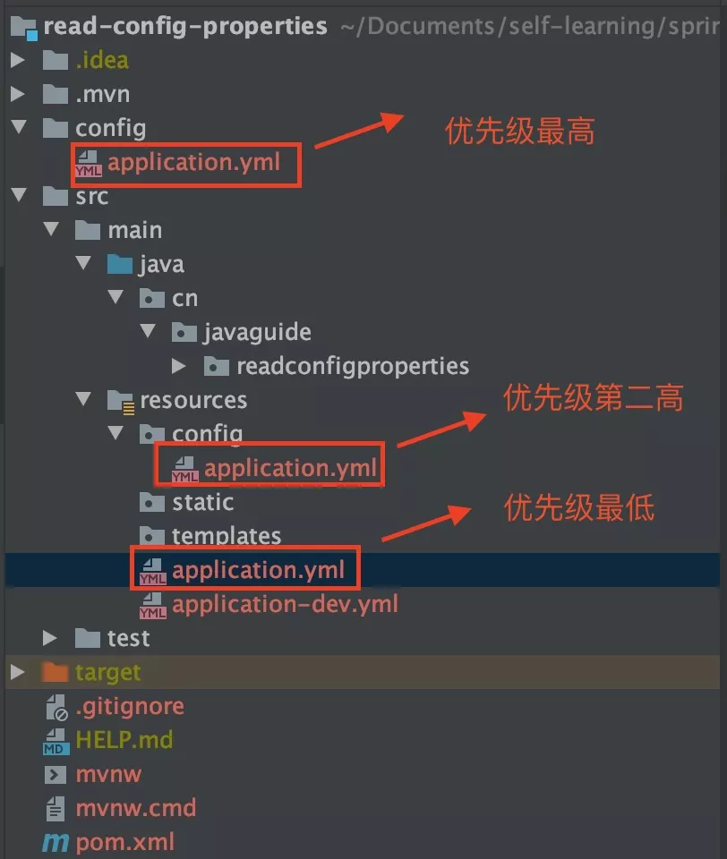

# SpringBoot

## SpringBoot 简介

#### SpringFramework解决了什么问题？

Spring是Java企业版（Java Enterprise Edition，JEE，也称J2EE）的轻量级代替品。无需开发重量级的EnterpriseJavaBean（EJB），Spring为企业级Java开发提供了一种相对简单的方法，通过依赖注入和面向切面编程，用简单的Java对象（Plain Old Java Object，POJO）实现了EJB的功能。

1. 使用Spring的IOC容器,将对象之间的依赖关系交给Spring,降低组件之间的耦合性,让我们更专注于应用逻辑 
2. 可以提供众多服务,事务管理,WS等。 
3. AOP的很好支持,方便面向切面编程。 
4. 对主流的框架提供了很好的集成支持,如Hibernate,Struts2,JPA等 
5. Spring DI机制降低了业务对象替换的复杂性。 
6. Spring属于低侵入,代码污染极低。 
7. Spring的高度可开放性,并不强制依赖于Spring,开发者可以自由选择Spring部分或全部

#### SpringFramework没有解决了什么问题？

虽然Spring的组件代码是轻量级的，但它的配置却是重量级的。一开始，Spring用XML配置，而且是很多XML配置。Spring 2.5引入了基于注解的组件扫描，这消除了大量针对应用程序自身组件的显式XML配置。Spring 3.0引入了基于Java的配置，这是一种类型安全的可重构配置方式，可以代替XML。

所有这些配置都代表了开发时的损耗。因为在思考Spring特性配置和解决业务问题之间需要进行思维切换，所以编写配置挤占了编写应用程序逻辑的时间。和所有框架一样，Spring实用，但与此同时它要求的回报也不少。

除此之外，项目的依赖管理也是一件耗时耗力的事情。在环境搭建时，需要分析要导入哪些库的坐标，而且还需要分析导入与之有依赖关系的其他库的坐标，一旦选错了依赖的版本，随之而来的不兼容问题就会严重阻碍项目的开发进度。

1. jsp中要写很多代码、控制器过于灵活,缺少一个公用控制器 
2. Spring不支持分布式,这也是EJB仍然在用的原因之一

#### SpringBoot解决上述Spring的缺点

SpringBoot对上述Spring的缺点进行的改善和优化，基于约定优于配置的思想，可以让开发人员不必在配置与逻辑业务之间进行思维的切换，全身心的投入到逻辑业务的代码编写中，从而大大提高了开发的效率，一定程度上缩短了项目周期。

1. 为基于Spring的开发提供更快的入门体验
2. 开箱即用，没有代码生成，也无需XML配置。同时也可以修改默认值来满足特定的需求
3. 提供了一些大型项目中常见的非功能性特性，如嵌入式服务器、安全、指标，健康检测、外部配置等

SpringBoot不是对Spring功能上的增强，而是提供了一种快速使用Spring的方式

### SpringBoot的概述

使用过 Spring 的一定有被 XML 配置统治的恐惧。即使 Spring 后面引入了基于注解的配置，在开启某些 Spring 特性或者引入第三方依赖的时候，还是需要用 XML 或 Java 进行显式配置。但是，Spring Boot 项目只需要添加相关依赖，无需配置，通过启动下面的 `main` 方法即可。并且们通过 Spring Boot 的全局配置文件 `application.properties`或`application.yml`即可对项目进行设置比如更换端口号，配置 JPA 属性等等。

Spring Boot 用起来这么方便得益于其自动装配。**自动装配可以说是 Spring Boot 的核心。**

- **起步依赖：** 起步依赖本质上是一个Maven项目对象模型（Project Object Model，POM），定义了对其他库的传递依赖，这些东西加在一起即支持某项功能。简单的说，起步依赖就是将具备某种功能的坐标打包到一起，并提供一些默认的功能。

- **自动配置：** Spring Boot的自动配置是一个运行时（更准确地说，是应用程序启动时）的过程，考虑了众多因素，才决定Spring配置应该用哪个，不该用哪个。该过程是Spring自动完成的。

### 测试工具

**postman**

​	常用于进行简单的接口测试

#### Swagger

使用Swagger仅需按照它的规范去定义接口及接口相关的信息，就可以做到生成接口文档，以及**在线接口调试**页面。官网：https://swagger.io

Yapi是设计阶段使用的工具，用于管理和维护接口；Swagger是在开发阶段使用的框架，帮助后端开发人员做后端的接口测试。

Knife4j 是为Java MVC框架集成Swagger生成Api文档的增强解决方案。

使用方式：

1. 导入 knife4j 的maven坐标
2. 在配置类中加入 knife4j 相关配置
3. 设置静态资源映射，否则接口文档页面无法访问404

1、

```xml
<dependency>
	<groupId>com.github.xiaoymin</groupId>
	<artifactId>knife4j-spring-boot-starter</artifactId>
	<version>${knife4j}</version>
</dependency>
```

2、WebMvcConfiguration

```java
@Bean
    public Docket docket() {
        ApiInfo apiInfo = new ApiInfoBuilder()
                .title("")
                .version("")
                .description("")
                .build();
        Docket docket = new Docket(DocumentationType.SWAGGER_2)
                .apiInfo(apiInfo)
                .select()
            	// 指定生成接口文档需要扫描的包
                .apis(RequestHandlerSelectors.basePackage(""))
                .paths(PathSelectors.any())
                .build();
        return docket;
    }
```

3、WebMvcConfiguration

```java
protected void addResourceHandlers(ResourceHandlerRegistry registry) {
    registry.addResourceHandler("/doc.html").addResourceLocations("classpath:/META-INF/resources/");
    registry.addResourceHandler("/webjars/**").addResourceLocations("classpath:/META-INF/resources/webjars/");
    }
```

**常用注解**

- @Api：用来类上，用来标识这个类是Swagger资源的一部分，表示对类的说明，例如 Controller
  - **tags**：生成的api文档会根据tags分类，即这个controller中的所有接口生成的接口文档都会在tags这个list下；tags如果有多个值，会生成多个list，每个list都显示所有接口
  - **value**：作用类似tags,但是不能有多个值
- @ApiModel：用来类上，表示对类进行说明，用于参数用实体类接收，例如 entity、DTO、VO
  - **value**：实体类的描述值，表示对象名，默认为实体类的名称
  - **description**：描述
- @ApiModelProperty：用在模型类的属性上，描述属性信息
  - **value**: 用于描述属性的简要信息
  - **name**: 允许重写属性的名称
  - **notes**: 对该字段的注释说明
  - **dataType**: 参数的数据类型
  - **required**: 指定参数是否可以为空，默认为 false
  - **position**: 允许显式地对模型中的属性排序
  - **hidden**: 是否允许模型属性隐藏在 Swagger 模型定义中，默认为 false
  - **example**: 属性的示例值
  - **readOnly**: 是否允许将属性指定为只读，默认为 false
  - **allowEmptyValue**: 是否允许传递空值，默认为 false
- @ApiOperation：用在方法上，说明方法的用途、作用，例如Controller的方法
  - **value**：用于方法描述
  - **notes**：用于提示内容
  - **tags**：可以重新分组（视情况而用）
- @ApiParam：用在方法或者参数上，字段说明，表示对参数的添加元数据（说明或是否必填等）
  - **name**：参数名
  - **value**：参数说明
  - **required**：是否必填

## SpringBoot 原理

简化Spring框架的开发而非取代

### 起步依赖

原理：Maven的依赖传递

### 自动装配

现在提到自动装配的时候，一般会和 Spring Boot 联系在一起。但是，实际上 Spring Framework 早就实现了这个功能。Spring Boot 只是在其基础上，通过 SPI 的方式，做了进一步优化。

> SpringBoot 定义了一套接口规范，这套规范规定：SpringBoot 在启动时会扫描外部引用 jar 包中的`META-INF/spring.factories`文件，将文件中配置的类型信息加载到 Spring 容器（此处涉及到 JVM 类加载机制与 Spring 的容器知识），并执行类中定义的各种操作。对于外部 jar 来说，只需要按照 SpringBoot 定义的标准，就能将自己的功能装置进 SpringBoot。
>  自 Spring Boot 3.0 开始，自动配置包的路径从`META-INF/spring.factories` 修改为 `META-INF/spring/org.springframework.boot.autoconfigure.AutoConfiguration.imports`。

简而言之就是当Spring容器启动后，一些配置类、bean对象会自动存入IOC容器中，不需要手动声明，从而简化了开发，省去了繁琐的配置操作。没有 Spring Boot 的情况下，如果我们需要引入第三方依赖，需要手动配置，非常麻烦。但是，Spring Boot 中，我们直接引入一个 starter 即可。比如你想要在项目中使用 redis 的话，直接在项目中引入对应的 starter 即可。

```
<dependency>
    <groupId>org.springframework.boot</groupId>
    <artifactId>spring-boot-starter-data-redis</artifactId>
</dependency>
```

引入 starter 之后，我们通过少量注解和一些简单的配置就能使用第三方组件提供的功能了。

自动装配可以简单理解为：**通过注解或者一些简单的配置就能在 Spring Boot 的帮助下实现某块功能。**

## 自动配置

### 配置文件


.yml (.yaml) 文件取代 .properties 文件：

- 层级表示更清晰
- 更关注数据

#### yml配置信息的书写与获取

- 三方技术配置信息

- 自定义配置信息

  - 书写配置文件——减少耦合！

    - 值前必须有空格作为分隔符
    - 使用空格作为缩进表示层级关系，相同的层级左侧堆对齐

  - 获取配置信息：

    - @Value("${ 前缀.键名 }")——麻烦

    - @ConfigurationProperties(prefix="前缀")，且实体类的成员变量名与配置文件中的键名保持一致

#### 配置优先级

properties > yml > yaml

SpringBoot 除了支持配置文件配置属性，还支持 **Java系统属性**(VM options) 和**命令行参数**(Program arguments) 的方式进行属性配置

### Bean管理

- Bean扫描
  - 标签：<context:component-scan base-package=""/>
  - 注解：@ComponentScan(basePackage="") —— 包含于 @SpringBootApplication（默认扫描该类所在的包及其子包）

- Bean注册
  - @Bean :  将方法返回值交给IOC容器管理，成为IOC容器的Bean对象；如果要注册的bean对象来自第三方（不是自定义的，如导入的jar包），是无法使用@Component及衍生注解声明bean的；  如果要注册第三方bean，建议在配置类@Configuration（放于启动类所在包及其子包）中集中注册；  如果方法的内部需要用到IOC容器中已存在的Bean对象，那么仅需在方法上声明@Bean即可，spring会自动注入
  - @Import(Xxx.class) :  导入配置类；导入 ImportSelector 接口实现类
    - @EnableCommonConfig
- 注册条件
  - 设置注册生效条件的注解 @Conditional；`@ConditionalOnProperty(prefix="", name={"", ""})` 配置文件中存在对应的属性，才声明该bean；`@ConditionalOnMissingBean(Xxx.class)` 当不存在当前类型的bean，才声明；`@ConditionalOnClass(name="XxXx")` 当环境存在指定的这个类，才声明

### 自动配置原理

 AutoConfigurationImportSelector.class

org.springframework.boot.autoconfigure.AutoConfiguration.imports

@EnableAutoConfiguration

### 自定义starter

实际开发中经常会定义一些公共组件，提供给各个项目团队使用，一般会将这些公共组件封装为 SpringBoot 的 starter。例如 实现自定义线程池：

1. 创建`threadpool-spring-boot-starter`工程
2. 引入 Spring Boot 相关依赖
3. 创建`ThreadPoolAutoConfiguration`
4. 在`threadpool-spring-boot-starter`工程的 resources 包下创建`META-INF/spring.factories`文件
5. 新建工程引入`threadpool-spring-boot-starter`

### 总结

Spring Boot 通过`@EnableAutoConfiguration`开启自动装配，通过 SpringFactoriesLoader 最终加载`META-INF/spring.factories`中的自动配置类实现自动装配，自动配置类其实就是通过`@Conditional`按需加载的配置类，想要其生效必须引入`spring-boot-starter-xxx`包实现起步依赖

## 常用注解

### @SprintBootApplication

是Spring Boot应用中的核心注解，可以看作是 `@Configuration`、`@EnableAutoConfiguration`、`@ComponentScan` 注解的集合，实现了自动配置和应用启动的功能。这个注解是 Spring Boot 项目的基石，创建 SpringBoot 项目之后会默认在主类加上，标识着应用的入口点。我们一般不会主动去使用它。

- `@EnableAutoConfiguration`：启用 SpringBoot 的自动配置机制
- `@ComponentScan`：扫描被`@Component` (`@Repository`,`@Service`,`@Controller`)注解的 bean，注解默认会扫描该类所在的包下所有的类
- `@Configuration`：允许在 Spring 上下文中注册额外的 bean 或导入其他配置类
  - 可以使用 `@Component`注解替代，不过使用`@Configuration`注解声明配置类更加语义化


###  Spring Bean 相关

#### `@Autowired`

自动导入对象到类中，被注入进的类同样要被 Spring 容器管理比如：Service 类注入到 Controller 类中。

#### `@Component`,`@Repository`,`@Service`, `@Controller`

一般使用 `@Autowired` 注解让 Spring 容器帮我们自动装配 bean。要想把类标识成可用于 `@Autowired` 注解自动装配的 bean 的类,可以采用以下注解实现：

- `@Component`：通用的注解，可标注任意类为 `Spring` 组件。如果一个 Bean 不知道属于哪个层，可以使用`@Component` 注解标注。
- `@Repository` : 对应持久层即 Dao 层，主要用于数据库相关操作。
- `@Service` : 对应服务层，主要涉及一些复杂的逻辑，需要用到 Dao 层。
- `@Controller` : 对应 Spring MVC 控制层，主要用于接受用户请求并调用 Service 层返回数据给前端页面。

#### `@RestController`

`@RestController`注解是`@Controller`和`@ResponseBody`的合集,表示这是个控制器 bean,并且是将函数的返回值以JSON或XML的形式直接填入 HTTP 响应体中,是 REST 风格的控制器。

*现在都是前后端分离，说实话已经很久没有用过`@Controller`。*

单独使用 `@Controller` 不加 `@ResponseBody`的话一般是用在要返回一个视图的情况，这种情况属于比较传统的 Spring MVC 的应用，对应于前后端不分离的情况。`@Controller` +`@ResponseBody` 返回 JSON 或 XML 形式数据。

#### `@Scope`

声明 Spring Bean 的作用域。

**四种常见的 Spring Bean 的作用域：**

- singleton : 唯一 bean 实例，Spring 中的 bean 默认都是单例的。
- prototype : 每次请求都会创建一个新的 bean 实例。
- request : 每一次 HTTP 请求都会产生一个新的 bean，该 bean 仅在当前 HTTP request 内有效。
- session : 每一个 HTTP Session 会产生一个新的 bean，该 bean 仅在当前 HTTP session 内有效。

### 处理常见的 HTTP 请求类型

**5 种常见的请求类型:**

- **GET**：请求从服务器获取特定资源。举个例子：`GET /users`（获取所有学生）
- **POST**：在服务器上创建一个新的资源。举个例子：`POST /users`（创建学生）
- **PUT**：更新服务器上的资源（客户端提供更新后的整个资源）。举个例子：`PUT /users/12`（更新编号为 12 的学生）
- **DELETE**：从服务器删除特定的资源。举个例子：`DELETE /users/12`（删除编号为 12 的学生）
- **PATCH**：更新服务器上的资源（客户端提供更改的属性，可以看做作是部分更新），使用的比较少，就不举例子了。

**GET 请求**

`@GetMapping("users")` 等价于`@RequestMapping(value="/users",method=RequestMethod.GET)`

**POST 请求**

`@PostMapping("users")` 等价于`@RequestMapping(value="/users",method=RequestMethod.POST)`

**PUT 请求**

`@PutMapping("/users/{userId}")` 等价于`@RequestMapping(value="/users/{userId}",method=RequestMethod.PUT)`

**DELETE 请求**

`@DeleteMapping("/users/{userId}")`等价于`@RequestMapping(value="/users/{userId}",method=RequestMethod.DELETE)`

**PATCH 请求**

一般实际项目中，我们都是 PUT 不够用了之后才用 PATCH 请求去更新数据。

### 前后端传值

#### `@PathVariable` 和 `@RequestParam`

`@PathVariable`用于获取路径参数，`@RequestParam`用于获取查询参数。

#### `@RequestBody`

@RequestBody是作用在形参列表上，用于读取 Request 请求（可能是 POST,PUT,DELETE,GET 请求）的 body 部分并且**Content-Type 为 application/json** 格式的数据，接收到数据之后会自动将数据绑定到 Java 对象上去。系统会使用`HttpMessageConverter`或者自定义的`HttpMessageConverter`将请求的 body 中的 json 字符串转换为 java 对象。

主要用来接收前端传递给后端的json字符串中的数据的(请求体中的数据的)，而最常用的使用请求体传参的无疑是POST请求了，所以使用@RequestBody接收数据时，一般都用POST方式进行提交。在后端的同一个接收方法里，`@RequestBody`与`@RequestParam()`可以同时使用，`@RequestBody`最多只能有一个，如果你的方法必须要用两个 `@RequestBody`来接受数据的话，大概率是你的数据库设计或者系统设计出问题了！而`@RequestParam`和`@PathVariable`可以有多个。

### 读取配置信息

#### `@Value`(常用)

使用 `@Value("${property}")` 读取比较简单的配置信息

**需要注意的是`@value`这种方式是不被推荐的**

#### `@ConfigurationProperties`(常用)

通过`@ConfigurationProperties`读取配置信息并与 bean 绑定，可以像使用普通的 Spring bean 一样，将**配置文件中的属性**绑定到Spring的Beans上注入到类中使用。

`@EnableConfigurationProperties`注册配置 bean

**Spring 比较建议此种读取配置信息的方式**

####  `@PropertySource`（不常用）



### 参数校验

**数据的校验的重要性就不用说了，即使在前端对数据进行校验的情况下，我们还是要对传入后端的数据再进行一遍校验，避免用户绕过浏览器直接通过一些 HTTP 工具直接向后端请求一些违法数据。**

#### 一些常用的字段验证的注解

- `@NotEmpty` 被注释的字符串的不能为 null 也不能为空
- `@NotBlank` 被注释的字符串非 null，并且必须包含一个非空白字符
- `@Null` 被注释的元素必须为 null
- `@NotNull` 被注释的元素必须不为 null
- `@AssertTrue` 被注释的元素必须为 true
- `@AssertFalse` 被注释的元素必须为 false
- `@Pattern(regex=,flag=)`被注释的元素必须符合指定的正则表达式
- `@Email` 被注释的元素必须是 Email 格式。
- `@Min(value)`被注释的元素必须是一个数字，其值必须大于等于指定的最小值
- `@Max(value)`被注释的元素必须是一个数字，其值必须小于等于指定的最大值
- `@DecimalMin(value)`被注释的元素必须是一个数字，其值必须大于等于指定的最小值
- `@DecimalMax(value)` 被注释的元素必须是一个数字，其值必须小于等于指定的最大值
- `@Size(max=, min=)`被注释的元素的大小必须在指定的范围内
- `@Digits(integer, fraction)`被注释的元素必须是一个数字，其值必须在可接受的范围内
- `@Past`被注释的元素必须是一个过去的日期
- `@Future` 被注释的元素必须是一个将来的日期
- ……

#### 验证请求体(RequestBody)

在需要验证的参数上加上`@Valid`注解，如果验证失败，它将抛出`MethodArgumentNotValidException`。

#### 验证请求参数(Path Variables 和 Request Parameters)

**一定一定不要忘记在类上加上 `@Validated` 注解，这个参数可以告诉 Spring 去校验方法参数。**

### 全局处理 Controller 层异常

介绍一下 Spring 项目必备的全局处理 Controller 层异常。

**相关注解：**

1. `@ControllerAdvice` :注解定义全局异常处理类
2. `@ExceptionHandler` :注解声明异常处理方法

#### `@RestControllerAdvice`

它结合了`@ControllerAdvice`和`@ResponseBody`的功能，专门用于构建RESTful API服务时的全局异常处理。这个注解允许开发者在一个集中的地方处理所有控制器层抛出的异常，并且能够统一错误响应格式。

#### `@ExceptionHandler`

是用于处理控制器 (Controller) 中抛出的异常。可以实现对特定异常的捕获和处理，可以减少代码中的异常处理逻辑。

### JPA 相关

`@Entity`声明一个类对应一个数据库实体。

`@Table` 设置表名

`@Id`：声明一个字段为主键。

- **通过 `@GeneratedValue`直接使用 JPA 内置提供的四种主键生成策略来指定主键生成策略。**
- **通过 `@GenericGenerator`声明一个主键策略，然后 `@GeneratedValue`使用这个策略**

`@Column` 声明字段。

`@Transient`：声明不需要与数据库映射的字段，在保存的时候不需要保存进数据库 。

`@Lob`:声明某个字段为大字段。

可以使用枚举类型的字段，不过枚举字段要用`@Enumerated`注解修饰。

只要继承了 `AbstractAuditBase`的类都会默认加上四个字段：

1. `@CreatedDate`: 表示该字段为创建时间字段，在这个实体被 insert 的时候，会设置值

2. `@CreatedBy` :表示该字段为创建人，在这个实体被 insert 的时候，会设置值

   1. `@LastModifiedDate`、`@LastModifiedBy`同理。

   `@EnableJpaAuditing`：开启 JPA 审计功能。

`@Modifying` 注解提示 JPA 该操作是修改操作,注意还要配合`@Transactional`注解使用。

关联关系：

- `@OneToOne` 声明一对一关系
- `@OneToMany` 声明一对多关系
- `@ManyToOne` 声明多对一关系
- `@ManyToMany` 声明多对多关系

### 事务

在要开启事务的方法上使用`@Transactional`注解即可。`@EnableTransactionManagement`是Spring框架中用于开启声明式事务管理的注解。在Spring Boot项目中，通过使用这个注解，可以启用事务支持，进而在访问数据库的Service方法上添加 `@Transactional` 注解来控制事务的提交和回滚。

 Exception 分为运行时异常 RuntimeException 和非运行时异常。在`@Transactional`注解中如果不配置`rollbackFor`属性,那么事务只会在遇到`RuntimeException`的时候才会回滚，加上`rollbackFor=Exception.class`，可以让事务在遇到非运行时异常时也回滚。

`@Transactional` 注解一般可以作用在`类`或者`方法`上。

- **作用于类**：当把`@Transactional` 注解放在类上时，表示所有该类的 public 方法都配置相同的事务属性信息。
- **作用于方法**：当类配置了`@Transactional`，方法也配置了`@Transactional`，方法的事务会覆盖类的事务配置信息。

### json 数据处理

#### 过滤 json 数据

**`@JsonIgnoreProperties` 作用在类上用于过滤掉特定字段不返回或者不解析。**

**`@JsonIgnore`一般用于类的属性上，作用和上面的`@JsonIgnoreProperties` 一样。**

#### 格式化 json 数据

`@JsonFormat`一般用来格式化 json 数据。

#### 扁平化对象

使用`@JsonUnwrapped` 扁平对象。

### 测试相关

**`@ActiveProfiles`一般作用于测试类上， 用于声明生效的 Spring 配置文件。**

**`@Test`声明一个方法为测试方法**

**`@Transactional`被声明的测试方法的数据会回滚，避免污染测试数据。**

**`@WithMockUser` Spring Security 提供的，用来模拟一个真实用户，并且可以赋予权限。**

## Mybatis 持久层框架

### 步骤

#### 1. 引入依赖

```xml
<!-- mysql 的驱动依赖 -->
<dependency>
            <groupId>mysql</groupId>
            <artifactId>mysql-connector-java</artifactId>
            <scope>runtime</scope>
            <version>8.0.xx</version><!-- MYSQL 8 以上把版本对应就好 -->
</dependency>

<!-- mybatis 的起步依赖 -->
<dependency>
            <groupId>org.mybatis.spring.boot</groupId>
            <artifactId>mybatis-spring-boot-starter</artifactId>
    		<version>3.0.0</version>
</dependency>
```

#### 2.配置数据源信息

### Mapper

在不使用@MapperScan前，我们需要直接在Mapper类上面添加注解@Mapper，这种方式要求每一个Mapper类都需要添加此注解，非常麻烦，属于重复劳动。通过使用@MapperScan注解，可以让我们不用为每个Mapper类都添加@Mapper注解。

### 报错解决整理

1. **java.sql.SQLException: Incorrect string value: '\xE6\x88\x91\xE7\x9A\x84...' for column 'groupName' at row 1**
   1. 创建数据库的时候数据编码设置错误 / 连接数据库的时候数据编码设置错误 / 创建表的时候数据编码设置错误
      1. create table (...)  **charset utf8 collate utf8_general_ci;**
