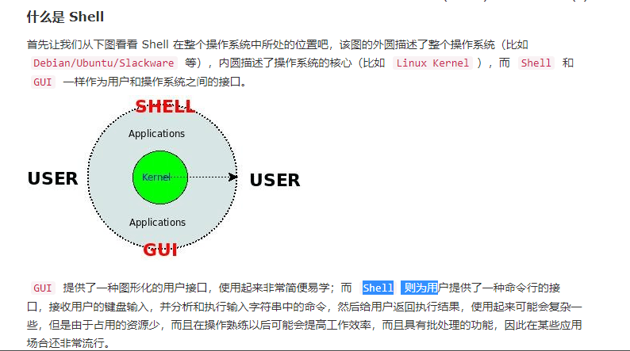

# Shell脚本编程

## Shell 变量

**Shell 编程中一般分为三种变量：**

1. **我们自己定义的变量（自定义变量）:** 仅在当前 Shell 实例中有效，其他 Shell 启动的程序不能访问局部变量。
2. **Linux 已定义的环境变量**（环境变量， 例如：`PATH`, `HOME` 等..., 这类变量我们可以直接使用），使用 `env` 命令可以查看所有的环境变量，而 set 命令既可以查看环境变量也可以查看自定义变量。
3. **Shell 变量**：Shell 变量是由 Shell 程序设置的特殊变量。Shell 变量中有一部分是环境变量，有一部分是局部变量，这些变量保证了 Shell 的正常运行

**常用的环境变量:**

> PATH 决定了 shell 将到哪些目录中寻找命令或程序
>  HOME 当前用户主目录
>  HISTSIZE 　历史记录数
>  LOGNAME 当前用户的登录名
>  HOSTNAME 　指主机的名称
>  SHELL 当前用户 Shell 类型
>  LANGUAGE 　语言相关的环境变量，多语言可以修改此环境变量
>  MAIL 　当前用户的邮件存放目录
>  PS1 　基本提示符，对于 root 用户是#，对于普通用户是$

**使用 Linux 已定义的环境变量：**

比如要看当前用户目录可以使用：`echo $HOME`命令；如果要看当前用户 Shell 类型 可以使用`echo $SHELL`命令。可以看出，使用方法非常简单。

**Shell 编程中的变量名的命名的注意事项：**

- 命名只能使用英文字母，数字和下划线，首个字符不能以数字开头，但是可以使用下划线（_）开头。
- 中间不能有空格，可以使用下划线（_）。
- 不能使用标点符号。
- 不能使用 bash 里的关键字（可用 help 命令查看保留关键字）。

## 命令行

ps -ef	ps -l

kill + PID	pkill + 程序名

## 环境变量

允许在内存中存储数据，以便shell中运行的程序或脚本能轻松访问到这些数据。

按照作用域来分，环境变量可以简单的分成:

- 用户级别环境变量 : `~/.bashrc`、`~/.bash_profile`。
- 系统级别环境变量 : `/etc/bashrc`、`/etc/environment`、`/etc/profile`、`/etc/profile.d`。

上述配置文件执行先后顺序为：`/etc/environment` –> `/etc/profile` –> `/etc/profile.d` –> `~/.bash_profile` –> `/etc/bashrc` –> `~/.bashrc`

## 脚本

- 将输出赋给变量：

​	testing = 反引号 date 反引号

​	testing = $(date)

- '>' ：命令输出保存至指定输出文件，若文件已存在则覆盖
- '>>' ：同上但不覆盖，而是追加
- '<' ：输入其余同上上
- '<<' ：内联输入重定向。无须使用文件进行重定向，只需要在命令行中指定相关数据即可，且必须指定一个文本标记来划分起 (EOF)
- ￥? ：保存最后一个已执行命令的退出状态码
- exit ：允许在脚本结束时指定一个退出状态码