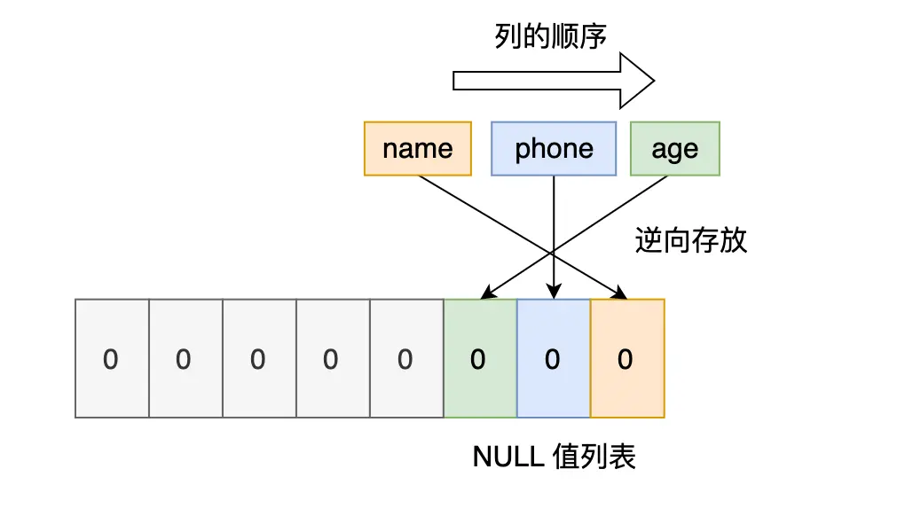
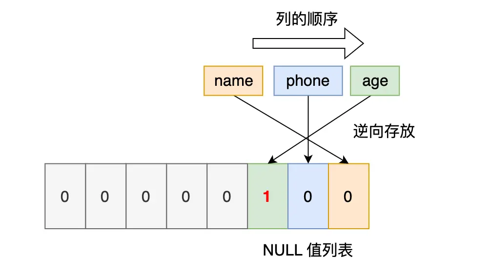

# MySQL

**底层和高性能**

## MySQL索引详解

数据库索引这个知识点在面试中出现的频率高到离谱。

除了对于准备面试来说非常重要之外，善用索引对 SQL 的性能提升非常明显，是一个性价比较高的 SQL 优化手段。

### MySQL隐式转换造成索引失效

数据库优化是一个任重而道远的任务，想要做优化必须深入理解数据库的各种特性。在开发过程中我们经常会遇到一些原因很简单但造成的后果却很严重的疑难杂症，这类问题往往还不容易定位，排查费时费力最后发现是一个很小的疏忽造成的，又或者是因为不了解某个技术特性产生的。

于数据库层面，最常见的恐怕就是索引失效了，且一开始因为数据量小还不易被发现。但随着业务的拓展数据量的提升，性能问题慢慢的就体现出来了，处理不及时还很容易造成雪球效应，最终导致数据库卡死甚至瘫痪。造成索引失效的原因可能有很多种，相关技术博客已经有太多了，今天要记录的是**隐式转换造成的索引失效**。

## MySQL事务详解

### 不可重复读和幻读有什么区别？

- 不可重复读的重点是内容修改或者记录减少比如多次读取一条记录发现其中某些记录的值被修改；
- 幻读的重点在于记录新增比如多次执行同一条查询语句（DQL）时，发现查到的记录增加了。

幻读其实可以看作是不可重复读的一种特殊情况，单独把幻读区分出来的原因主要是解决幻读和不可重复读的方案不一样。

举个例子：执行 `delete` 和 `update` 操作的时候，可以直接对记录加锁，保证事务安全。而执行 `insert` 操作的时候，由于记录锁（Record Lock）只能锁住已经存在的记录，为了避免插入新记录，需要依赖间隙锁（Gap Lock）。也就是说执行 `insert` 操作的时候需要依赖 Next-Key Lock（Record Lock+Gap Lock） 进行加锁来保证不出现幻读。

### 并发事务的控制方式有哪些？

MySQL 中并发事务的控制方式无非就两种：**锁** 和 **MVCC**。锁可以看作是悲观控制的模式，多版本并发控制（MVCC，Multiversion concurrency control）可以看作是乐观控制的模式。

**锁** 控制方式下会通过锁来显式控制共享资源而不是通过调度手段，MySQL 中主要是通过 **读写锁** 来实现并发控制。

- **共享锁（S 锁）**：又称读锁，事务在读取记录的时候获取共享锁，允许多个事务同时获取（锁兼容）。
- **排他锁（X 锁）**：又称写锁/独占锁，事务在修改记录的时候获取排他锁，不允许多个事务同时获取。如果一个记录已经被加了排他锁，那其他事务不能再对这条记录加任何类型的锁（锁不兼容）。

读写锁可以做到读读并行，但是无法做到写读、写写并行。另外，根据根据锁粒度的不同，又被分为 **表级锁(table-level locking)** 和 **行级锁(row-level locking)** 。InnoDB 不光支持表级锁，还支持行级锁，默认为行级锁。行级锁的粒度更小，仅对相关的记录上锁即可（对一行或者多行记录加锁），所以对于并发写入操作来说， InnoDB 的性能更高。不论是表级锁还是行级锁，都存在共享锁（Share Lock，S 锁）和排他锁（Exclusive Lock，X 锁）这两类。

**MVCC** 是多版本并发控制方法，即对一份数据会存储多个版本，通过事务的可见性来保证事务能看到自己应该看到的版本。通常会有一个全局的版本分配器来为每一行数据设置版本号，版本号是唯一的。

MVCC 在 MySQL 中实现所依赖的手段主要是: **隐藏字段、read view、undo log**。

- undo log : undo log 用于记录某行数据的多个版本的数据。
- read view 和 隐藏字段 : 用来判断当前版本数据的可见性。

### MySQL事务隔离级别

SQL 标准定义了四个隔离级别：

- **READ-UNCOMMITTED(读取未提交)** ：最低的隔离级别，允许读取尚未提交的数据变更，可能会导致脏读、幻读或不可重复读。
- **READ-COMMITTED(读取已提交)** ：允许读取并发事务已经提交的数据，可以阻止脏读，但是幻读或不可重复读仍有可能发生。
- **REPEATABLE-READ(可重复读)** ：对同一字段的多次读取结果都是一致的，除非数据是被本身事务自己所修改，可以阻止脏读和不可重复读，但幻读仍有可能发生。
- **SERIALIZABLE(可串行化)** ：最高的隔离级别，完全服从 ACID 的隔离级别。所有的事务依次逐个执行，这样事务之间就完全不可能产生干扰，也就是说，该级别可以防止脏读、不可重复读以及幻读。

### MySQL 的隔离级别是基于锁实现的吗？

MySQL 的隔离级别基于锁和 MVCC 机制共同实现的。

SERIALIZABLE 隔离级别是通过锁来实现的，READ-COMMITTED 和 REPEATABLE-READ 隔离级别是基于 MVCC 实现的。不过， SERIALIZABLE 之外的其他隔离级别可能也需要用到锁机制，就比如 REPEATABLE-READ 在当前读情况下需要使用加锁读来保证不会出现幻读。

### MySQL 的默认隔离级别是什么?

MySQL InnoDB 存储引擎的默认支持的隔离级别是 **REPEATABLE-READ（可重读）**。可以通过`SELECT @@tx_isolation;`命令来查看，MySQL 8.0 该命令改为`SELECT @@transaction_isolation;`

## MySQL日期类型选择建议

平时开发中不可避免的就是要存储时间，比如要记录操作表中这条记录的时间、记录转账的交易时间、记录出发时间、用户下单时间等等。时间这个东西与我们开发的联系还是非常紧密的，用的好与不好会给我们的业务甚至功能带来很大的影响。所以，有必要重新出发，好好认识一下这个东西。

### 不要用字符串存储日期

毕竟简单直白，容易上手。

但是，这是不正确的做法，主要会有下面两个问题：

1. 字符串占用的空间更大！
2. 字符串存储的日期效率比较低（逐个字符进行比对），无法用日期相关的 API 进行计算和比较。

### Datetime 和 Timestamp 之间的抉择

Datetime 和 Timestamp 是 MySQL 提供的两种比较相似的保存时间的数据类型，可以精确到秒。他们两者究竟该如何选择呢？

#### 时区信息

**DateTime 类型是没有时区信息的（时区无关）** ，DateTime 类型保存的时间都是当前会话所设置的时区对应的时间。这样就会有什么问题呢？当你的时区更换之后，比如你的服务器更换地址或者更换客户端连接时区设置的话，就会导致你从数据库中读出的时间错误。

**Timestamp 和时区有关**。Timestamp 类型字段的值会随着服务器时区的变化而变化，自动换算成相应的时间，说简单点就是在不同时区，查询到同一个条记录此字段的值会不一样。

**扩展：一些关于 MySQL 时区设置的一个常用 sql 命令**

```sql
# 查看当前会话时区
SELECT @@session.time_zone;
# 设置当前会话时区
SET time_zone = 'Europe/Helsinki';
SET time_zone = "+00:00";
# 数据库全局时区设置
SELECT @@global.time_zone;
# 设置全局时区
SET GLOBAL time_zone = '+8:00';
SET GLOBAL time_zone = 'Europe/Helsinki';
```

#### 占用空间

MySQL 日期类型所占的存储空间（官方文档传送门：[https://dev.mysql.com/doc/refman/8.0/en/storage-requirements.htmlopen in new window](https://dev.mysql.com/doc/refman/8.0/en/storage-requirements.html)）：

在 MySQL 5.6.4 之前，DateTime 和 Timestamp 的存储空间是固定的，分别为 8 字节和 4 字节。但是从 MySQL 5.6.4 开始，它们的存储空间会根据毫秒精度的不同而变化，DateTime 的范围是 5~8 字节，Timestamp 的范围是 4~7 字节。

#### 表示范围

Timestamp 表示的时间范围更小，只能到 2038 年：

- DateTime：1000-01-01 00:00:00.000000 ~ 9999-12-31 23:59:59.499999
- Timestamp：1970-01-01 00:00:01.000000 ~ 2038-01-19 03:14:07.499999

#### 性能

由于 TIMESTAMP 需要根据时区进行转换，所以从毫秒数转换到 TIMESTAMP 时，不仅要调用一个简单的函数，还要调用操作系统底层的系统函数。这个系统函数为了保证操作系统时区的一致性，需要进行加锁操作，这就降低了效率。

DATETIME 不涉及时区转换，所以不会有这个问题。

为了避免 TIMESTAMP 的时区转换问题，建议使用指定的时区，而不是依赖于操作系统时区。

### 数值时间戳是更好的选择吗？

很多时候，也会使用 int 或者 bigint 类型的数值也就是数值时间戳来表示时间。

这种存储方式的具有 Timestamp 类型的所具有一些优点，并且使用它的进行日期排序以及对比等操作的效率会更高，跨系统也很方便，毕竟只是存放的数值。缺点也很明显，就是数据的可读性太差了，你无法直观的看到具体时间。

时间戳的定义如下：

> 时间戳的定义是从一个基准时间开始算起，这个基准时间是「1970-1-1 00:00:00 +0:00」，从这个时间开始，用整数表示，以秒计时，随着时间的流逝这个时间整数不断增加。这样一来，我只需要一个数值，就可以完美地表示时间了，而且这个数值是一个绝对数值，即无论的身处地球的任何角落，这个表示时间的时间戳，都是一样的，生成的数值都是一样的，并且没有时区的概念，所以在系统的中时间的传输中，都不需要进行额外的转换了，只有在显示给用户的时候，才转换为字符串格式的本地时间。

数据库中实际操作：

```sql
mysql> select UNIX_TIMESTAMP('2020-01-11 09:53:32');
+---------------------------------------+
| UNIX_TIMESTAMP('2020-01-11 09:53:32') |
+---------------------------------------+
|                            1578707612 |
+---------------------------------------+
1 row in set (0.00 sec)

mysql> select FROM_UNIXTIME(1578707612);
+---------------------------+
| FROM_UNIXTIME(1578707612) |
+---------------------------+
| 2020-01-11 09:53:32       |
+---------------------------+
1 row in set (0.01 sec)
```

很多程序员会觉得数值型时间戳是真的好，效率又高还各种兼容，但是很多人又觉得它表现的不够直观。《高性能 MySQL 》这本神书的作者就是推荐 Timestamp，原因是数值表示时间不够直观。

每种方式都有各自的优势，根据实际场景选择最合适的才是王道。下面再对这三种方式做一个简单的对比，以供大家实际开发中选择正确的存放时间的数据类型：

| 类型         | 存储空间 | 日期格式                       | 日期范围                                                     | 是否带时区信息 |
| ------------ | -------- | ------------------------------ | ------------------------------------------------------------ | -------------- |
| DATETIME     | 5~8 字节 | YYYY-MM-DD hh:mm:ss[.fraction] | 1000-01-01 00:00:00[.000000] ～ 9999-12-31 23:59:59[.999999] | 否             |
| TIMESTAMP    | 4~7 字节 | YYYY-MM-DD hh:mm:ss[.fraction] | 1970-01-01 00:00:01[.000000] ～ 2038-01-19 03:14:07[.999999] | 是             |
| 数值型时间戳 | 4 字节   | 全数字如 1578707612            | 1970-01-01 00:00:01 之后的时间                               | 否             |

## InnoDB存储引擎对MVCC的实现

多版本并发控制 (Multi-Version Concurrency Control)

MVCC 是一种并发控制机制，用于在多个并发事务同时读写数据库时保持数据的一致性和隔离性。它是通过在每个数据行上维护多个版本的数据来实现的。当一个事务要对数据库中的数据进行修改时，MVCC 会为该事务创建一个数据快照，而不是直接修改实际的数据行。

## MySQL自增主键一定是连续的吗

众所周知，自增主键可以让聚集索引尽量地保持递增顺序插入，避免了随机查询，从而提高了查询效率。

但实际上，MySQL 的自增主键并不能保证一定是连续递增的。

## MySQL 数据库优化

### MySQL隐式转换造成索引失效

数据库优化是一个任重而道远的任务，想要做优化必须深入理解数据库的各种特性。在开发过程中经常会遇到一些原因很简单但造成的后果却很严重的疑难杂症，这类问题往往还不容易定位，排查费时费力最后发现是一个很小的疏忽造成的，又或者是因为不了解某个技术特性产生的。

于数据库层面，最常见的恐怕就是索引失效了，且一开始因为数据量小还不易被发现。但随着业务的拓展数据量的提升，性能问题慢慢的就体现出来了，处理不及时还很容易造成雪球效应，最终导致数据库卡死甚至瘫痪。造成索引失效的原因可能有很多种，相关技术博客已经有太多了，今天要记录的是**隐式转换造成的索引失效**。

### 读写分离和分库分表详解

**读写分离主要是为了将对数据库的读写操作分散到不同的数据库节点上。** 这样的话，就能够小幅提升写性能，大幅提升读性能。

### 数据冷热分离详解

数据冷热分离是指根据数据的访问频率和业务重要性，将数据分为冷数据和热数据，冷数据一般存储在存储在低成本、低性能的介质中，热数据高性能存储介质中。

### 深度分页介绍及优化建议

查询偏移量过大的场景我们称为深度分页，这会导致查询性能较低

#### 深度分页问题的原因


## SQL语句在MySQL中的执行过程

### 执行一条 select 语句，期间发生了什么？👇

### MySQL 基本架构

- **连接器：** 身份认证和权限相关(登录 MySQL 的时候)。
- **查询缓存：** 执行查询语句的时候，会先查询缓存（MySQL 8.0 版本后移除，因为这个功能不太实用）。
- **分析器：** 没有命中缓存的话，SQL 语句就会经过分析器，分析器说白了就是要先看你的 SQL 语句要干嘛，再检查你的 SQL 语句语法是否正确。
- **优化器：** 按照 MySQL 认为最优的方案去执行。
- **执行器：** 执行语句，然后从存储引擎返回数据。

简单来说 MySQL 主要分为 Server 层和存储引擎层：

- **Server 层负责建立连接、分析和执行 SQL**：主要包括连接器、查询缓存、分析器、优化器、执行器等，所有跨存储引擎的功能都在这一层实现，比如存储过程、触发器、视图，函数等，还有一个通用的日志模块 binlog 日志模块。
- **存储引擎层负责数据的存储和提取**：主要负责数据的存储和读取，采用可以替换的插件式架构，支持 InnoDB、MyISAM、Memory 等多个存储引擎，其中 InnoDB 引擎有自有的日志模块 redolog 模块。**现在最常用的存储引擎是 InnoDB，它从 MySQL 5.5 版本开始就被当做默认存储引擎了。**常说的索引数据结构，就是由存储引擎层实现的，不同的存储引擎支持的索引类型也不相同，比如 InnoDB 支持索引类型是 B+树 ，且是默认使用，也就是说在数据表中创建的主键索引和二级索引默认使用的是 B+ 树索引。

#### MySQL 执行流程


#### 第一步：连接器

连接器主要和身份认证和权限相关的功能相关。主要负责用户登录数据库，进行用户的身份认证，包括校验账户密码，权限等操作，如果用户账户密码已通过，连接器会到权限表中查询该用户的所有权限，之后在这个连接里的权限逻辑判断都是会依赖此时读取到的权限数据，也就是说，后续只要这个连接不断开，即使管理员修改了该用户的权限，该用户也是不受影响的。

在 Linux 操作系统里要使用 MySQL，第一步肯定是要先连接 MySQL 服务，然后才能执行 SQL 语句，普遍都是使用下面这条命令进行连接：

```shell
# -h 指定 MySQL 服务得 IP 地址，如果是连接本地的 MySQL服务，可以不用这个参数；
# -u 指定用户名，管理员角色名为 root；
# -p 指定密码，如果命令行中不填写密码（为了密码安全，建议不要在命令行写密码），就需要在交互对话里面输入密码
mysql -h$ip -u$user -p
```

连接的过程需要先经过 TCP 三次握手，因为 MySQL 是基于 TCP 协议进行传输的

如果 MySQL 服务正常运行，且用户密码都没有问题，连接器就会获取该用户的权限，然后保存起来，后续该用户在此连接里的任何操作，都会基于连接开始时读到的权限进行权限逻辑的判断。所以，如果一个用户已经建立了连接，即使管理员中途修改了该用户的权限，也不会影响已经存在连接的权限。修改完成后，只有再新建的连接才会使用新的权限设置。

可以执行 `show processlist` 命令查看当前 MySQL 服务被多少个客户端连接了

<u>*空闲连接会一直占用着吗？*</u>

当然不是了，MySQL 定义了空闲连接的最大空闲时长，由 `wait_timeout` 参数控制的，默认值是 8 小时（28880秒），如果空闲连接超过了这个时间，连接器就会自动将它断开

```sql
mysql> show variables like 'wait_timeout';
+---------------+-------+
| Variable_name | Value |
+---------------+-------+
| wait_timeout  | 28800 |
+---------------+-------+
1 row in set (0.00 sec)
```

当然，也可以使用 kill connection + id 的命令手动断开空闲的连接

```sql
mysql> kill connection +6;
Query OK, 0 rows affected (0.00 sec)
```

一个处于空闲状态的连接被服务端主动断开后，这个客户端并不会马上知道，等到客户端在发起下一个请求的时候，才会收到这样的报错“ERROR 2013 (HY000): Lost connection to MySQL server during query”。

*<u>MySQL 的连接数有限制吗？</u>*

MySQL 服务支持的最大连接数由 max_connections 参数控制

MySQL 的连接也跟 HTTP 一样，有短连接和长连接的概念，区别如下：

```c
// 短连接
连接 mysql 服务（TCP 三次握手）
执行sql
断开 mysql 服务（TCP 四次挥手）

// 长连接
连接 mysql 服务（TCP 三次握手）
执行sql
执行sql
执行sql
....
断开 mysql 服务（TCP 四次挥手）
```

可以看到，使用长连接的好处就是可以减少建立连接和断开连接的过程，所以一般是推荐使用长连接。但是，使用长连接后可能会占用内存增多，因为 MySQL 在执行查询过程中临时使用内存管理连接对象，这些连接对象资源只有在连接断开时才会释放。如果长连接累计很多，将导致 MySQL 服务占用内存太大，有可能会被系统强制杀掉，这样会发生 MySQL 服务异常重启的现象。

*<u>怎么解决长连接占用内存的问题？</u>*

第一种，**定期断开长连接**。既然断开连接后就会释放连接占用的内存资源，那么我们可以定期断开长连接。

第二种，**客户端主动重置连接**。MySQL 5.7 版本实现了 `mysql_reset_connection()` 函数的接口，注意这是接口函数不是命令，那么当客户端执行了一个很大的操作后，在代码里调用 mysql_reset_connection 函数来重置连接，达到释放内存的效果。这个过程不需要重连和重新做权限验证，但是会将连接恢复到刚刚创建完时的状态。

**<u>总结，连接器的工作：</u>**

- 与客户端进行 TCP 三次握手建立连接；
- 校验客户端的用户名和密码，如果用户名或密码不对，则会报错；
- 如果用户名和密码都对了，会读取该用户的权限，然后后面的权限逻辑判断都基于此时读取到的权限；

#### 第二步：查询缓存(MySQL 8.0 版本后移除)

查询缓存主要用来缓存所执行的 SELECT 语句以及该语句的结果集。

连接器的工作完成后，客户端就可以向 MySQL 服务发送 SQL 语句了，MySQL 服务收到 SQL 语句后，就会解析出 SQL 语句的第一个字段，看看是什么类型的语句。

如果 SQL 是查询语句（select 语句），MySQL 就会先去查询缓存（ Query Cache ）里查找缓存数据，看看之前有没有执行过这一条命令，这个查询缓存是以 key-value 形式保存在内存中的，key 为 SQL 查询语句，value 为 SQL 语句查询的结果。

如果查询的语句命中查询缓存，那么就会直接返回 value 给客户端。如果查询的语句没有命中查询缓存中，那么就要往下继续执行，等执行完后，查询的结果就会被存入查询缓存中。

这么看，查询缓存还挺有用，但是其实**查询缓存挺鸡肋**的。

对于更新比较频繁的表，查询缓存的命中率很低的，因为只要一个表有更新操作，那么这个表的查询缓存就会被清空。如果刚缓存了一个查询结果很大的数据，还没被使用的时候，刚好这个表有更新操作，查询缓冲就被清空了，相当于缓存了个寂寞。

所以，MySQL 8.0 版本直接将查询缓存删掉了，也就是说 MySQL 8.0 开始，执行一条 SQL 查询语句，不会再走到查询缓存这个阶段了。

对于 MySQL 8.0 之前的版本，如果想关闭查询缓存，我们可以通过将参数 query_cache_type 设置成 DEMAND。

**TIP：**这里说的查询缓存是 server 层的，也就是 MySQL 8.0 版本移除的是 server 层的查询缓存，并不是 Innodb 存储引擎中的 buffer pool。

#### 第三步：解析 SQL

在正式执行 SQL 查询语句之前， MySQL 会先对 SQL 语句做解析，这个工作交由「解析器」来完成。解析器会做如下两件事情。

第一步，**词法分析**。MySQL 会根据你输入的字符串识别出关键字出来，例如，SQL语句 select username from userinfo，在分析之后，会得到4个Token，其中有2个Keyword，分别为select和from：

| 关键字 | 非关键字 | 关键字 | 非关键字 |
| ------ | -------- | ------ | -------- |
| select | username | from   | userinfo |

第二步，**语法分析**。根据词法分析的结果，语法解析器会根据语法规则，判断你输入的这个 SQL 语句是否满足 MySQL 语法，如果没问题就会构建出 SQL 语法树，这样方便后面模块获取 SQL 类型、表名、字段名、 where 条件等等。

*但是注意*，表不存在或者字段不存在，并不是在解析器里做的，<u>《MySQL 45 讲》</u>说是在解析器做的，但是经过**看 MySQL 源码**（5.7和8.0）得出结论是解析器只负责检查语法和构建语法树，但是不会去查表或者字段存不存在。

#### 第四步：执行 SQL

经过解析器后，接着就要进入执行 SQL 查询语句的流程了，每条SELECT 查询语句流程主要可以分为下面这三个阶段：

- prepare 阶段，也就是预处理阶段；
- optimize 阶段，也就是优化阶段；
- execute 阶段，也就是执行阶段；

预处理器在预处理阶段做了如下事情。

- 检查 SQL 查询语句中的表或者字段是否存在；
- 将 `select *` 中的 `*` 符号，扩展为表上的所有列；

#### 优化器

经过预处理阶段后，还需要为 SQL 查询语句先制定一个执行计划，这个工作交由「优化器」来完成的。

**优化器主要负责将 SQL 查询语句的执行方案确定下来**，比如在表里面有多个索引的时候，优化器会基于查询成本的考虑，来决定选择使用哪个索引。

要想知道优化器选择了哪个索引，可以在查询语句最前面加个 `explain` 命令，这样就会输出这条 SQL 语句的执行计划，然后执行计划中的 key 就表示执行过程中使用了哪个索引，比如 key 为 `PRIMARY` 就是使用了主键索引。如果查询语句的执行计划里的 key 为 null 说明没有使用索引，那就会全表扫描（type = ALL），这种查询扫描的方式是效率最低档次的。

普通索引（二级索引）。如果一条查询语句的结果既可以使用主键索引，也可以使用普通索引，执行的效率有不同。这时，就需要优化器来决定使用哪个索引了。

#### 执行器

经历完优化器后，就确定了执行方案，接下来 MySQL 就真正开始执行语句了，这个工作是由「执行器」完成的。在执行的过程中，执行器就会和存储引擎交互了，交互是以记录为单位的。

以下三种方式执行过程，描述执行器和存储引擎的交互过程

- 主键索引查询

  - 执行器第一次查询，会调用 read_first_record 函数指针指向的函数，因为优化器选择的访问类型为 const，这个函数指针被指向为 InnoDB 引擎索引查询的接口，把条件 `id = 1` 交给存储引擎，**让存储引擎定位符合条件的第一条记录**。
  - 存储引擎通过主键索引的 B+ 树结构定位到 id = 1的第一条记录，如果记录是不存在的，就会向执行器上报记录找不到的错误，然后查询结束。如果记录是存在的，就会将记录返回给执行器；
  - 执行器从存储引擎读到记录后，接着判断记录是否符合查询条件，如果符合则发送给客户端，如果不符合则跳过该记录。
  - 执行器查询的过程是一个 while 循环，所以还会再查一次，但是这次因为不是第一次查询了，所以会调用 read_record 函数指针指向的函数，因为优化器选择的访问类型为 const，这个函数指针被指向为一个永远返回 - 1 的函数，所以当调用该函数的时候，执行器就退出循环，也就是结束查询了。

- 全表扫描

  - 执行器第一次查询，会调用 read_first_record 函数指针指向的函数，因为优化器选择的访问类型为 all，这个函数指针被指向为 InnoDB 引擎全扫描的接口，**让存储引擎读取表中的第一条记录**；
  - 执行器会判断读到的这条记录的 name 是不是 iphone，如果不是则跳过；如果是则将记录发给客户的（是的没错，Server 层每从存储引擎读到一条记录就会发送给客户端，之所以客户端显示的时候是直接显示所有记录的，是因为客户端是等查询语句查询完成后，才会显示出所有的记录）。
  - 执行器查询的过程是一个 while 循环，所以还会再查一次，会调用 read_record 函数指针指向的函数，因为优化器选择的访问类型为 all，read_record 函数指针指向的还是 InnoDB 引擎全扫描的接口，所以接着向存储引擎层要求继续读刚才那条记录的下一条记录，存储引擎把下一条记录取出后就将其返回给执行器（Server层），执行器继续判断条件，不符合查询条件即跳过该记录，否则发送到客户端；
  - 一直重复上述过程，直到存储引擎把表中的所有记录读完，然后向执行器（Server层） 返回了读取完毕的信息；
  - 执行器收到存储引擎报告的查询完毕的信息，退出循环，停止查询。

- 索引下推：索引下推能够减少**二级索引**在查询时的回表操作，提高查询的效率，因为它将 Server 层部分负责的事情，交给存储引擎层去处理了。

  - 联合索引当遇到范围查询 (>、<) 就会停止匹配，也就是 age 字段能用到联合索引，但是 reward 字段则无法利用到索引。

  - 没有索引下推的时候，每查询到一条二级索引记录，都要进行回表操作，然后将记录返回给 Server，接着 Server 再判断该记录的 reward 是否等于 100000。

  - 使用了索引下推后，虽然 reward 列无法使用到联合索引，但是因为它包含在联合索引（age，reward）里，所以直接在存储引擎过滤出满足 reward = 100000 的记录后，才去执行回表操作获取整个记录。相比于没有使用索引下推，节省了很多回表操作。

    当你发现执行计划里的 Extr 部分显示了 “Using index condition”，说明使用了索引下推。

  - 不使用索引下推（MySQL 5.6 之前的版本）时，执行器与存储引擎的执行流程：

    - Server 层首先调用存储引擎的接口定位到满足查询条件的第一条二级索引记录，也就是定位到 age > 20 的第一条记录；
    - 存储引擎根据二级索引的 B+ 树快速定位到这条记录后，获取主键值，然后**进行回表操作**，将完整的记录返回给 Server 层；
    - Server 层在判断该记录的 reward 是否等于 100000，如果成立则将其发送给客户端；否则跳过该记录；
    - 接着，继续向存储引擎索要下一条记录，存储引擎在二级索引定位到记录后，获取主键值，然后回表操作，将完整的记录返回给 Server 层；
    - 如此往复，直到存储引擎把表中的所有记录读完。

  - 使用索引下推后，判断记录的 reward 是否等于 100000 的工作交给了存储引擎层：

    - Server 层首先调用存储引擎的接口定位到满足查询条件的第一条二级索引记录，也就是定位到 age > 20 的第一条记录；
    - 存储引擎定位到二级索引后，**先不执行回表**操作，而是先判断一下该索引中包含的列（reward列）的条件（reward 是否等于 100000）是否成立。如果**条件不成立**，则直接**跳过该二级索引**。如果**成立**，则**执行回表**操作，将完成记录返回给 Server 层。
    - Server 层在判断其他的查询条件（本次查询没有其他条件）是否成立，如果成立则将其发送给客户端；否则跳过该记录，然后向存储引擎索要下一条记录。
    - 如此往复，直到存储引擎把表中的所有记录读完。

### 语句分析

#### 查询语句

SQL 可以分为两种，一种是查询，一种是更新（增加，修改，删除）。

分析下`select * from tb_student  A where A.age='18' and A.name=' 张三 ';`的执行流程：

- 先检查该语句是否有权限，如果没有权限，直接返回错误信息，如果有权限，在 MySQL8.0 版本以前，会先查询缓存，以这条 SQL 语句为 key 在内存中查询是否有结果，如果有直接缓存，如果没有，执行下一步。
- 通过分析器进行词法分析，提取 SQL 语句的关键元素，比如提取上面这个语句是查询 select，提取需要查询的表名为 tb_student，需要查询所有的列，查询条件是这个表的 id='1'。然后判断这个 SQL 语句是否有语法错误，比如关键词是否正确等等，如果检查没问题就执行下一步。
- 接下来就是优化器进行确定执行方案，上面的 SQL 语句，可以有两种执行方案：a.先查询学生表中姓名为“张三”的学生，然后判断是否年龄是 18。b.先找出学生中年龄 18 岁的学生，然后再查询姓名为“张三”的学生。那么优化器根据自己的优化算法进行选择执行效率最好的一个方案（优化器认为，有时候不一定最好）。那么确认了执行计划后就准备开始执行了。
- 进行权限校验，如果没有权限就会返回错误信息，如果有权限就会调用数据库引擎接口，返回引擎的执行结果。

#### 更新语句

分析`update tb_student A set A.age='19' where A.name=' 张三 ';`

来给张三修改下年龄，在实际数据库肯定不会设置年龄这个字段的，不然要被技术负责人打的。其实这条语句也基本上会沿着上一个查询的流程走，只不过执行更新的时候肯定要记录日志啦，这就会引入日志模块了，MySQL 自带的日志模块是 **binlog（归档日志）** ，所有的存储引擎都可以使用，我们常用的 InnoDB 引擎还自带了一个日志模块 **redo log（重做日志）**，我们就以 InnoDB 模式下来探讨这个语句的执行流程。流程如下：

- 先查询到张三这一条数据，不会走查询缓存，因为更新语句会导致与该表相关的查询缓存失效。
- 然后拿到查询的语句，把 age 改为 19，然后调用引擎 API 接口，写入这一行数据，InnoDB 引擎把数据保存在内存中，同时记录 redo log，此时 redo log 进入 prepare 状态，然后告诉执行器，执行完成了，随时可以提交。
- 执行器收到通知后记录 binlog，然后调用引擎接口，提交 redo log 为提交状态。
- 更新完成。

**为什么要用两个日志模块，用一个日志模块不行吗?**

因为最开始 MySQL 并没有 InnoDB 引擎（InnoDB 引擎是其他公司以插件形式插入 MySQL 的），MySQL 自带的引擎是 MyISAM，但是我们知道 redo log 是 InnoDB 引擎特有的，其他存储引擎都没有，这就导致会没有 crash-safe 的能力(crash-safe 的能力即使数据库发生异常重启，之前提交的记录都不会丢失)，binlog 日志只能用来归档。

并不是说只用一个日志模块不可以，只是 InnoDB 引擎就是通过 redo log 来支持事务的。那么，又会有同学问，我用两个日志模块，但是不要这么复杂行不行，为什么 redo log 要引入 prepare 预提交状态？这里我们用反证法来说明下为什么要这么做？

- **先写 redo log 直接提交，然后写 binlog**，假设写完 redo log 后，机器挂了，binlog 日志没有被写入，那么机器重启后，这台机器会通过 redo log 恢复数据，但是这个时候 binlog 并没有记录该数据，后续进行机器备份的时候，就会丢失这一条数据，同时主从同步也会丢失这一条数据。
- **先写 binlog，然后写 redo log**，假设写完了 binlog，机器异常重启了，由于没有 redo log，本机是无法恢复这一条记录的，但是 binlog 又有记录，那么和上面同样的道理，就会产生数据不一致的情况。

如果采用 redo log 两阶段提交的方式就不一样了，写完 binlog 后，然后再提交 redo log 就会防止出现上述的问题，从而保证了数据的一致性。那么问题来了，有没有一个极端的情况呢？假设 redo log 处于预提交状态，binlog 也已经写完了，这个时候发生了异常重启会怎么样呢？
 这个就要依赖于 MySQL 的处理机制了，MySQL 的处理过程如下：

- 判断 redo log 是否完整，如果判断是完整的，就立即提交。
- 如果 redo log 只是预提交但不是 commit 状态，这个时候就会去判断 binlog 是否完整，如果完整就提交 redo log, 不完整就回滚事务。

这样就解决了数据一致性的问题。

## MySQL执行计划

**执行计划** 是指一条 SQL 语句在经过 **MySQL 查询优化器** 的优化会后，具体的执行方式。

执行计划通常用于 SQL 性能分析、优化等场景。通过 `EXPLAIN` 的结果，可以了解到如数据表的查询顺序、数据查询操作的操作类型、哪些索引可以被命中、哪些索引实际会命中、每个数据表有多少行记录被查询等信息。

## MySQL 一行记录是怎么存储的？

可解锁这些面试题：

- MySQL 的 NULL 值会占用空间吗？
- MySQL 怎么知道 varchar(n) 实际占用数据的大小？
- varchar(n) 中 n 最大取值为多少？
- 行溢出后，MySQL 是怎么处理的？

### MySQL 的数据存放在哪个文件？

大家都知道 MySQL 的数据都是保存在磁盘的，那具体是保存在哪个文件呢？

MySQL 存储的行为是由存储引擎实现的，MySQL 支持多种存储引擎，不同的存储引擎保存的文件自然也不同。

InnoDB 是我们常用的存储引擎，也是 MySQL 默认的存储引擎。所以，本文主要以 InnoDB 存储引擎展开讨论。

先来看看 MySQL 数据库的文件存放在哪个目录？

```sql
mysql> SHOW VARIABLES LIKE 'datadir';
+---------------+-----------------+
| Variable_name | Value           |
+---------------+-----------------+
| datadir       | /var/lib/mysql/ |
+---------------+-----------------+
1 row in set (0.00 sec)
```

我们每创建一个 database（数据库） 都会在 /var/lib/mysql/ 目录里面创建一个以 database 为名的目录，然后保存表结构和表数据的文件都会存放在这个目录里。

比如，我这里有一个名为 my_test 的 database，该 database 里有一张名为 t_order 数据库表。


然后，我们进入 /var/lib/mysql/my_test 目录，看看里面有什么文件？

```shell
[root@xiaolin ~]#ls /var/lib/mysql/my_test
db.opt  
t_order.frm  
t_order.ibd
```

可以看到，共有三个文件，这三个文件分别代表着：

- db.opt，用来存储当前数据库的默认字符集和字符校验规则。
- t_order.frm ，t_order 的**表结构**会保存在这个文件。在 MySQL 中建立一张表都会生成一个.frm 文件，该文件是用来保存每个表的元数据信息的，主要包含表结构定义。
- t_order.ibd，t_order 的**表数据**会保存在这个文件。表数据既可以存在共享表空间文件（文件名：ibdata1）里，也可以存放在独占表空间文件（文件名：表名字.ibd）。这个行为是由参数 innodb_file_per_table 控制的，若设置了参数 innodb_file_per_table 为 1，则会将存储的数据、索引等信息单独存储在一个独占表空间，从 MySQL 5.6.6 版本开始，它的默认值就是 1 了，因此从这个版本之后， MySQL 中每一张表的数据都存放在一个独立的 .ibd 文件。

现在我们知道了一张数据库表的数据是保存在「 表名字.ibd 」的文件里的，这个文件也称为独占表空间文件。

###  表空间文件的结构是怎么样的？

**表空间由段（segment）、区（extent）、页（page）、行（row）组成**，InnoDB存储引擎的逻辑存储结构大致如下图：


#### 1、行（row）

数据库表中的记录都是按行（row）进行存放的，每行记录根据不同的行格式，有不同的存储结构。

后面我们详细介绍 InnoDB 存储引擎的行格式，也是本文重点介绍的内容。

#### 2、页（page）

记录是按照行来存储的，但是数据库的读取并不以「行」为单位，否则一次读取（也就是一次 I/O 操作）只能处理一行数据，效率会非常低。

因此，**InnoDB 的数据是按「页」为单位来读写的**，也就是说，当需要读一条记录的时候，并不是将这个行记录从磁盘读出来，而是以页为单位，将其整体读入内存。

**默认每个页的大小为 16KB**，也就是最多能保证 16KB 的连续存储空间。

页是 InnoDB 存储引擎磁盘管理的最小单元，意味着数据库每次读写都是以 16KB 为单位的，一次最少从磁盘中读取 16K 的内容到内存中，一次最少把内存中的 16K 内容刷新到磁盘中。

页的类型有很多，常见的有数据页、undo 日志页、溢出页等等。数据表中的行记录是用「数据页」来管理的，表中的记录存储在「数据页」里面。

#### 3、区（extent）

我们知道 InnoDB 存储引擎是用 B+ 树来组织数据的。

B+ 树中每一层都是通过双向链表连接起来的，如果是以页为单位来分配存储空间，那么链表中相邻的两个页之间的物理位置并不是连续的，可能离得非常远，那么磁盘查询时就会有大量的随机I/O，随机 I/O 是非常慢的。

解决这个问题也很简单，就是让链表中相邻的页的物理位置也相邻，这样就可以使用顺序 I/O 了，那么在范围查询（扫描叶子节点）的时候性能就会很高。

那具体怎么解决呢？

**在表中数据量大的时候，为某个索引分配空间的时候就不再按照页为单位分配了，而是按照区（extent）为单位分配。每个区的大小为 1MB，对于 16KB 的页来说，连续的 64 个页会被划为一个区，这样就使得链表中相邻的页的物理位置也相邻，就能使用顺序 I/O 了**。

#### 4、段（segment）

表空间是由各个段（segment）组成的，段是由多个区（extent）组成的。段一般分为数据段、索引段和回滚段等。

- 索引段：存放 B + 树的非叶子节点的区的集合；
- 数据段：存放 B + 树的叶子节点的区的集合；
- 回滚段：存放的是回滚数据的区的集合。

好了，终于说完表空间的结构了。接下来，就具体讲一下 InnoDB 的行格式了。

之所以要绕一大圈才讲行记录的格式，主要是想让我知道行记录是存储在哪个文件，以及行记录在这个表空间文件中的哪个区域，有一个从上往下切入的视角，这样理解起来不会觉得很抽象。

### InnoDB 行格式有哪些？

行格式（row_format），就是一条记录的存储结构。

InnoDB 提供了 4 种行格式，分别是 Redundant、Compact、Dynamic和 Compressed 行格式。

- Redundant 是很古老的行格式了， MySQL 5.0 版本之前用的行格式，现在基本没人用了。
- 由于 Redundant 不是一种紧凑的行格式，所以 MySQL 5.0 之后引入了 Compact 行记录存储方式，Compact 是一种紧凑的行格式，设计的初衷就是为了让一个数据页中可以存放更多的行记录，从 MySQL 5.1 版本之后，行格式默认设置成 Compact。
- Dynamic 和 Compressed 两个都是紧凑的行格式，它们的行格式都和 Compact 差不多，因为都是基于 Compact 改进一点东西。从 MySQL5.7 版本之后，默认使用 Dynamic 行格式。

Redundant 行格式我这里就不讲了，因为现在基本没人用了，这次重点介绍 Compact 行格式，因为 Dynamic 和 Compressed 这两个行格式跟 Compact 非常像。

所以，弄懂了 Compact 行格式，之后你们在去了解其他行格式，很快也能看懂。

### COMPACT 行格式长什么样？

先跟 Compact 行格式混个脸熟，它长这样：


可以看到，一条完整的记录分为「记录的额外信息」和「记录的真实数据」两个部分。

### 记录的额外信息

记录的额外信息包含 3 个部分：变长字段长度列表、NULL 值列表、记录头信息。

####  1. 变长字段长度列表

varchar(n) 和 char(n) 的区别是什么，相信大家都非常清楚，char 是定长的，varchar 是变长的，变长字段实际存储的数据的长度（大小）不固定的。

所以，在存储数据的时候，也要把数据占用的大小存起来，存到「变长字段长度列表」里面，读取数据的时候才能根据这个「变长字段长度列表」去读取对应长度的数据。其他 TEXT、BLOB 等变长字段也是这么实现的。

为了展示「变长字段长度列表」具体是怎么保存「变长字段的真实数据占用的字节数」，我们先创建这样一张表，字符集是 ascii（所以每一个字符占用的 1 字节），行格式是 Compact，t_user 表中 name 和 phone 字段都是变长字段：

```sql
CREATE TABLE `t_user` (
  `id` int(11) NOT NULL,
  `name` VARCHAR(20) DEFAULT NULL,
  `phone` VARCHAR(20) DEFAULT NULL,
  `age` int(11) DEFAULT NULL,
  PRIMARY KEY (`id`) USING BTREE
) ENGINE = InnoDB DEFAULT CHARACTER SET = ascii ROW_FORMAT = COMPACT;
```

现在 t_user 表里有这三条记录：


接下来，我们看看看看这三条记录的行格式中的 「变长字段长度列表」是怎样存储的。

先来看第一条记录：

- name 列的值为 a，真实数据占用的字节数是 1 字节，十六进制 0x01；
- phone 列的值为 123，真实数据占用的字节数是 3 字节，十六进制 0x03；
- age 列和 id 列不是变长字段，所以这里不用管。

这些变长字段的真实数据占用的字节数会按照列的顺序**逆序存放**（等下会说为什么要这么设计），所以「变长字段长度列表」里的内容是「 03 01」，而不是 「01 03」。


同样的道理，我们也可以得出**第二条记录**的行格式中，「变长字段长度列表」里的内容是「 04 02」，如下图：


**第三条记录**中 phone 列的值是 NULL，**NULL 是不会存放在行格式中记录的真实数据部分里的**，所以「变长字段长度列表」里不需要保存值为 NULL 的变长字段的长度。


#### 为什么「变长字段长度列表」的信息要按照逆序存放？

这个设计是有想法的，主要是因为「记录头信息」中指向下一个记录的指针，指向的是下一条记录的「记录头信息」和「真实数据」之间的位置，这样的好处是向左读就是记录头信息，向右读就是真实数据，比较方便。

「变长字段长度列表」中的信息之所以要逆序存放，是因为这样可以**使得位置靠前的记录的真实数据和数据对应的字段长度信息可以同时在一个 CPU Cache Line 中，这样就可以提高 CPU Cache 的命中率**。

同样的道理， NULL 值列表的信息也需要逆序存放。

#### 每个数据库表的行格式都有「变长字段字节数列表」吗？

其实变长字段字节数列表不是必须的。

**当数据表没有变长字段的时候，比如全部都是 int 类型的字段，这时候表里的行格式就不会有「变长字段长度列表」了**，因为没必要，不如去掉以节省空间。

所以「变长字段长度列表」只出现在数据表有变长字段的时候。

#### 2. NULL 值列表

表中的某些列可能会存储 NULL 值，如果把这些 NULL 值都放到记录的真实数据中会比较浪费空间，所以 Compact 行格式把这些值为 NULL 的列存储到 NULL值列表中。

如果存在允许 NULL 值的列，则每个列对应一个二进制位（bit），二进制位按照列的顺序逆序排列。

- 二进制位的值为`1`时，代表该列的值为NULL。
- 二进制位的值为`0`时，代表该列的值不为NULL。

另外，NULL 值列表必须用整数个字节的位表示（1字节8位），如果使用的二进制位个数不足整数个字节，则在字节的高位补 `0`。

还是以 t_user 表的这三条记录作为例子：


接下来，我们看看看看这三条记录的行格式中的 NULL 值列表是怎样存储的。

先来看**第一条记录**，第一条记录所有列都有值，不存在 NULL 值，所以用二进制来表示是这样的：


但是 InnoDB 是用整数字节的二进制位来表示 NULL 值列表的，现在不足 8 位，所以要在高位补 0，最终用二进制来表示是这样的：



所以，对于第一条数据，NULL 值列表用十六进制表示是 0x00。

接下来看**第二条记录**，第二条记录 age 列是 NULL 值，所以，对于第二条数据，NULL值列表用十六进制表示是 0x04。



最后**第三条记录**，第三条记录 phone 列 和 age 列是 NULL 值，所以，对于第三条数据，NULL 值列表用十六进制表示是 0x06。


我们把三条记录的 NULL 值列表都填充完毕后，它们的行格式是这样的：


#### 每个数据库表的行格式都有「NULL 值列表」吗？

NULL 值列表也不是必须的。

**当数据表的字段都定义成 NOT NULL 的时候，这时候表里的行格式就不会有 NULL 值列表了**。

所以在设计数据库表的时候，通常都是建议将字段设置为 NOT NULL，这样可以至少节省 1 字节的空间（NULL 值列表至少占用 1 字节空间）。

#### 「NULL 值列表」是固定 1 字节空间吗？如果这样的话，一条记录有 9 个字段值都是 NULL，这时候怎么表示？

「NULL 值列表」的空间不是固定 1 字节的。

当一条记录有 9 个字段值都是 NULL，那么就会创建 2 字节空间的「NULL 值列表」，以此类推。

#### 3. 记录头信息

记录头信息中包含的内容很多，我就不一一列举了，这里说几个比较重要的：

- delete_mask ：标识此条数据是否被删除。从这里可以知道，我们执行 detele 删除记录的时候，并不会真正的删除记录，只是将这个记录的 delete_mask 标记为 1。
- next_record：下一条记录的位置。从这里可以知道，记录与记录之间是通过链表组织的。在前面我也提到了，指向的是下一条记录的「记录头信息」和「真实数据」之间的位置，这样的好处是向左读就是记录头信息，向右读就是真实数据，比较方便。
- record_type：表示当前记录的类型，0表示普通记录，1表示B+树非叶子节点记录，2表示最小记录，3表示最大记录

### 记录的真实数据

记录真实数据部分除了我们定义的字段，还有三个隐藏字段，分别为：row_id、trx_id、roll_pointer，我们来看下这三个字段是什么。

- row_id

如果我们建表的时候指定了主键或者唯一约束列，那么就没有 row_id 隐藏字段了。如果既没有指定主键，又没有唯一约束，那么 InnoDB 就会为记录添加 row_id 隐藏字段。row_id不是必需的，占用 6 个字节。

- trx_id

事务id，表示这个数据是由哪个事务生成的。 trx_id是必需的，占用 6 个字节。

- roll_pointer

这条记录上一个版本的指针。roll_pointer 是必需的，占用 7 个字节。

如果你熟悉 MVCC 机制，你应该就清楚 trx_id 和 roll_pointer 的作用了。

## 行溢出后，MySQL 是怎么处理的？

MySQL 中磁盘和内存交互的基本单位是页，一个页的大小一般是 `16KB`，也就是 `16384字节`，而一个 varchar(n) 类型的列最多可以存储 `65532字节`，一些大对象如 TEXT、BLOB 可能存储更多的数据，这时一个页可能就存不了一条记录。这个时候就会**发生行溢出，多的数据就会存到另外的「溢出页」中**。

如果一个数据页存不了一条记录，InnoDB 存储引擎会自动将溢出的数据存放到「溢出页」中。在一般情况下，InnoDB 的数据都是存放在 「数据页」中。但是当发生行溢出时，溢出的数据会存放到「溢出页」中。

当发生行溢出时，在记录的真实数据处只会保存该列的一部分数据，而把剩余的数据放在「溢出页」中，然后真实数据处用 20 字节存储指向溢出页的地址，从而可以找到剩余数据所在的页。大致如下图所示。


上面这个是 Compact 行格式在发生行溢出后的处理。

Compressed 和 Dynamic 这两个行格式和 Compact 非常类似，主要的区别在于处理行溢出数据时有些区别。

这两种格式采用完全的行溢出方式，记录的真实数据处不会存储该列的一部分数据，只存储 20 个字节的指针来指向溢出页。而实际的数据都存储在溢出页中，看起来就像下面这样：


### 小结

#### 行溢出后，MySQL 是怎么处理的？

如果一个数据页存不了一条记录，InnoDB 存储引擎会自动将溢出的数据存放到「溢出页」中。

Compact 行格式针对行溢出的处理是这样的：当发生行溢出时，在记录的真实数据处只会保存该列的一部分数据，而把剩余的数据放在「溢出页」中，然后真实数据处用 20 字节存储指向溢出页的地址，从而可以找到剩余数据所在的页。

Compressed 和 Dynamic 这两种格式采用完全的行溢出方式，记录的真实数据处不会存储该列的一部分数据，只存储 20 个字节的指针来指向溢出页。而实际的数据都存储在溢出页中。
