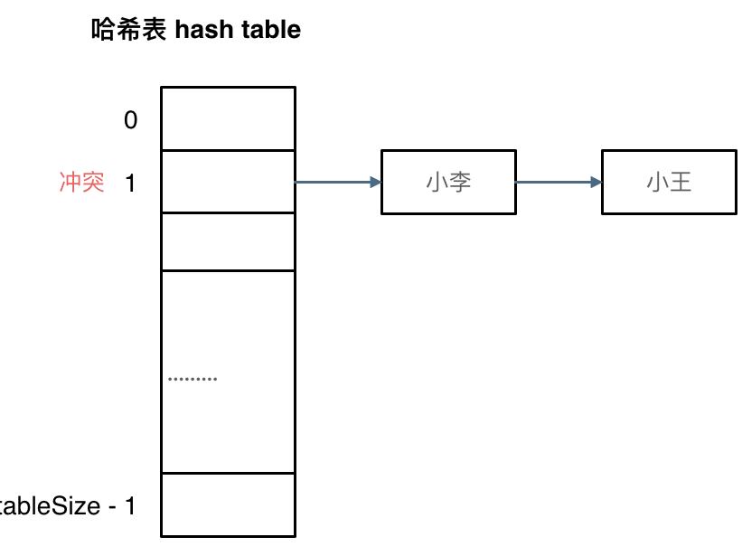

# 哈希表

哈希表（英文名字为Hash table，国内也有一些算法书籍翻译为散列表）。哈希表是根据关键码的值而直接进行访问的数据结构。其实直白来讲其实**数组就是一张哈希表**。**一般哈希表都是用来快速判断一个元素是否出现集合里。**

### 哈希函数

哈希函数如下图所示，通过hashCode把名字转化为数值，一般hashcode是通过特定编码方式，可以将其他数据格式转化为不同的数值，这样就把学生名字映射为哈希表上的索引数字了。

如果hashCode得到的数值大于 哈希表的大小了，也就是大于tableSize了，怎么办呢？

此时为了保证映射出来的索引数值都落在哈希表上，会在再次对数值做一个取模的操作，这样就保证了学生姓名一定可以映射到哈希表上了。

如果学生的数量大于哈希表的大小怎么办，此时就算哈希函数计算的再均匀，也避免不了会有几位学生的名字同时映射到哈希表同一个索引下标的位置。 ↓↓↓

#### 哈希碰撞

一般哈希碰撞有两种解决方法：

- 拉链法：假如小李和小王在索引1的位置发生了冲突，发生冲突的元素都被存储在链表中。 这样就可以通过索引找到小李和小王了。其实拉链法就是要选择适当的哈希表的大小，这样既不会因为数组空值而浪费大量内存，也不会因为链表太长而在查找上浪费太多时间。
  - 
- 线性探测法：使用线性探测法，一定要保证tableSize大于dataSize。 需要依靠哈希表中的空位来解决碰撞问题。例如冲突的位置，放了小李，那么就向下找一个空位放置小王的信息。所以要求tableSize一定要大于dataSize ，要不然哈希表上就没有空置的位置来存放 冲突的数据了。如图所示：
  - 

### 三种常见的哈希结构

- 数组
- set （集合）
- map(映射)

**当我们遇到了要快速判断一个元素是否出现集合里的时候，就要考虑哈希法**。

但是哈希法也是**牺牲了空间换取了时间**，因为我们要使用额外的数组，set或者是map来存放数据，才能实现快速的查找。

如果在做面试题目的时候遇到需要判断一个元素是否出现过的场景也应该第一时间想到哈希法！

## 有效的字母异位词

**数组其实就是一个简单哈希表**，而且这道题目中字符串只有小写字符，那么就可以定义一个数组，来记录字符串s里字符出现的次数。需要定义一个多大的数组呢，定一个数组叫做record，大小为26 就可以了，初始化为0，因为字符a到字符z的ASCII也是26个连续的数值。

需要把字符映射到数组也就是哈希表的索引下标上，**因为字符a到字符z的ASCII是26个连续的数值，所以字符a映射为下标0，相应的字符z映射为下标25。**在遍历字符串s的时候，**只需要将 s[i] - ‘a’ 所在的元素做+1 操作即可，并不需要记住字符a的ASCII，只要求出一个相对数值就可以了。** 这样就将字符串s中字符出现的次数，统计出来了。再看一下如何检查字符串t中是否出现了这些字符，同样在遍历字符串t的时候，对t中出现的字符映射哈希表索引上的数值再做-1的操作。

最后检查一下，**record数组如果有的元素不为零0，说明字符串s和t一定是谁多了字符或者谁少了字符，return false。**

## 两个数组的交集

如果哈希值比较少、特别分散、跨度非常大，使用数组就造成空间的极大浪费！

用数组来做哈希表，但是要注意，**使用数组来做哈希的题目，是因为题目都限制了数值的大小。**而这道题目没有限制数值的大小，就无法使用数组来做哈希表了。**而且如果哈希值比较少、特别分散、跨度非常大，使用数组就造成空间的极大浪费。**

遇到哈希问题我直接都用set不就得了，用什么数组啊。

直接使用set 不仅占用空间比数组大，而且速度要比数组慢，set把数值映射到key上都要做hash计算的。不要小瞧 这个耗时，在数据量大的情况，差距是很明显的。

## 快乐数

「快乐数」定义为：对于一个正整数，每一次将该数替换为它每个位置上的数字的平方和，然后重复这个过程直到这个数变为 1，也可能是无限循环但始终变不到 1。如果可以变为 1，那么这个数就是快乐数。

这道题目看上去貌似一道数学问题，其实并不是！

题目中说了会 **无限循环**，那么也就是说**求和的过程中，sum会重复出现，这对解题很重要！** 

“当我们遇到了要快速判断一个元素是否出现集合里的时候，就要考虑哈希法了。”所以这道题目使用哈希法，来判断这个sum是否重复出现，如果重复了就是return false， 否则一直找到sum为1为止。

## 两数之和

因为本题，我们不仅要知道元素有没有遍历过，还要知道这个元素对应的下标，**需要使用 key value结构来存放，key来存元素，value来存下标，那么使用map正合适**。

再来看一下使用数组和set来做哈希法的局限。

- 数组的大小是受限制的，而且如果元素很少，而哈希值太大会造成内存空间的浪费。
- set是一个集合，里面放的元素只能是一个key，而两数之和这道题目，不仅要判断y是否存在而且还要记录y的下标位置，因为要返回x 和 y的下标。所以set 也不能用。

接下来需要明确两点：

- **map用来做什么**
- **map中key和value分别表示什么**

map目的用来存放我们访问过的元素，因为遍历数组的时候，需要记录我们之前遍历过哪些元素和对应的下标，这样才能找到与当前元素相匹配的（也就是相加等于target）

接下来是map中key和value分别表示什么。

这道题 我们需要 给出一个元素，判断这个元素是否出现过，如果出现过，返回这个元素的下标。那么判断元素是否出现，这个元素就要作为key，所以数组中的元素作为key，有key对应的就是value，value用来存下标。所以 map中的存储结构为 {key：数据元素，value：数组元素对应的下标}。

在遍历数组的时候，只需要向map去查询是否有和目前遍历元素匹配的数值，如果有，就找到的匹配对，如果没有，就把目前遍历的元素放进map中，因为map存放的就是我们访问过的元素。

## 三数之和

**其实这道题目使用哈希法并不十分合适**，因为在去重的操作中有很多细节需要注意，在面试中很难直接写出没有bug的代码。而且使用哈希法 在使用两层for循环的时候，能做的剪枝操作很有限，虽然时间复杂度是O(n^2)，也是可以在leetcode上通过，但是程序的执行时间依然比较长 。

**这道题目使用双指针法 要比哈希法高效一些**

首先将数组排序，然后有一层for循环，i从下标0的地方开始，同时定一个下标left 定义在i+1的位置上，定义下标right 在数组结尾的位置上。依然还是在数组中找到 abc 使得a + b +c =0，我们这里相当于 a = nums[i]，b = nums[left]，c = nums[right]。

接下来如何移动left 和right呢， 如果nums[i] + nums[left] + nums[right] > 0 就说明 此时三数之和大了，因为数组是排序后了，所以right下标就应该向左移动，这样才能让三数之和小一些。如果 nums[i] + nums[left] + nums[right] < 0 说明 此时 三数之和小了，left 就向右移动，才能让三数之和大一些，直到left与right相遇为止。

### 去重

#### a的去重

说到去重，其实主要考虑三个数的去重。 a, b ,c, 对应的就是 nums[i]，nums[left]，nums[right] 

a 如果重复了怎么办，a是nums里遍历的元素，那么应该直接跳过去。但这里有一个问题，是判断 nums[i] 与 nums[i + 1]是否相同，还是判断 nums[i] 与 nums[i-1] 是否相同。

有人可能想，这不都一样吗？其实不一样！

## 四数之和

## 四数相加II