# 树

二叉树主要有两种遍历方式：

1. 深度优先遍历：先往深走，遇到叶子节点再往回走。
2. 广度优先遍历：一层一层的去遍历。

**这两种遍历是图论中最基本的两种遍历方式**，后面在介绍图论的时候 还会介绍到。

那么从深度优先遍历和广度优先遍历进一步拓展，才有如下遍历方式：

- 深度优先遍历 (DFS)
  - 前序遍历（递归法，迭代法）
  - 中序遍历（递归法，迭代法）
  - 后序遍历（递归法，迭代法）
- 广度优先遍历 (BFS)
  - 层次遍历（迭代法）

二叉树中深度优先和广度优先遍历实现方式。我们做二叉树相关题目，经常会使用递归的方式来实现深度优先遍历，也就是实现前中后序遍历，使用递归是比较方便的。**之前讲栈与队列的时候，就说过栈其实就是递归的一种实现结构**，也就说前中后序遍历的逻辑其实都是可以借助栈使用递归的方式来实现的。而广度优先遍历的实现一般使用队列来实现，这也是队列先进先出的特点所决定的，因为需要先进先出的结构，才能一层一层的来遍历二叉树。

要注意二叉树节点定义的书写方式。**在现场面试的时候 面试官可能要求手写代码，所以数据结构的定义以及简单逻辑的代码一定要锻炼白纸写出来。**因为在刷leetcode的时候，节点的定义默认都定义好了，真到面试的时候，需要自己写节点定义的时候，有时候会一脸懵逼！

## 二叉树的递归遍历

为什么很多同学看递归算法都是“一看就会，一写就废”。主要是对递归不成体系，没有方法论，每次写递归算法 ，都是靠玄学来写代码，代码能不能编过都靠运气。**我们要通过简单题目把方法论确定下来，有了方法论，后面才能应付复杂的递归。**

**每次次写递归，都按照这三要素来写，可以保证大家写出正确的递归算法！**

1. **确定递归函数的参数和返回值：** 确定哪些参数是递归的过程中需要处理的，那么就在递归函数里加上这个参数（可以先空着后续补上）， 并且还要明确每次递归的返回值是什么进而确定递归函数的返回类型。
2. **确定终止条件：** 写完了递归算法, 运行的时候，经常会遇到栈溢出的错误，就是没写终止条件或者终止条件写的不对，操作系统也是用一个栈的结构来保存每一层递归的信息，如果递归没有终止，操作系统的内存栈必然就会溢出。
3. **确定单层递归的逻辑：** 确定每一层递归需要处理的信息。在这里也就会重复调用自己来实现递归的过程。

## 二叉树的迭代遍历（非递归）

递归法可以用栈来模拟，用栈也可以是实现二叉树的前后中序遍历了。

### 前序

前序遍历是中左右，每次先处理的是中间节点，那么先将根节点放入栈中，然后将右孩子加入栈，再加入左孩子。为什么要先加入 右孩子，再加入左孩子呢？ 因为这样出栈的时候才是中左右的顺序。


### 中序

**此时是不是想改一点前序遍历代码顺序就把中序遍历搞出来了？**

其实还真不行！**目前的前序遍历的逻辑无法直接应用到中序遍历上。**

为了解释清楚，说明一下刚刚在迭代的过程中，其实我们有两个操作：

1. **处理：将元素放进result数组中**
2. **访问：遍历节点**

为什么刚刚写的前序遍历的代码，不能和中序遍历通用呢，因为前序遍历的顺序是中左右，先访问的元素是中间节点，要处理的元素也是中间节点，所以刚刚才能写出相对简洁的代码，**因为要访问的元素和要处理的元素顺序是一致的，都是中间节点。**

那么再看看中序遍历，中序遍历是左中右，先访问的是二叉树顶部的节点，然后一层一层向下访问，直到到达树左面的最底部，再开始处理节点（也就是在把节点的数值放进result数组中），这就造成了**处理顺序和访问顺序是不一致的。**

那么**在使用迭代法写中序遍历，就需要借用指针的遍历来帮助访问节点，栈则用来处理节点上的元素。**

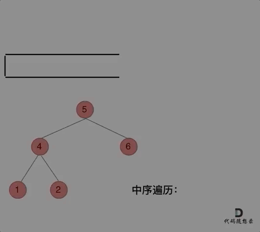

### 后序

再来看后序遍历，先序遍历是中左右，后序遍历是左右中，那么我们只需要调整一下先序遍历的代码顺序，就变成中右左的遍历顺序，然后在反转`reverse()` result数组，输出的结果顺序就是左右中了。**所以后序遍历只需要前序遍历的代码稍作修改就可以了**。

## 二叉树的统一迭代法

前序和中序是完全两种代码风格，并不像递归写法那样代码稍做调整，就可以实现前后中序。**这是因为前序遍历中访问节点（遍历节点）和处理节点（将元素放进result数组中）可以同步处理，但是中序就无法做到同步！**

那么问题又来了，难道二叉树前后中序遍历的迭代法实现，就不能风格统一么（即前序遍历改变代码顺序就可以实现中序 和 后序）？

**无法同时解决访问节点（遍历节点）和处理节点（将元素放进结果集）不一致的情况。那我们就将访问的节点放入栈中，把要处理的节点也放入栈中但是要做标记。**

如何标记呢？

- 方法一：**就是要处理的节点放入栈之后，紧接着放入一个空指针作为标记。** 这种方法可以叫做`空指针标记法`。
- 方法二：**加一个 `boolean` 值跟随每个节点，`false` (默认值) 表示需要为该节点和它的左右儿子安排在栈中的位次，`true` 表示该节点的位次之前已经安排过了，可以收割节点了。** 这种方法可以叫做`boolean 标记法`，`C++ 和 Python 的 boolean 标记法`。 这种方法更容易理解，在面试中更容易写出来。

此时我们写出了统一风格的迭代法，不用在纠结于前序写出来了，中序写不出来的情况了。但是统一风格的迭代法并不好理解，而且想在面试直接写出来还有难度的。

## 二叉树的层序遍历

层序遍历一个二叉树。就是从左到右一层一层的去遍历二叉树。需要借用一个辅助数据结构即队列来实现，**队列先进先出，符合一层一层遍历的逻辑，而用栈先进后出适合模拟深度优先遍历也就是递归的逻辑。**

**而这种层序遍历方式就是图论中的广度优先遍历，只不过我们应用在二叉树上。**

## 从中序与后序遍历序列构造二叉树


## 满二叉树

一个二叉树，如果每一个层的结点数都达到最大值，则这个二叉树就是 **满二叉树**。也就是说，如果一个二叉树的层数为 K，且结点总数是(2^k) -1 ，则它就是 **满二叉树**。

## 翻转二叉树

可以发现想要翻转它，其实就把每一个节点的左右孩子交换一下就可以了。**注意只要把每一个节点的左右孩子翻转一下，就可以达到整体翻转的效果**

关键在于遍历顺序，前中后序应该选哪一种遍历顺序？ 

**这道题目使用前序遍历和后序遍历都可以，唯独中序遍历不方便，因为中序遍历会把某些节点的左右孩子翻转了两次！**

那么层序遍历可以不可以呢？**依然可以的！只要把每一个节点的左右孩子翻转一下的遍历方式都是可以的**。

### 递归法

来看一下递归三部曲：

1. 确定递归函数的参数和返回值

参数就是要传入节点的指针，不需要其他参数了，通常此时定下来主要参数，如果在写递归的逻辑中发现还需要其他参数的时候，随时补充。

返回值的话其实也不需要，但是题目中给出的要返回root节点的指针，可以直接使用题目定义好的函数，所以就函数的返回类型为`TreeNode*`。

2. 确定终止条件

当前节点为空的时候，就返回。

3. 确定单层递归的逻辑

因为是前序遍历，所以先进行交换左右孩子节点，然后反转左子树，反转右子树。


针对二叉树的问题，解题之前一定要想清楚究竟是前中后序遍历，还是层序遍历。**二叉树解题的大忌就是自己稀里糊涂的过了（因为这道题相对简单），但是也不知道自己是怎么遍历的。**这也是造成了二叉树的题目“一看就会，一写就废”的原因。

**针对翻转二叉树，给出了一种递归，三种迭代（两种模拟深度优先遍历，一种层序遍历）的写法。**一定要有自己的解法，一定要成方法论，这样才能通用，才能举一反三！

## 二叉树的最大深度

本题可以使用前序（中左右），也可以使用后序遍历（左右中），使用前序求的就是深度，使用后序求的是高度。

- 二叉树节点的深度：指从根节点到该节点的最长简单路径边的条数或者节点数（取决于深度从0开始还是从1开始）
- 二叉树节点的高度：指从该节点到叶子节点的最长简单路径边的条数或者节点数（取决于高度从0开始还是从1开始）

**而根节点的高度就是二叉树的最大深度**，所以本题中我们通过后序求的根节点高度来求的二叉树最大深度。

用后序遍历（左右中）来计算树的高度。

### 递归法

1. 确定递归函数的参数和返回值：参数就是传入树的根节点，返回就返回这棵树的深度，所以返回值为int类型。
2. 确定终止条件：如果为空节点的话，就返回0，表示高度为0。
3. 确定单层递归的逻辑：先求它的左子树的深度，再求右子树的深度，最后取左右深度最大的数值 再+1 （加1是因为算上当前中间节点）就是目前节点为根节点的树的深度。

**精简之后的代码根本看不出是哪种遍历方式，也看不出递归三部曲的步骤，所以如果对二叉树的操作还不熟练，尽量不要直接照着精简代码来学。**

## 二叉树的最小深度

最小深度是从根节点到最近叶子节点的距离 (最短路径上的节点数量)。

直觉上好像和求最大深度差不多，其实还是差不少的。

本题依然是前序遍历和后序遍历都可以，前序求的是深度，后序求的是高度。

- 二叉树节点的深度：指从根节点到该节点的最长简单路径边的条数或者节点数（取决于深度从0开始还是从1开始）
- 二叉树节点的高度：指从该节点到叶子节点的最长简单路径边的条数后者节点数（取决于高度从0开始还是从1开始）

那么使用后序遍历，其实求的是根节点到叶子节点的最小距离，就是求高度的过程，不过这个最小距离 也同样是最小深度。

### 递归法

1. 确定递归函数的参数和返回值：参数为要传入的二叉树根节点，返回的是int类型的深度。
2. 确定终止条件：终止条件也是遇到空节点返回0，表示当前节点的高度为0。
3. 确定单层递归的逻辑：

```cpp
nt leftDepth = getDepth(node->left);
int rightDepth = getDepth(node->right);
int result = 1 + min(leftDepth, rightDepth);
return result;
```

走入误区，最小深度是从根节点到最近叶子节点的最短路径上的节点数量，**注意是叶子节点**。什么是叶子节点，左右孩子都为空的节点才是叶子节点！

如果这么求的话，没有左孩子的分支会算为最短深度。所以，如果左子树为空，右子树不为空，说明最小深度是 1 + 右子树的深度。反之，右子树为空，左子树不为空，最小深度是 1 + 左子树的深度。 最后如果左右子树都不为空，返回左右子树深度最小值 + 1 。

## 完全二叉树

除最后一层外，若其余层都是满的，并且最后一层是满的或者是在右边缺少连续若干节点，则这个二叉树就是 **完全二叉树** 。若最底层为第 h 层（h从1开始），则该层包含 1~ 2^(h-1) 个节点。

可以想象为一棵树从根结点开始扩展，扩展完左子节点才能开始扩展右子节点，每扩展完一层，才能继续扩展下一层。

完全二叉树有一个很好的性质：**父结点和子节点的序号有着对应关系。**当根节点的值为 1 的情况下，若父结点的序号是 i，那么左子节点的序号就是 2i，右子节点的序号是 2i+1。这个性质使得完全二叉树利用数组存储时可以极大地节省空间，以及利用序号找到某个节点的父结点和子节点。

**优先级队列其实是一个堆，堆就是一棵完全二叉树，同时保证父子节点的顺序关系。**

## 完全二叉树的节点个数


## 最大二叉树

最大二叉树定义如下：

- 二叉树的根是数组中的最大元素。
- 左子树是通过数组中最大值左边部分构造出的最大二叉树。
- 右子树是通过数组中最大值右边部分构造出的最大二叉树。

## 二叉查找树

（Binary Search Tree，简称BST）又称二叉排序树或者二叉搜索树。前面介绍的树，都没有数值的，而二叉搜索树是有数值的了，**二叉搜索树是一个有序树**。

特点：

- 若它的左子树不空，则左子树上所有结点的值均小于它的根结点的值；
- 若它的右子树不空，则右子树上所有结点的值均大于它的根结点的值；
- 它的左、右子树也分别为二叉排序树

### 添加节点

规则：小的存左边，大的存右边，一样的不存

### 查找节点

同上规则

### 遍历

**这里前中后，其实指的就是中间节点的遍历顺序**，只要记住前中后序指的就是中间节点的位置就可以了。

- 前序遍历：从根节点开始，按照当前节点，左子结点，右子节点的顺序遍历；也就是先输出根结点，再遍历左子树，最后遍历右子树，遍历左子树和右子树的时候，同样遵循先序遍历的规则，也就是说，我们可以递归实现先序遍历。

  - 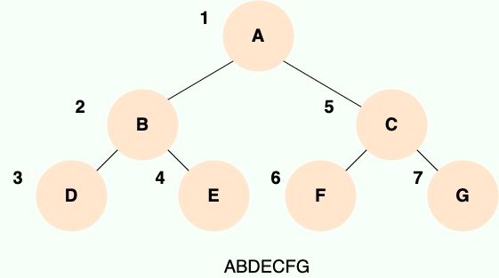
  - ```java
    public void preOrder(TreeNode root){
    	if(root == null){
    		return;
    	}
    	system.out.println(root.data);
    	preOrder(root.left);
    	preOrder(root.right);
    }
    ```

    

- 中序遍历：从最左边的子节点开始，按照左子结点，当前节点，右子节点的顺序遍历；也就是先递归中序遍历左子树，再输出根结点的值，再递归中序遍历右子树。

  - 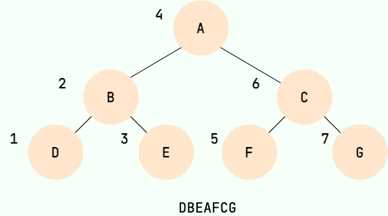
  - ```java
    public void inOrder(TreeNode root){
    	if(root == null){
    		return;
    	}
    	inOrder(root.left);
    	system.out.println(root.data);
    	inOrder(root.right);
    }
    ```

    

- 后序遍历：从最左边的子节点开始，按照左子结点，右子节点，当前节点的顺序遍历；也就是先递归后序遍历左子树，再递归后序遍历右子树，最后输出根结点的值

  - 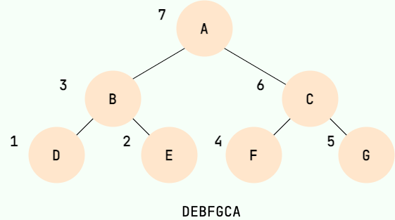
  - ```java
    public void postOrder(TreeNode root){
    	if(root == null){
    		return;
    	}
     	postOrder(root.left);
    	postOrder(root.right);
    	system.out.println(root.data);
    }
    ```

    

- 层序遍历：从根节点开始一层一层的从左往右遍历

### 弊端

左右子树的高度差可能很大，导致查询效率低，平衡二叉树来解决。

## 平衡二叉树

特点：平衡二叉树是一棵二叉排序树，在二叉查找树的基础上，

1. 可以是一棵空树
2. 如果不是空树，它的左右两个子树的高度差的绝对值不超过 1，并且左右两个子树都是一棵平衡二叉树。

平衡二叉树的常用实现方法有 **红黑树**、**AVL 树（Adelson-Velsky and Landis，平衡二叉搜索树）**、**替罪羊树**、**加权平衡树**、**伸展树** 等。

**C++中map、set、multimap，multiset的底层实现都是平衡二叉搜索树**，所以map、set的增删操作时间时间复杂度是O(logn)，注意这里没有说unordered_map、unordered_set，unordered_map、unordered_set底层实现是哈希表。

**所以大家使用自己熟悉的编程语言写算法，一定要知道常用的容器底层都是如何实现的，最基本的就是map、set等等，否则自己写的代码，自己对其性能分析都分析不清楚！**

### 旋转机制

触发时机：当添加一个节点后，该树不再是一棵平衡二叉树

#### 左旋

1. 确定支点：从添加的节点开始，不断地往父节点找不平衡的节点
2. 把支点左旋降级，变为左子结点
3. 晋升原来的右子节点

/

1. 以不平衡的点作为支点
2. 将根节点的右侧往左拉
3. 原先的右子节点变为新的父节点，并把多余的左子结点让出，给已降级的根节点当右子节点

#### 右旋

同上

#### 旋转的四种情况

1. 左左：当根节点左子树的左子树有节点插入—— 一次右旋
2. 左右：当根节点左子树的右子树有节点插入——先局部左旋变为左左，再一次右旋
3. 右右：当根节点右子树的右子树有节点插入—— 一次左旋
4. 右左：当根节点右子树的左子树有节点插入——先局部右旋变为右右，再一次左旋

### 给定一个二叉树，判断它是否是高度平衡的二叉树。


## 二叉树的存储

二叉树的存储主要分为 **链式存储** 和 **顺序存储** 两种。

### 链式存储

和链表类似，二叉树的链式存储依靠指针将各个节点串联起来，不需要连续的存储空间。

每个节点包括三个属性：

- 数据 data。data 不一定是单一的数据，根据不同情况，可以是多个具有不同类型的数据。
- 左节点指针 left。
- 右节点指针 right。

可是 JAVA 没有指针啊！那就直接引用对象呗。

### 顺序存储

顺序存储就是利用数组进行存储，数组中的每一个位置仅存储节点的 data，不存储左右子节点的指针，子节点的索引通过数组下标完成。根结点的序号为 1，对于每个节点 Node，假设它存储在数组中下标为 i 的位置，那么它的左子节点就存储在 2i 的位置，它的右子节点存储在下标为 2i+1 的位置。

一棵完全二叉树的数组顺序存储如下图所示：

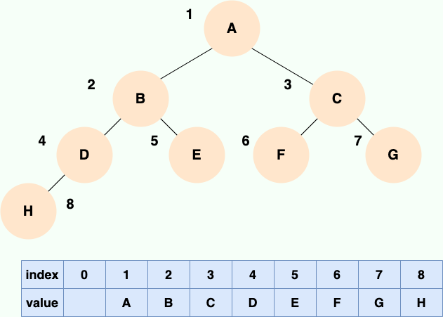

**|| **


如果父节点的数组下标是 i，那么它的左孩子就是 i \* 2 + 1，右孩子就是 i \* 2 + 2。

但是用链式表示的二叉树，更有利于我们理解，所以一般都是用链式存储二叉树。**但要了解，用数组依然可以表示二叉树。**

## 二叉树的所有路径


## 红黑树

是一种自平衡的二叉查找树，曾被称为平衡二叉B树。是一种特殊的二叉查找树，红黑树的每一个节点上都有存储位表示节点的颜色，每一个节点可以是红或者黑色；红黑树不是高度平衡的，所以不是平衡二叉树，它的平衡是通过“红黑规则”进行实现的。由于其自平衡的特性，保证了最坏情形下在 O(logn) 时间复杂度内完成查找、增加、删除等操作，性能表现稳定。

### 为什么需要红黑树？

红黑树的诞生就是为了解决二叉查找树的缺陷。

二叉查找树是一种基于比较的数据结构，它的每个节点都有一个键值，而且左子节点的键值小于父节点的键值，右子节点的键值大于父节点的键值。这样的结构可以方便地进行查找、插入和删除操作，因为只需要比较节点的键值就可以确定目标节点的位置。但是，二叉查找树有一个很大的问题，就是它的形状取决于节点插入的顺序。如果节点是按照升序或降序的方式插入的，那么二叉查找树就会退化成一个线性结构，也就是一个链表。这样的情况下，二叉查找树的性能就会大大降低，时间复杂度就会从 O(logn) 变为 O(n)。

简而言之，红黑树的诞生就是为了解决二叉查找树的缺陷，因为二叉查找树在某些情况下会退化成一个线性结构。

### 红黑规则

- 每个节点非红即黑。黑色决定平衡，红色不决定平衡。这对应了 2-3 树中一个节点内可以存放 1~2 个节点。
- 根节点总是黑色。
- 每个叶子节点都是黑色的空节点（NIL 节点）。这里指红黑树都会有一个空的叶子节点，是红黑树自己的规则。
- 如果某个节点是红色的，那么它的子节点必须是黑色的（不能出现两个红色节点相连的情况)(反之不一定）。一个节点最多临时会有 3 个子节点，中间是黑色节点，左右是红色节点。
- 从任意节点到它的叶子节点或空子节点的每条路径，必须包含相同数目的黑色节点（即相同的黑色高度）。每一层都只是有一个节点贡献了树高决定平衡性，也就是对应红黑树中的黑色节点。

正是这些特点才保证了红黑树的平衡，让红黑树的高度不会超过 2log(n+1)。

### 添加节点

根：直接变为黑色

非根：

- 父黑色：不需要任何操作

- 父红色

  - 叔叔红色

    1. 将父设为黑色，将叔叔设为黑色

    2. 将祖父设为红色

    3. 如果祖父为根，再将根变回黑色

    4. 如果祖父非根，将祖父设置为当前节点再进行其他判断

  - 叔叔黑色，当前节点是父的右孩子：把父作为当前节点并左旋，再进行判断

  - 叔叔黑色，当前节点是父的左孩子

    1. 将父设为黑色

    2. 将祖父变为红色

    3. 以祖父为支点右旋

1. #### 左倾染色

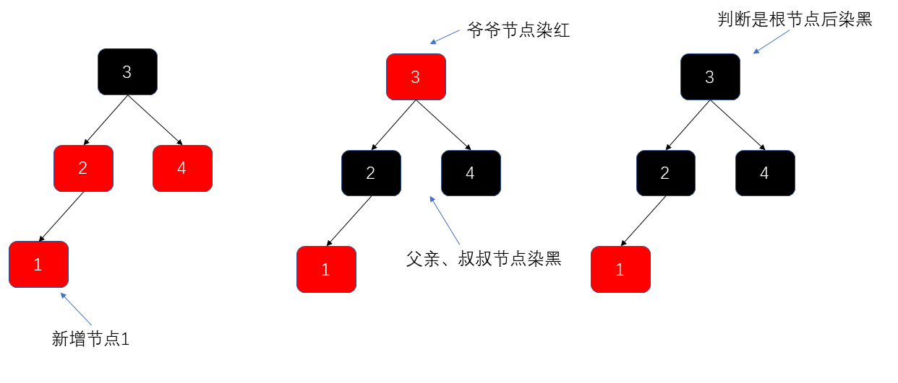

2. ####  右倾染色

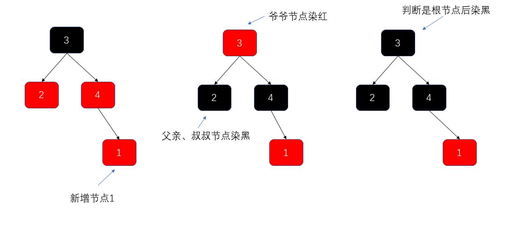

3. #### 左旋调衡

   1. 一次左旋

      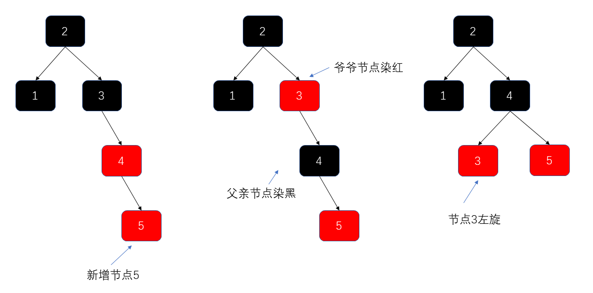

   2. 右旋+左旋

      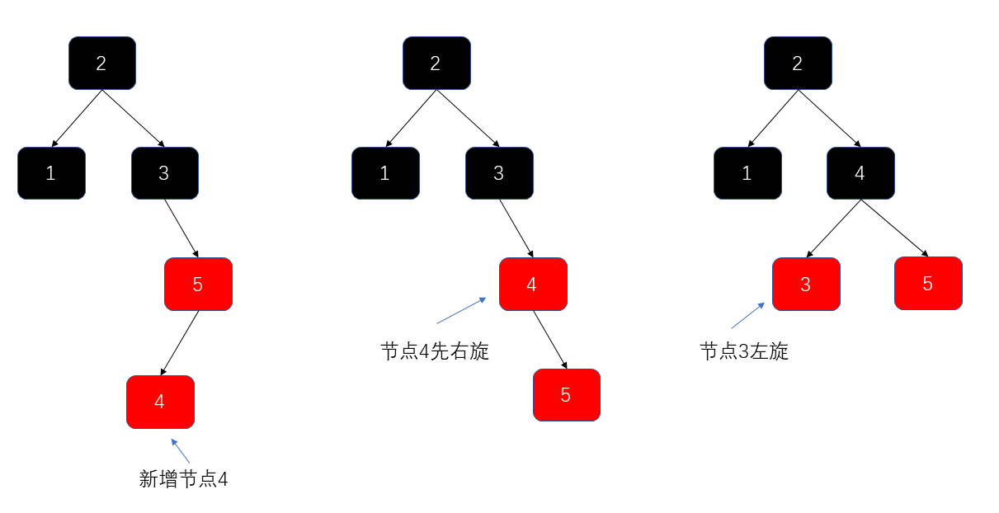

4. #### 右旋调衡

   1. 一次右旋

      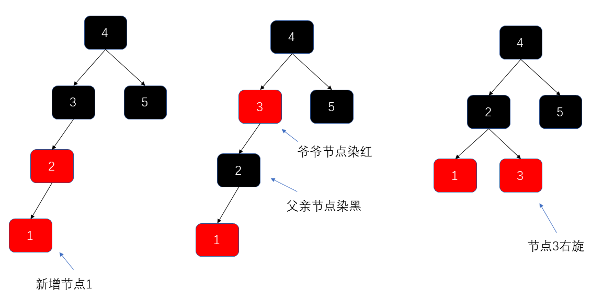

   2. 左旋+右旋

      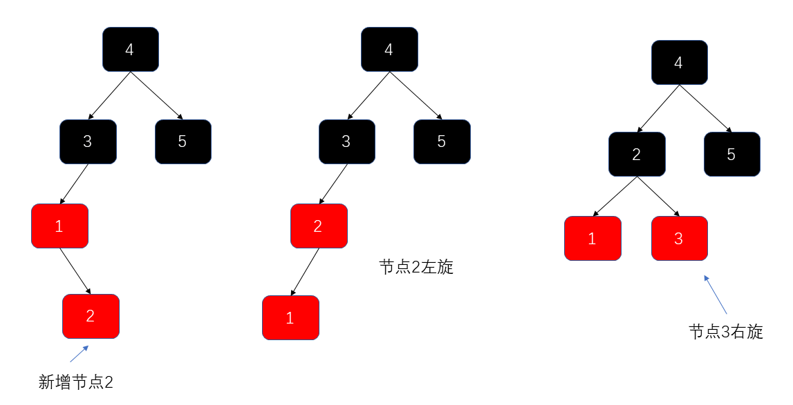
