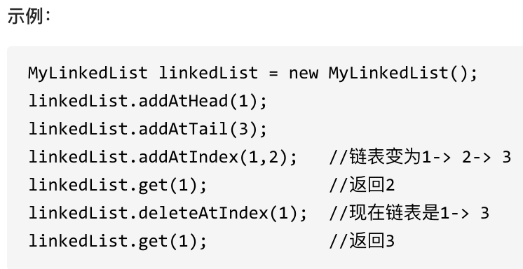

# 链表

链表的几种类型:

- 单链表：单向链表只有一个方向，结点只有一个后继指针 next 指向后面的节点。因此，链表这种数据结构通常在物理内存上是不连续的。我们习惯性地把第一个结点叫作头结点，链表通常有一个不保存任何值的 head 节点(头结点)，通过头结点我们可以遍历整个链表。尾结点通常指向 null。
- 双链表：包含两个指针，一个 prev 指向前一个节点，一个 next 指向后一个节点。
- 循环链表：其实是一种特殊的单链表，和单链表不同的是循环链表的尾结点不是指向 null，而是指向链表的头结点。
- 双向循环链表：最后一个节点的 next 指向 head，而 head 的 prev 指向最后一个节点，构成一个环。

链表的存储方式：链表中的节点在内存中不是连续分布的 ，而是散乱分布在内存中的某地址上，分配机制取决于操作系统的内存管理。

### 链表的定义

```cpp
// 单链表
struct ListNode {
    int val;  // 节点上存储的元素
    ListNode *next;  // 指向下一个节点的指针
    ListNode(int x) : val(x), next(NULL) {}  // 节点的构造函数
};
```

### 应用场景

- 如果需要支持随机访问的话，链表没办法做到。

- 如果需要存储的数据元素的个数不确定，并且需要经常添加和删除数据的话，使用链表比较合适。

- 如果需要存储的数据元素的个数确定，并且不需要经常添加和删除数据的话，使用数组比较合适。

#### 数组 VS 链表

- 数组支持随机访问，而链表不支持。

- 数组使用的是连续内存空间对 CPU 的缓存机制友好，链表则相反。

- 数组的大小固定，而链表则天然支持动态扩容。如果声明的数组过小，需要另外申请一个更大的内存空间存放数组元素，然后将原数组拷贝进去，这个操作是比较耗时的！

## 移除链表元素

**双指针法在数组，链表和字符串中很常用**

两种方式：

- **直接使用原来的链表来进行删除操作**：移除头结点和移除其他节点的操作是不一样的，因为链表的其他节点都是通过前一个节点来移除当前节点，而头结点没有前一个节点。所以头结点如何移除呢，其实只要将头结点向后移动一位就可以，这样就从链表中移除了一个头结点。
- **设置一个虚拟头结点在进行删除操作**：可以设置一个虚拟头结点，这样原链表的所有节点就都可以按照统一的方式进行移除了。
  - 为什么不`return head`而是`return dummy->next`？因为head节点可能已经被删除了。

## 设计链表

实现这些功能：

- get(index)：获取链表中第 index 个节点的值。如果索引无效，则返回-1。
- addAtHead(val)：在链表的第一个元素之前添加一个值为 val 的节点。插入后，新节点将成为链表的第一个节点。
- addAtTail(val)：将值为 val 的节点追加到链表的最后一个元素。
- addAtIndex(index,val)：在链表中的第 index 个节点之前添加值为 val 的节点。如果 index 等于链表的长度，则该节点将附加到链表的末尾。如果 index 大于链表长度，则不会插入节点。如果index小于0，则在头部插入节点。
- deleteAtIndex(index)：如果索引 index 有效，则删除链表中的第 index 个节点。



这道题目设计链表的五个接口：

- 获取链表第index个节点的数值
- 在链表的最前面插入一个节点
- 在链表的最后面插入一个节点
- 在链表第index个节点前面插入一个节点
- 删除链表的第index个节点

可以说这五个接口，已经覆盖了链表的常见操作，是练习链表操作非常好的一道题目。链表操作的两种方式：1. 直接使用原来的链表来进行操作。 2. 设置一个虚拟头结点在进行操作。采用虚拟头结点方式，这样更方便一些。

## 两两交换链表中的节点

建议使用虚拟头结点，这样会方便很多，要不然每次针对头结点（没有前一个指针指向头结点），还要单独处理。接下来就是交换相邻两个元素了，**此时一定要画图，不画图，操作多个指针很容易乱，而且要操作的先后顺序**

`temp`

## 反转链表

**双指针法**

如果再定义一个新的链表，实现链表元素的反转，其实这是对内存空间的浪费。其实只需要改变链表的next指针的指向，直接将链表反转 ，而不用重新定义一个新的链表。

之前链表的头节点是元素1， 反转之后头结点就是元素5 ，这里并没有添加或者删除节点，仅仅是改变next指针的方向。

## 删除链表的倒数第N个节点

**双指针**的经典应用，如果要删除倒数第n个节点，让fast移动n步，然后让fast和slow同时移动，直到fast指向链表末尾。删掉slow所指向的节点就可以了。

但要注意一些细节。

分为如下几步：

- 首先推荐大家使用虚拟头结点，这样方便处理删除实际头结点的逻辑
- 定义fast指针和slow指针，初始值为虚拟头结点
- fast首先走n + 1步 ，为什么是n+1呢，因为只有这样同时移动的时候slow才能指向删除节点的上一个节点（方便做删除操作）
- fast和slow同时移动，直到fast指向末尾，此时slow指向倒数第n个节点的前一个结点
- 删除slow指向的下一个节点

## 链表相交

**双指针法**

## 环形链表II

**双指针法**
